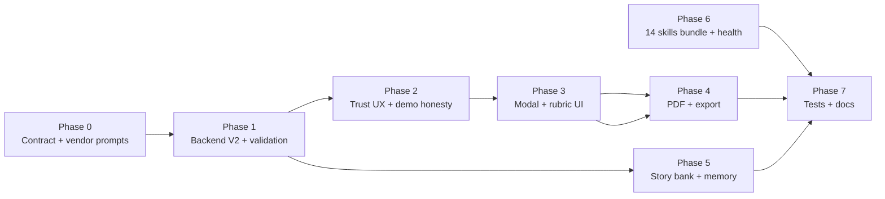

# Master-Level Job Evaluation Implementation Plan

> **For agentic workers:** REQUIRED SUB-SKILL: Use superpowers:subagent-driven-development (recommended) or superpowers:executing-plans to implement this plan task-by-task. Steps use checkbox (`- [ ]`) syntax for tracking.

**Goal:** Bring NewCareers job evaluation to parity with [santifer/career-ops](https://github.com/santifer/career-ops) rigor—structured A–F scoring, honest UX, offline prompt reliability, and production-grade PDF—while keeping the SaaS advantages (daily delivery, persisted breakdowns, multi-user pipeline).

**Architecture:** Treat evaluation as a **versioned data contract** (`EvaluationReportV2`) produced by `JobDeliveryService` + `evaluate` skill, stored in `user_jobs.score_breakdown`, rendered by `resolveJobEvaluation()` + `JobEvaluationModal`, exported via `POST /skills/pdf/evaluation-report`. Prompts ship **bundled** under `backend/src/main/resources/career-ops-skills/` (no runtime dependency on GitHub). Trust layer is **UI + copy + server validation**, not stronger models alone.

**Tech Stack:** Spring Boot 3, Jackson `JsonNode`, NVIDIA NIM (existing), React + TypeScript, OpenHTMLtoPDF, Flyway (only if new columns), Vitest + JUnit.

**Reference:** Upstream README promises 10 weighted dimensions, 6 narrative blocks, human-in-the-loop, “do not apply below 4.0/5”, story bank accumulation. Your app already has 6 sections + daily delivery; this plan closes the gaps.

---

## Success criteria (definition of “master level”)

| # | Criterion | How we verify |
|---|-----------|---------------|
| 1 | **Honest UX** | Preview jobs show “Sample evaluation” in modal + PDF; live jobs show “Based on your CV & profile” |
| 2 | **Rubric parity** | Every evaluation returns 10 scored dimensions + 1-line reason each; overall maps to 0–5 “apply score” |
| 3 | **Apply gate** | UI warns when apply score &lt; 4.0; verdict “Skip” cannot be styled as positive |
| 4 | **Offline prompts** | Backend starts with full `evaluate/SKILL.md` + `scoring-rubric.md` + `archetypes.md` on classpath; GitHub fetch is optional refresh only |
| 5 | **PDF fidelity** | PDF mirrors modal (dimensions table, sections, disclaimer footer); `%PDF` magic bytes in integration test |
| 6 | **Reliability** | `GET /health` or startup log confirms PDF route registered; CI smoke POST returns 200 |
| 7 | **No silent fallback** | If AI returns invalid JSON, job is saved with `evaluationStatus: partial` and UI shows “re-run evaluation” |

---

## Target evaluation contract (`EvaluationReportV2`)

Store inside `user_jobs.score_breakdown` (JSONB). Add top-level field `"schemaVersion": 2`.

```json
{
  "schemaVersion": 2,
  "archetype": "Agentic Engineering",
  "applyScore": 4.2,
  "overallScore": 84,
  "matchPercent": 88,
  "verdict": "Worth applying",
  "humanSummary": "…",
  "matchedSkills": ["…"],
  "unmatchedSkills": ["…"],
  "cvImprovementTips": ["…"],
  "sponsorshipMatch": true,
  "salaryMatch": true,
  "dimensions": [
    { "key": "role_fit", "label": "Role fit", "score": 4.5, "weight": 0.15, "reason": "…" }
  ],
  "sections": {
    "executiveSummary": "…",
    "backgroundMatch": "…",
    "positioningStrategy": "…",
    "compensationAndMarket": "…",
    "tailoringPlan": "…",
    "interviewPrep": "…"
  },
  "storyBankCandidates": [
    { "title": "Led portal redesign", "situation": "…", "action": "…", "result": "…" }
  ],
  "evaluationStatus": "complete",
  "generatedAt": "2026-05-20T12:00:00Z",
  "source": "daily_delivery"
}
```

**10 dimension keys** (align naming in prompt + UI + PDF):

1. `role_fit` — title/level/seniority vs profile  
2. `skills_match` — hard skills vs JD  
3. `experience_depth` — years + domain evidence  
4. `cv_evidence` — provable bullets vs claims  
5. `location_work_model` — geo, hybrid, relocation  
6. `compensation` — band vs target  
7. `sponsorship_visa` — if required  
8. `company_stage` — startup/enterprise fit  
9. `growth_learning` — trajectory vs candidate goals  
10. `culture_signals` — values/pace from JD language  

**Apply score:** Weighted mean of dimension `score` (0–5). `applyScore = sum(score * weight) / sum(weight)`. Weights default equal (0.1 each); rubric doc can define non-equal weights later.

**Verdict rules (server-side after AI response):**

- `applyScore >= 4.0` → allow “Strong match” / “Worth applying”  
- `3.0 <= applyScore < 4.0` → force “Stretch role” if model said “Strong match”  
- `applyScore < 3.0` → force “Skip”  

---

## Phase map (recommended order)



**Estimated effort:** 3–4 focused weeks (1 engineer). Phases 0–4 are MVP for “master evaluation”; 5–7 are completeness.

---

## Phase 0 — Contract & prompt vendor (1–2 days)

### Task 0.1: Document the contract

**Files:**
- Create: `docs/EVALUATION_CONTRACT.md`
- Modify: `README.md` (link to contract)

- [ ] **Step 1:** Write `docs/EVALUATION_CONTRACT.md` with `EvaluationReportV2` schema, dimension keys, verdict rules, `schemaVersion` migration note (v1 = legacy flat scores in breakdown root).

- [ ] **Step 2:** Add README section “Job evaluation” linking to contract + upstream attribution.

### Task 0.2: Vendor upstream references into the repo

**Files:**
- Create: `backend/src/main/resources/career-ops-skills/references/scoring-rubric.md`
- Create: `backend/src/main/resources/career-ops-skills/references/archetypes.md`
- Create: `backend/src/main/resources/career-ops-skills/references/profile-schema.md`
- Create: `backend/src/main/resources/career-ops-skills/references/states.md`
- Modify: `backend/src/main/java/com/careerops/service/SkillPromptLibrary.java` (classpath path for references)

**Source strategy:** Copy/adapt from [santifer/career-ops](https://github.com/santifer/career-ops) `modes/_shared.md` + `modes/oferta.md` scoring sections OR from your pinned `career-ops-plugin` commit when available. **Do not leave empty placeholders**—minimum viable rubric is 2 pages in-repo.

- [ ] **Step 1:** Add `scoring-rubric.md` defining 10 dimensions, 0–5 scale, anti-inflation rules, apply threshold 4.0.

- [ ] **Step 2:** Add `archetypes.md` with 6–8 archetype labels the model must pick from.

- [ ] **Step 3:** Run backend locally; log line `SkillPromptLibrary: loaded references/scoring-rubric.md` from classpath (Layer 3).

### Task 0.3: Upgrade bundled `evaluate/SKILL.md`

**Files:**
- Modify: `backend/src/main/resources/career-ops-skills/evaluate/SKILL.md`

- [ ] **Step 1:** Replace schema section with full `EvaluationReportV2` JSON example.

- [ ] **Step 2:** Add explicit rules: “Return ONLY JSON”, “Do not inflate scores”, “Each dimension.reason max 280 chars”, “storyBankCandidates: 0–2 items only when strong STAR material exists”.

---

## Phase 1 — Backend V2 pipeline (3–4 days)

### Task 1.1: Java DTO + validator

**Files:**
- Create: `backend/src/main/java/com/careerops/dto/EvaluationReportV2.java` (records for Dimension, Sections, StoryCandidate)
- Create: `backend/src/main/java/com/careerops/service/EvaluationReportValidator.java`
- Test: `backend/src/test/java/com/careerops/service/EvaluationReportValidatorTest.java`

- [ ] **Step 1: Write failing tests** for: valid V2 passes; missing dimensions fails; applyScore recomputed from dimensions; verdict coercion for low applyScore.

- [ ] **Step 2: Implement** `EvaluationReportValidator.normalize(JsonNode raw) → JsonNode` that fills `schemaVersion`, recomputes `applyScore`, applies verdict rules, sets `evaluationStatus`.

- [ ] **Step 3: Run** `mvn -q test -Dtest=EvaluationReportValidatorTest` → PASS.

### Task 1.2: Wire into JobDeliveryService

**Files:**
- Modify: `backend/src/main/java/com/careerops/service/JobDeliveryService.java`
- Modify: `backend/src/main/java/com/careerops/service/SkillService.java` (evaluate skill path)

- [ ] **Step 1:** After NIM JSON parse, call `EvaluationReportValidator.normalize()` before `persistResults`.

- [ ] **Step 2:** On validation failure, persist job with `evaluationStatus: "failed"` and store raw JSON + error in breakdown for debugging (do not drop the job silently).

- [ ] **Step 3:** Integration test: mock NIM response fixture `evaluation-v2-fixture.json` → assert DB row has 10 dimensions.

### Task 1.3: API surface

**Files:**
- Modify: `backend/src/main/java/com/careerops/dto/JobDtos.java` (`JobDetailResponse`)
- Modify: job detail controller/service mapping

- [ ] **Step 1:** Expose `scoreBreakdown` unchanged (frontend parses V2).

- [ ] **Step 2:** Optional: add `evaluationStatus` column on `user_jobs` if you want SQL filtering (Flyway `V79__evaluation_status.sql`); **YAGNI:** can stay inside JSON only for v1 of this plan.

---

## Phase 2 — Trust & honesty layer (1 day)

### Task 2.1: Demo / preview labeling

**Files:**
- Modify: `frontend/src/components/job-detail/JobEvaluationModal.tsx`
- Modify: `frontend/src/lib/downloadJobEvaluationPdf.ts` (pass `isPreview: boolean` in payload)
- Modify: `backend/src/main/java/com/careerops/dto/JobEvaluationPdfRequest.java`
- Modify: `backend/src/main/java/com/careerops/service/JobEvaluationPdfHtml.java`

- [ ] **Step 1:** Pass `isDemo={isDummyJobId(job.userJobId)}` into modal; show amber banner: “Sample evaluation — not based on your CV. Save this job to your pipeline for a real analysis.”

- [ ] **Step 2:** PDF watermark line when `isPreview=true`: “SAMPLE — CareerOps preview data”.

### Task 2.2: Advisory footer (modal + PDF)

**Files:**
- Modify: `JobEvaluationModal.tsx`, `JobEvaluationPdfHtml.java`
- Create: `frontend/src/lib/evaluationDisclaimers.ts` (shared strings)

- [ ] **Step 1:** Add footer copy: AI advisory only; verify salary/sponsorship on official posting; you decide whether to apply; scores are not guarantees.

- [ ] **Step 2:** Mirror same footer in PDF (9pt grey text).

### Task 2.3: Apply gate UI

**Files:**
- Create: `frontend/src/lib/evaluationApplyGate.ts`
- Modify: `JobEvaluationModal.tsx`

```typescript
// evaluationApplyGate.ts
export function applyGate(applyScore?: number): {
  level: 'go' | 'caution' | 'stop';
  message: string;
} {
  if (applyScore == null) return { level: 'caution', message: 'Run a full evaluation for an apply recommendation.' };
  if (applyScore >= 4) return { level: 'go', message: 'Meets CareerOps apply threshold (4.0/5).' };
  if (applyScore >= 3) return { level: 'caution', message: 'Stretch role — improve gaps before applying.' };
  return { level: 'stop', message: 'Below apply threshold — consider skipping.' };
}
```

- [ ] **Step 1:** Show gate banner under header with color by level.

- [ ] **Step 2:** Vitest: `evaluationApplyGate.test.ts` for 4.2 → go, 3.5 → caution, 2.8 → stop.

---

## Phase 3 — Master evaluation UI (2–3 days)

### Task 3.1: Parse V2 in frontend

**Files:**
- Modify: `frontend/src/lib/jobEvaluation.ts`
- Modify: `frontend/src/types/skills-data.ts` (add `EvaluationDimension`, extend `EvaluationData`)

- [ ] **Step 1:** `parseEvaluationReport(raw)` returns V2 with `dimensions[]`, `applyScore`, `archetype`, `schemaVersion`.

- [ ] **Step 2:** Legacy v1: if no `schemaVersion`, map flat numeric keys in breakdown to dimensions where possible; set `fromDailyDelivery` + `legacy: true` badge.

- [ ] **Step 3:** Unit tests with fixture from `frontend/src/test/fixtures/evaluation-v2.json`.

### Task 3.2: Rubric panel in modal

**Files:**
- Modify: `JobEvaluationModal.tsx`
- Create: `frontend/src/components/job-detail/EvaluationDimensionGrid.tsx`
- Modify: `frontend/src/styles/job-evaluation-modal.css`

- [ ] **Step 1:** Replace generic “Score breakdown” with table: Dimension | Score /5 | Weight | Reason (expandable).

- [ ] **Step 2:** Show archetype pill + apply score large (e.g. **4.2 / 5**).

- [ ] **Step 3:** Keep existing 3 pillars + A–F sections below rubric.

### Task 3.3: Deep evaluation refresh

**Files:**
- Modify: `JobDetailSkillsTab.tsx`

- [ ] **Step 1:** After deep `evaluate` skill completes, merge V2 into `evaluationView`; open modal; toast “Evaluation updated from your CV”.

- [ ] **Step 2:** Disable “Run deep evaluation” while `evaluationStatus === 'running'` (optional backend flag).

---

## Phase 4 — PDF & export parity (1–2 days)

### Task 4.1: PDF payload V2

**Files:**
- Modify: `frontend/src/lib/downloadJobEvaluationPdf.ts`
- Modify: `backend/src/main/java/com/careerops/dto/JobEvaluationPdfRequest.java`
- Modify: `JobEvaluationPdfHtml.java`

- [ ] **Step 1:** Extend PDF request with `dimensions`, `applyScore`, `archetype`, `isPreview`, `disclaimer`.

- [ ] **Step 2:** HTML: dimension table + apply gate line + sections + footer.

- [ ] **Step 3:** Extend `JobEvaluationPdfRenderTest` to assert PDF contains “Apply score”.

### Task 4.2: Export reliability

**Files:**
- Modify: `middleware/src/routes/skills.routes.ts` (already has POST)
- Create: `backend/src/test/java/com/careerops/controller/SkillsPdfEvaluationReportIT.java`
- Modify: `.github/workflows/ci.yml` (smoke step)

- [ ] **Step 1:** Spring MockMvc test: POST `/api/v1/skills/pdf/evaluation-report` with V2 fixture → 200 + `%PDF`.

- [ ] **Step 2:** CI: `curl` smoke against test profile or Testcontainers (if already used).

---

## Phase 5 — Story bank & memory (2–3 days, can parallelize after Phase 1)

### Task 5.1: Persist story candidates

**Files:**
- Create: Flyway `V79__interview_story_bank.sql` (table `interview_story_bank`: user_id, title, situation, action, result, source_user_job_id, created_at)
- Create: `InterviewStoryBankService.java`
- Modify: `JobDeliveryService` or validator to call `storyBank.ingest(candidates)` when present

- [ ] **Step 1:** Migration + entity + repository.

- [ ] **Step 2:** After evaluation, upsert 0–2 stories; dedupe by title hash per user.

### Task 5.2: Surface in Interview Prep skill

**Files:**
- Modify: `SkillPromptLibrary.buildFullSystemPrompt` for `prep-interview`
- Modify: `frontend` interview UI to list “From your story bank” (if page exists)

- [ ] **Step 1:** Inject last 5 story bank entries into prep-interview system prompt.

- [ ] **Step 2:** API `GET /api/v1/account/story-bank` for settings/history page (optional).

---

## Phase 6 — Full 14-skill bundle & ops (1–2 days)

### Task 6.1: Bundle remaining skills

**Files:**
- Create under `backend/src/main/resources/career-ops-skills/`: `scan/`, `salary-negotiation/`, `culture-fit/`, `linkedin-optimize/`, `cover-letter/`, `skills-gap-plan/` each with `SKILL.md`

- [ ] **Step 1:** Copy minimal SKILL.md from `SkillPromptLibrary.getFallbackPrompt` into real files (fallback becomes duplicate of bundle).

- [ ] **Step 2:** Startup test: `SkillPromptLibraryTest` asserts all 14 paths load from classpath.

### Task 6.2: Prompt refresh policy

**Files:**
- Modify: `application.properties` — `skill.prompt.github.enabled=false` for production
- Modify: `SkillPromptLibrary` — skip Layer 1 when disabled

- [ ] **Step 1:** Production uses classpath only; staging may enable GitHub refresh cron.

### Task 6.3: Health check for PDF route

**Files:**
- Modify: `backend/src/main/java/com/careerops/controller/HealthController.java` or actuator custom indicator

- [ ] **Step 1:** On startup, register check that `SkillsController` mapping includes `POST /skills/pdf/evaluation-report` (Spring `RequestMappingHandlerMapping`).

---

## Phase 7 — Tests, docs, rollout (1–2 days)

### Task 7.1: Test matrix

| Layer | Test |
|-------|------|
| Validator | JUnit `EvaluationReportValidatorTest` |
| PDF | `JobEvaluationPdfRenderTest` + MockMvc IT |
| Frontend | `jobEvaluation.test.ts`, `evaluationApplyGate.test.ts` |
| E2E | Extend `scripts/e2e-onboarding.mjs` or new `scripts/e2e-evaluation-pdf.mjs` |

- [ ] **Step 1:** Add fixtures under `backend/src/test/resources/evaluation/`.

- [ ] **Step 2:** MSW handler in `frontend/src/test/server.ts` for PDF POST returning mock blob.

### Task 7.2: Rollout & migration

- [ ] **Step 1:** Feature flag `evaluation.v2.enabled=true` in backend; when false, keep v1 parser only.

- [ ] **Step 2:** Backfill not required—old jobs keep v1 display via legacy parser.

- [ ] **Step 3:** Document in `docs/LOCAL_ENV.md`: restart Java after backend changes; `JAVA_BACKEND_URL` port.

### Task 7.3: Upstream alignment doc

**Files:**
- Create: `docs/UPSTREAM_CAREER_OPS_PARITY.md`

- [ ] **Step 1:** Table: GitHub feature → NewCareers status → phase.

- [ ] **Step 2:** Explicit “CLI-only” items: batch, portal scan, Go TUI → link to optional future work or `npm run scan` in monorepo subfolder.

---

## Explicitly out of scope (phase 2 product)

Keep these separate to avoid a 3-month rewrite:

| Upstream feature | Recommendation |
|------------------|----------------|
| Go TUI dashboard | Keep React pipeline/Kanban as primary |
| `scan.mjs` + Playwright portal scanner | Phase 8: backend cron + job ingest service |
| Batch `claude -p` workers | Phase 8: `run-all-async` already partial; add queue UI |
| LaTeX PDF pipeline | Stay on OpenHTML unless print quality blocks launch |
| Full `modes/de/*` i18n | English-first; i18n later |

---

## Risk register

| Risk | Mitigation |
|------|------------|
| NIM returns markdown-wrapped JSON | Existing JSON extract; add retry once with “JSON only” user suffix |
| Longer prompts = higher cost/latency | Truncate JD/CV in `JobDeliveryService` (already 4k/6k); dimension reasons capped |
| Demo users trust fake scores | Phase 2 banner + PDF watermark (mandatory) |
| Stale backend (PDF 500) | Phase 6.3 health + CI smoke |
| Rubric drift from upstream | Version `references/*` in repo; quarterly manual sync from santifer/career-ops |

---

## Suggested implementation order (first sprint = shippable)

**Sprint 1 (week 1):** Phase 0 + Phase 1 + Phase 2 → honest, validated V2 evaluations on live jobs.  
**Sprint 2 (week 2):** Phase 3 + Phase 4 → master modal + PDF.  
**Sprint 3 (week 3):** Phase 5 + Phase 6 + Phase 7 → story bank, full skill bundle, CI.

---

## Execution handoff

**Plan saved to:** `docs/superpowers/plans/2026-05-20-master-job-evaluation.md`

**Two execution options:**

1. **Subagent-driven (recommended)** — one task per phase with review between phases.  
2. **Inline in Cursor** — implement Sprint 1 in this session starting at Phase 0 Task 0.2.

**Which approach do you want?** If you say “start Sprint 1”, begin with bundling `scoring-rubric.md` and upgrading `evaluate/SKILL.md`, then `EvaluationReportValidator`.
