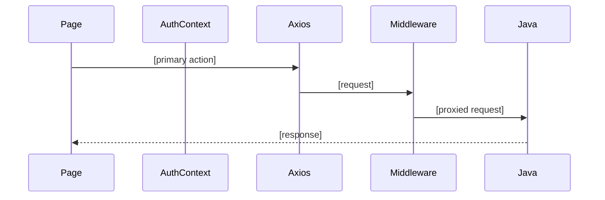

# [Page Name]

## Overview

[One paragraph: what this page does and who can access it.]

## Route

| Property | Value |
|----------|-------|
| URL | `/path` |
| Guard | `GuestRoute` / `OnboardingRoute` / `ProtectedRoute` / `AdminRoute` / none |
| Layout | `AppShell` / full-width / standalone |
| Redirects | [legacy aliases, if any] |

## Fields and inputs

| Field | Required | Validation | When shown |
|-------|----------|------------|------------|
| | Yes / No / Conditional | | |

## Actions

| Action | Trigger | Result |
|--------|---------|--------|
| | | |

## Auth and session

[Cookie/token behavior, or "N/A" for public static pages.]

## API endpoints

| User action | Frontend | Middleware (`/api/v1`) | Java (`/api`) |
|-------------|----------|------------------------|---------------|
| | | | |

## File map

### Frontend

| Role | Path |
|------|------|
| Page | `frontend/src/pages/...` |
| Components | `frontend/src/components/...` |
| Hooks / services | `frontend/src/...` |

### Middleware

| Role | Path |
|------|------|
| Routes | `middleware/src/routes/...` |

### Backend

| Role | Path |
|------|------|
| Controller | `backend/src/main/java/...` |

## Sequence diagram

## Edge cases

- [Errors, rate limits, query params, redirects]

## Related docs

- [shared/auth-infrastructure.md](../shared/auth-infrastructure.md)
- [shared/route-guards.md](../shared/route-guards.md)
