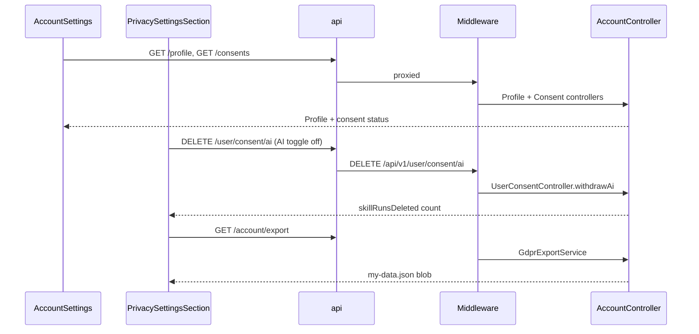

# Account Settings

## Overview

Full profile and preference editor for signed-in, onboarded users. Consolidates account identity, CV management, professional summary, work history, education, job-matching preferences (roles, tech, salary, visa, minimum match %), and GDPR privacy controls. Saving updates the profile via optimistic filter mutation plus `AuthContext.updateProfile`. Uses the same onboarding chip/slider patterns as `/onboarding`.

## Routes

| URL | Tab | Content |
|-----|-----|---------|
| `/account` | — | Redirects to `/account/profile` |
| `/account/profile` | Profile | Full profile editor (CV, work, education, job prefs, GDPR) |
| `/account/security` | Security | Password change, 2FA, active sessions, recent activity |
| `/account/notifications` | Notifications | Placeholder (coming soon) |
| `/account/billing` | Subscription & Billing | Plan, usage, Stripe portal, invoices, cancel |
| `/account/team` | Team | Placeholder (coming soon) |
| `/account/profile#danger-zone` | Danger Zone | Scroll target for GDPR / delete account |

| Property | Value |
|----------|-------|
| Guard | `ProtectedRoute` |
| Layout | `AccountSettingsLayout` — `DashboardTopNav` + left settings sidebar + `<Outlet />` (no `AppShell`) |
| Redirects | Cancel → `/dashboard`; Forgot password → `/forgot-password` with email in location state |

## Fields and inputs

| Field | Required | Validation | When shown |
|-------|----------|------------|------------|
| Full name | Yes (on save) | Non-empty trim | Account section |
| Email | — | Read-only | Account section |
| CV file | No | PDF or DOCX, max 5 MB (middleware) | CV section |
| Professional headline | No | Free text | Professional summary |
| Location | No | Free text | Professional summary |
| Preferred job location | No | Free text | Professional summary |
| Years of experience | No | `0-2`, `3-5`, `6-10`, `10+` | Professional summary |
| Work experience rows | No | Job title, company, dates, location, description | Work experience (min 1 row) |
| Education rows | No | School, degree combobox (B.Tech/MSc mapping), field, graduation year, location | Education (min 1 row) |
| Target roles | No | Chips + custom role | Job preferences |
| Tech stack | No | Chips + custom tech | Job preferences |
| Work types | Yes (on save) | At least one of Full-time, Part-time, Contract, etc. | Job preferences |
| Work setting | Yes (on save) | At least one of Remote, On-site, Hybrid | Job preferences |
| Minimum match % | No | Slider via `MinMatchPercentField` | Job preferences |
| Salary min/max (k) | No | 20–500; min ≤ max | Job preferences |
| Salary currency | No | EUR, USD, GBP | Job preferences |
| Availability | No | Preset options | Job preferences |
| Visa sponsorship | No | Checkbox | Job preferences |
| Consent toggles | No | Per consent type | Privacy & data |
| Delete account password | Conditional | Required for email/password accounts | Privacy & data |

## Actions

| Action | Trigger | Result |
|--------|---------|--------|
| Save all changes | Form submit | `settingsFormToPayload` → `useFiltersMutation` + `updateProfile`; toast success/error |
| Cancel | Link | Navigate to `/dashboard` |
| Upload / replace CV | File input | `POST /profile/cv`; reload profile into form |
| Download CV | Button when CV on file | `GET /profile/cv/download` → open signed URL or blob |
| Add/remove work or education | Buttons | Local form state only until save |
| Change password | Form on `/account/security` | `PATCH /account/password` → new tokens; revokes other sessions |
| Enable / disable 2FA | Buttons on `/account/security` | `POST /account/two-factor/*` (rollout-gated via `TWO_FACTOR_ROLLOUT_ENABLED`) |
| End session / End all | Links on `/account/security` | `DELETE /account/sessions/:id`, `POST /account/sessions/revoke-others` |
| View audit log | Link on `/account/security` | `GET /account/security/activity` (paginated modal) |
| Manage subscription | Button on `/account/billing` | `POST /billing/customer-portal` → Stripe redirect |
| Upgrade plan | Button on `/account/billing` | `POST /billing/checkout-session` |
| Cancel plan | Modal on `/account/billing` | `POST /billing/cancel` (falls back to portal if unavailable) |
| Turn on marketing / analytics | Toggle in `PrivacySettingsSection` | `POST /consents` |
| Turn off AI processing | Toggle off | `DELETE /user/consent/ai` → withdraws consent + purges `skill_runs` older than 30 days |
| Turn on AI processing | Toggle on | `POST /consents` with `AI_PROCESSING` accepted |
| Export my data | Button | `GET /account/export` → download `my-data.json` (includes skill runs + token usage) |
| Delete account | Password or Google re-auth | `POST /account/delete` (or `DELETE /account`) → sign out |

## API endpoints

| User action | Frontend | Middleware (`/api/v1`) | Java (`/api`) |
|-------------|----------|------------------------|---------------|
| Load profile | `GET /profile` | `GET /profile` | `ProfileController` `GET /profile` |
| Save settings | `PUT /profile` | `PUT /profile` | `ProfileController` `PUT /profile` |
| Upload CV | `POST /profile/cv` (multipart) | `POST /profile/cv` | `ProfileController` `POST /cv` |
| Download CV | `GET /profile/cv/download` | `GET /profile/cv/download` | `ProfileController` `GET /cv/download` |
| Get consents | `GET /consents` | `GET /consents` | `ConsentController` `GET /consents` |
| Update consent (marketing/analytics/AI on) | `POST /consents` | `POST /consents` | `ConsentController` `POST /consents` |
| Withdraw AI consent | `DELETE /user/consent/ai` | `DELETE /user/consent/ai` | `UserConsentController` `DELETE /user/consent/ai` |
| Export data | `GET /account/export` | `GET /account/export` | `AccountController` `GET /export` |
| Delete account | `POST /account/delete` | `POST /account/delete` | `AccountController` `POST /delete` |
| Subscription | `GET /billing/subscription` | `GET /billing/subscription` | `BillingController` `GET /subscription` |
| Checkout | `POST /billing/checkout-session` | `POST /billing/checkout-session` | `BillingController` `POST /checkout-session` |
| Customer portal | `POST /billing/customer-portal` | `POST /billing/customer-portal` | `BillingController` `POST /customer-portal` |
| Change password | `PATCH /account/password` | `PATCH /account/password` | `AccountController` `PATCH /password` |
| List sessions | `GET /account/sessions` | `GET /account/sessions` | `SecurityController` `GET /sessions` |
| Revoke session | `DELETE /account/sessions/:id` | `DELETE /account/sessions/:id` | `SecurityController` `DELETE /sessions/{id}` |
| Revoke other sessions | `POST /account/sessions/revoke-others` | `POST /account/sessions/revoke-others` | `SecurityController` `POST /sessions/revoke-others` |
| Security activity | `GET /account/security/activity` | `GET /account/security/activity` | `SecurityController` `GET /security/activity` |
| 2FA status / setup | `GET/POST /account/two-factor/*` | proxied | `SecurityController` + `TwoFactorService` |
| Login 2FA step-up | `POST /auth/two-factor/verify` | `POST /auth/two-factor/verify` | `AuthController` after `requiresTwoFactor` login |

## File map

### Frontend

| Role | Path |
|------|------|
| Layout shell | `frontend/src/pages/account/AccountSettingsLayout.tsx` |
| Sidebar nav | `frontend/src/pages/account/AccountSettingsNav.tsx` |
| Profile tab | `frontend/src/pages/account/AccountProfilePage.tsx` |
| Security tab | `frontend/src/pages/account/AccountSecurityPage.tsx` |
| Security cards | `frontend/src/pages/account/security/ChangePasswordCard.tsx`, `TwoFactorCard.tsx`, `ActiveSessionsCard.tsx`, `RecentActivityCard.tsx`, `SecurityAuditModal.tsx` |
| Security API | `frontend/src/services/securityApi.ts` |
| Billing tab | `frontend/src/pages/account/AccountBillingPage.tsx` |
| Notifications / Team | `frontend/src/pages/account/AccountNotificationsPage.tsx`, `AccountTeamPage.tsx` |
| Shared form hook | `frontend/src/pages/account/useAccountSettingsForm.ts` |
| Shared form UI | `frontend/src/pages/account/accountSettingsShared.tsx` |
| Styles | `frontend/src/styles/account-settings.css` |
| Components | `frontend/src/components/dashboard/DashboardTopNav.tsx`, `frontend/src/components/onboarding/MinMatchPercentField.tsx`, `MonthYearField.tsx`, `PreferencesStep.tsx` (constants), `frontend/src/components/gdpr/PrivacySettingsSection.tsx` |
| Hooks / services | `frontend/src/hooks/queries/useFiltersMutation.ts`, `useUsageLimits.ts`, `frontend/src/context/AuthContext.tsx`, `frontend/src/services/api.ts`, `billingApi.ts`, `accountApi.ts`, `securityApi.ts`, `consentApi.ts` |
| Lib | `frontend/src/lib/settingsProfileForm.ts` |

### Middleware

| Role | Path |
|------|------|
| Routes | `middleware/src/routes/profile.routes.ts`, `account.routes.ts`, `consents.routes.ts`, `user.consent.routes.ts` |

### Backend

| Role | Path |
|------|------|
| Controllers | `ProfileController.java`, `AccountController.java`, `SecurityController.java`, `ConsentController.java`, `UserConsentController.java` |
| Services | `AccountSecurityService.java`, `TwoFactorService.java`, `UserConsentService.java`, `GdprExportService.java`, `UserAnonymizationService.java` |

## Sequence diagram

## Edge cases

- **Profile load failure**: Banner shown; form falls back to `defaultSettingsForm(user)`; toast error.
- **Save validation**: Empty name or missing work type/setting blocks save with toast (no API call).
- **Optimistic rollback**: `useFiltersMutation` reverts profile cache on `PUT` failure.
- **CV upload errors**: Generic toast; file input reset after selection.
- **Email immutable**: Display only; password reset via separate flow.
- **Google-only delete**: Requires Google re-auth token instead of password.
- **Not onboarded**: Redirected to `/onboarding` by `ProtectedRoute`.
- **AI consent off**: Dedicated withdrawal endpoint; does not use `POST /consents` with `accepted: false`.
- **Account delete body**: `POST /account/delete` used by frontend (reliable JSON body); equivalent to `DELETE /account`.

## Related docs

- [shared/gdpr-data-storage.md](../shared/gdpr-data-storage.md) — database storage and erasure detail
- [privacy/PAGE.md](../privacy/PAGE.md) — public policy (links here for exercise of rights)
