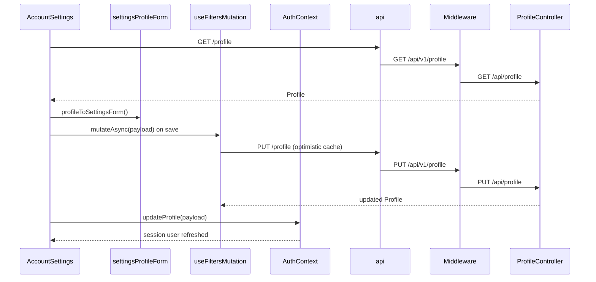

# Account Settings

## Overview

Full profile and preference editor for signed-in, onboarded users. Consolidates account identity, CV management, professional summary, work history, education, job-matching preferences (roles, tech, salary, visa, minimum match %), and GDPR privacy controls. Saving updates the profile via optimistic filter mutation plus `AuthContext.updateProfile`. Uses the same onboarding chip/slider patterns as `/onboarding`.

## Route

| Property | Value |
|----------|-------|
| URL | `/account` |
| Guard | `ProtectedRoute` |
| Layout | Full-width standalone with `DashboardTopNav` (no `AppShell` sidebar) |
| Redirects | Cancel → `/dashboard`; Forgot password → `/forgot-password` with email in location state |

## Fields and inputs

| Field | Required | Validation | When shown |
|-------|----------|------------|------------|
| Full name | Yes (on save) | Non-empty trim | Account section |
| Email | — | Read-only | Account section |
| CV file | No | PDF or DOCX, max 5 MB (middleware) | CV section |
| Professional headline | No | Free text | Professional summary |
| Location | No | Free text | Professional summary |
| Preferred job location | No | Free text | Professional summary |
| Years of experience | No | `0-2`, `3-5`, `6-10`, `10+` | Professional summary |
| Work experience rows | No | Job title, company, dates, description | Work experience (min 1 row) |
| Education rows | No | School, degree, field, graduation year | Education (min 1 row) |
| Target roles | No | Chips + custom role | Job preferences |
| Tech stack | No | Chips + custom tech | Job preferences |
| Work types | Yes (on save) | At least one of Full-time, Part-time, Contract, etc. | Job preferences |
| Work setting | Yes (on save) | At least one of Remote, On-site, Hybrid | Job preferences |
| Minimum match % | No | Slider via `MinMatchPercentField` | Job preferences |
| Salary min/max (k) | No | 20–500; min ≤ max | Job preferences |
| Salary currency | No | EUR, USD, GBP | Job preferences |
| Availability | No | Preset options | Job preferences |
| Visa sponsorship | No | Checkbox | Job preferences |
| Consent toggles | No | Per consent type | Privacy & data |
| Delete account password | Conditional | Required for email/password accounts | Privacy & data |

## Actions

| Action | Trigger | Result |
|--------|---------|--------|
| Save all changes | Form submit | `settingsFormToPayload` → `useFiltersMutation` + `updateProfile`; toast success/error |
| Cancel | Link | Navigate to `/dashboard` |
| Upload / replace CV | File input | `POST /profile/cv`; reload profile into form |
| Download CV | Button when CV on file | `GET /profile/cv/download` → open signed URL or blob |
| Add/remove work or education | Buttons | Local form state only until save |
| Forgot password | Link | `/forgot-password` with `state.email` |
| Update consent | Toggle in `PrivacySettingsSection` | `POST /consents` |
| Export my data | Button | `GET /account/export` → download JSON blob |
| Delete account | Password or Google re-auth | `DELETE /account` → sign out |

## API endpoints

| User action | Frontend | Middleware (`/api/v1`) | Java (`/api`) |
|-------------|----------|------------------------|---------------|
| Load profile | `GET /profile` | `GET /profile` | `ProfileController` `GET /profile` |
| Save settings | `PUT /profile` | `PUT /profile` | `ProfileController` `PUT /profile` |
| Upload CV | `POST /profile/cv` (multipart) | `POST /profile/cv` | `ProfileController` `POST /cv` |
| Download CV | `GET /profile/cv/download` | `GET /profile/cv/download` | `ProfileController` `GET /cv/download` |
| Get consents | `GET /consents` | `GET /consents` | Consent controller (proxied) |
| Update consent | `POST /consents` | `POST /consents` | Consent controller (proxied) |
| Export data | `GET /account/export` | `GET /account/export` | Account export (proxied) |
| Delete account | `DELETE /account` | `DELETE /account` | Account deletion (proxied) |

## File map

### Frontend

| Role | Path |
|------|------|
| Page | `frontend/src/pages/AccountSettings.tsx` |
| Components | `frontend/src/components/dashboard/DashboardTopNav.tsx`, `frontend/src/components/onboarding/MinMatchPercentField.tsx`, `MonthYearField.tsx`, `PreferencesStep.tsx` (constants), `frontend/src/components/gdpr/PrivacySettingsSection.tsx` |
| Hooks / services | `frontend/src/hooks/queries/useFiltersMutation.ts`, `frontend/src/context/AuthContext.tsx`, `frontend/src/services/api.ts`, `accountApi.ts`, `consentApi.ts` |
| Lib | `frontend/src/lib/settingsProfileForm.ts` |

### Middleware

| Role | Path |
|------|------|
| Routes | `middleware/src/routes/profile.routes.ts`, `account.routes.ts`, `consents.routes.ts` |

### Backend

| Role | Path |
|------|------|
| Controller | `backend/src/main/java/com/careerops/controller/ProfileController.java` |

## Sequence diagram

## Edge cases

- **Profile load failure**: Banner shown; form falls back to `defaultSettingsForm(user)`; toast error.
- **Save validation**: Empty name or missing work type/setting blocks save with toast (no API call).
- **Optimistic rollback**: `useFiltersMutation` reverts profile cache on `PUT` failure.
- **CV upload errors**: Generic toast; file input reset after selection.
- **Email immutable**: Display only; password reset via separate flow.
- **Google-only delete**: Requires Google re-auth token instead of password.
- **Not onboarded**: Redirected to `/onboarding` by `ProtectedRoute`.
