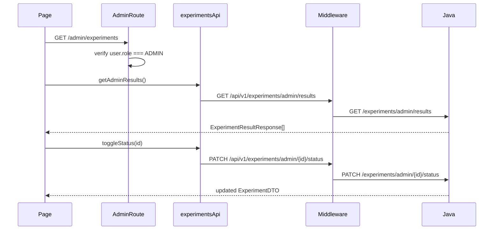

# Experiment Dashboard (Admin)

## Overview

Admin-only A/B experiment management dashboard. Lists experiments, shows conversion results per variant, and allows pausing/resuming active experiments. Requires `user.role === 'ADMIN'` via `AdminRoute`; non-admins are redirected to `/dashboard` with a toast. Renders inside `AppShell` (sidebar + top bar).

## Route

| Property | Value |
|----------|-------|
| URL | `/admin/experiments` |
| Guard | `AdminRoute` |
| Layout | `AppShell` |
| Redirects | — |

## Fields and inputs

| Field | Required | Validation | When shown |
|-------|----------|------------|------------|
| Tab selector | No | `experiments` \| `results` | Always (local state) |
| Pause / Resume | No | Disabled while `toggling === id` | Experiments tab; hidden when status is `completed` |

## Actions

| Action | Trigger | Result |
|--------|---------|--------|
| Load dashboard | Page mount | `GET /experiments/admin/results` → populate experiments + results tabs |
| Switch tab | Tab button click | Toggle between Experiments list and Results cards |
| Pause experiment | Pause button (active) | `PATCH /experiments/admin/{id}/status` → toast success/error |
| Resume experiment | Resume button (paused) | Same PATCH endpoint |
| Refresh (implicit) | Re-mount only | No manual refresh button |

## Auth and session

- Requires authenticated session with `ADMIN` role.
- Unauthenticated → `/login` with `state.from`.
- Authenticated non-admin → `/dashboard` + toast "Admin access required."
- Admin role is assigned via `APP_ADMIN_USER_IDS` env (see [mandatory-fields.md](../mandatory-fields.md)).
- API calls use authenticated Axios client (`co_session` cookie + CSRF).

## API endpoints

| User action | Frontend | Middleware (`/api/v1`) | Java (`/api`) |
|-------------|----------|------------------------|---------------|
| Load results | `experimentsApi.getAdminResults()` | `GET /experiments/admin/results` | `GET /experiments/admin/results` (`ExperimentAdminController`) |
| Toggle status | `experimentsApi.toggleStatus(id)` | `PATCH /experiments/admin/{id}/status` | `PATCH /experiments/admin/{id}/status` |
| Create experiment (unused in UI) | `experimentsApi.createExperiment()` | `POST /experiments/admin` | `POST /experiments/admin` |

Middleware proxy: `middleware/src/routes/experiments.routes.ts` → Java `/experiments`.

## File map

### Frontend

| Role | Path |
|------|------|
| Page | `frontend/src/pages/ExperimentDashboardPage.tsx` |
| Components | `frontend/src/components/PageMeta.tsx`, `frontend/src/components/LoadingSpinner.tsx` (`PageLoader`) |
| Services | `frontend/src/services/experimentsApi.ts` |
| Guard | `frontend/src/components/ProtectedRoute.tsx` (`AdminRoute`) |
| Layout | `frontend/src/components/layout/AppShell.tsx` |

### Middleware

| Role | Path |
|------|------|
| Routes | `middleware/src/routes/experiments.routes.ts` |

### Backend

| Role | Path |
|------|------|
| Controller | `backend/src/main/java/com/careerops/controller/ExperimentAdminController.java` |
| Repositories | `ExperimentRepository`, `ExperimentAssignmentRepository` |

## Sequence diagram

## Edge cases

- On load, experiment list is **derived** from results payload (all mapped to `status: 'active'`) — may not reflect true DB status until toggle is used.
- `toggleStatus` PATCH body must include `{ status }` per Java controller; verify frontend service sends correct payload.
- `createExperiment` API exists but no UI to create experiments on this page.
- Loading state shows full-page `PageLoader` until first fetch completes.
- Failed toggle shows `toast.error('Failed to toggle experiment.')`.

## Related docs

- [shared/auth-infrastructure.md](../shared/auth-infrastructure.md)
- [shared/route-guards.md](../shared/route-guards.md)
- [mandatory-fields.md](../mandatory-fields.md) — `APP_ADMIN_USER_IDS`
