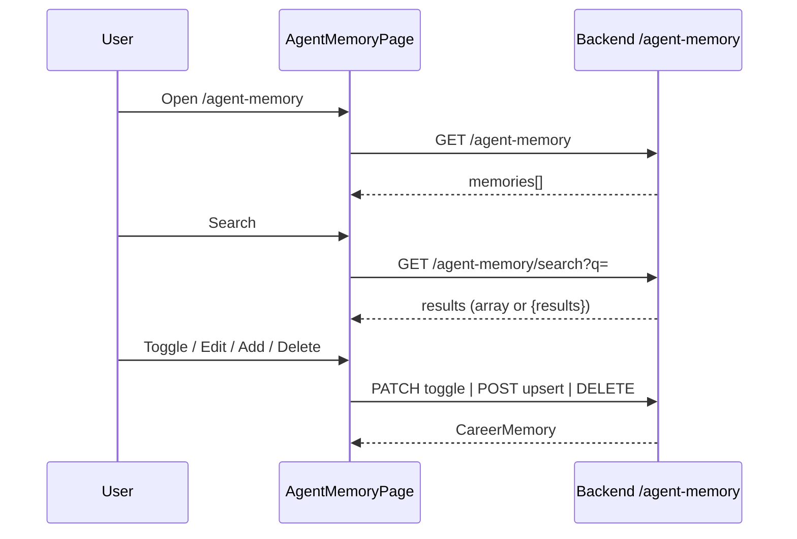

# Agent Memory

## Overview

CRUD for **career memories** injected into AI skill prompts. Filter by category, toggle enable/disable, semantic search against local agent-memory daemon, manual add.

## Route

| Item | Value |
|------|-------|
| Path | `/agent-memory` |
| Guard | `ProtectedRoute` |
| Layout | `AppShell` |
| Lazy import | `AgentMemoryPage` in `App.tsx` |

## Main UI fields / actions

- **Semantic search:** query input + Search; shows matched contexts
- **Category filters:** all, skills, experience, preferences, personal, goals, other
- **Memory row:** toggle, content, category/source badges, edit/save/delete
- **Add memory:** textarea, category select, Add Memory
- **Info box:** How memories feed Skills (static)

## API endpoints

| Method | Endpoint | Action |
|--------|----------|--------|
| GET | `/agent-memory` | List memories |
| POST | `/agent-memory` | Create/update (`agentMemoryApi.upsert`) |
| GET | `/agent-memory/search?q=` | Semantic search |
| PATCH | `/agent-memory/{id}/toggle` | Enable/disable |
| DELETE | `/agent-memory/{id}` | Delete one |

Not used on page: `DELETE /agent-memory` (bulk clear).

## File map

| File | Role |
|------|------|
| `frontend/src/pages/AgentMemoryPage.tsx` | Page + MemoryRow |
| `frontend/src/services/agentMemoryApi.ts` | HTTP client |
| `frontend/src/components/ui/EmptyState.tsx` | Empty category filter |

## Sequence diagram

## Edge cases

- **Search response shapes:** Handles raw array or `{ results: [] }`; otherwise error toast.
- **Search daemon down:** Surfaces `response.data.error` or generic daemon message.
- **Disabled memories:** Row at 50% opacity; excluded from prompts server-side when toggled off.
- **New memory key:** Client-generated `{category}-{slug}-{timestamp}`.
- **Empty filtered category:** EmptyState inside list card.
