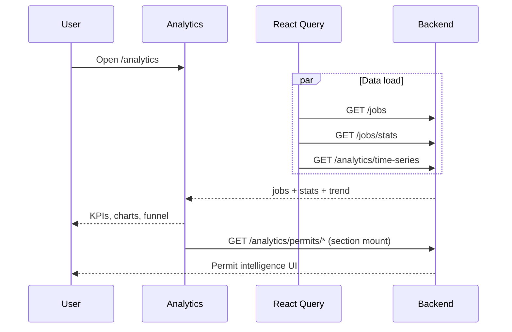

# Analytics

## Overview

Job-search performance dashboard: KPIs, application trend chart, funnel, top sources/roles, offer banner. Includes **Irish Permit Intelligence** section (enterprise.gov.ie permit data). Refresh invalidates jobs + analytics caches.

## Route

| Item | Value |
|------|-------|
| Path | `/analytics` |
| Guard | `ProtectedRoute` |
| Layout | `AppShell` |
| Lazy import | `Analytics` in `App.tsx` |

## Main UI fields / actions

- **Refresh:** Re-fetch jobs list, stats, time series
- **KPIs:** jobs tracked, applications, interviews (+ response rate), avg match %
- **Application trend:** CSS mini bar chart (weekly from API or 14-day fallback from jobs)
- **Funnel:** Discovered → Applied → Interviews → Offers
- **Top job sources / role titles:** Derived from job list
- **Offer banner:** When `offers > 0`
- **Irish Permit Intelligence:** Sectors, companies, reliability, watchlist (`IrishPermitIntelligenceSection`)

## API endpoints

### Page metrics

| Method | Endpoint | Source |
|--------|----------|--------|
| GET | `/jobs?page=&size=` | `useJobsList` |
| GET | `/jobs/stats` | `useJobsStats` |
| GET | `/analytics/time-series?weeks=8` | `useAnalyticsTimeSeries` |

Stats/time-series optional: page derives stats from jobs if API stats missing.

### Permit section (child component)

| Method | Endpoint | Purpose |
|--------|----------|---------|
| GET | `/analytics/permits/summary` | Market summary |
| GET | `/analytics/permits/companies` | Company search |
| GET | `/analytics/permits/companies/{name}/profile` | Company profile |
| GET | `/analytics/permits/sectors` | Sector breakdown |
| GET | `/analytics/permits/market/trend` | Market trend |
| GET | `/analytics/permits/reliability/top` | Top sponsors |
| GET | `/analytics/permits/watchlist` | User permit watchlist |
| POST/DELETE | `/analytics/permits/watchlist/{name}` | Add/remove watch |

## File map

| File | Role |
|------|------|
| `frontend/src/pages/Analytics.tsx` | Main analytics UI |
| `frontend/src/components/permit-analytics/IrishPermitIntelligenceSection.tsx` | Permit block |
| `frontend/src/services/analyticsApi.ts` | Time series + summary |
| `frontend/src/services/permitAnalyticsService.ts` | Permit APIs |
| `frontend/src/hooks/queries/useAnalytics.ts` | React Query |
| `frontend/src/hooks/queries/useJobs.ts` | Jobs list/stats |

## Sequence diagram

## Edge cases

- **All sources fail + no jobs:** “Analytics are unavailable right now.”
- **Empty trend from API:** Falls back to 14-day histogram from job `deliveredAt`/`postedAt`.
- **Response rate in chart:** `responses` often 0 in time-series mapping.
- **Offer rate color:** Green if &gt; 5%.
- **Permit section:** May prompt sign-in for personalized industry insights.
