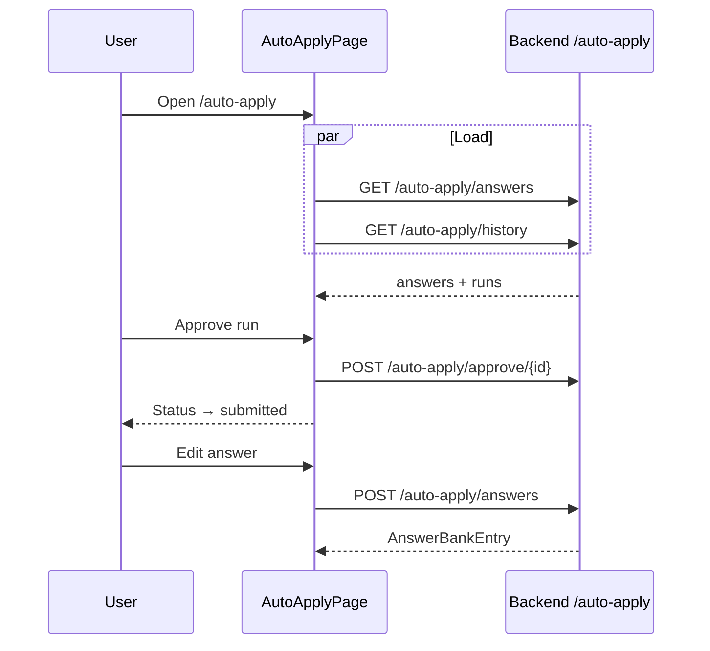

# Auto-Apply

## Overview

Manage **Answer Bank** (reusable application form answers) and **Run History** for browser-agent auto-applications. Approve pending runs, retry failures. Runs are started from Job Detail, not this page.

## Route

| Item | Value |
|------|-------|
| Path | `/auto-apply` |
| Guard | `ProtectedRoute` |
| Layout | `AppShell` |
| Lazy import | `AutoApplyPage` in `App.tsx` |

## Main UI fields / actions

- **Tabs:** Answer Bank \| Run History (badge if awaiting approval)
- **Answer rows:** question, answer, category chip; inline edit/save/delete
- **Add answer form:** question, answer, category select
- **Run cards:** job id stub, status chip, error message, Approve (awaiting_approval), Retry (failed)
- **How it works:** 3-step explainer (static)

## API endpoints

| Method | Endpoint | Action |
|--------|----------|--------|
| GET | `/auto-apply/answers` | List answer bank |
| POST | `/auto-apply/answers` | Upsert answer |
| DELETE | `/auto-apply/answers/{id}` | Delete answer |
| GET | `/auto-apply/history` | List runs |
| POST | `/auto-apply/approve/{runId}` | Approve submission (`{ approved: true }`) |
| POST | `/auto-apply/retry/{runId}` | Retry failed run |

Not used on page: `POST /auto-apply/start/{userJobId}`, `GET /auto-apply/status/{runId}`.

## File map

| File | Role |
|------|------|
| `frontend/src/pages/AutoApplyPage.tsx` | Page + subcomponents |
| `frontend/src/services/autoApplyApi.ts` | HTTP client |

## Sequence diagram

## Edge cases

- **Status mapping:** Backend `in_progress` → UI `running`; `completed` → `submitted`.
- **Run display:** Job title/company are placeholders (`Job {id slice}`, generic company).
- **Category on add:** UI category select not sent to API (category inferred from question key on read).
- **Empty history:** Directs user to Job Detail to start runs.
- **Approve/retry null response:** Handler returns early without UI update.
