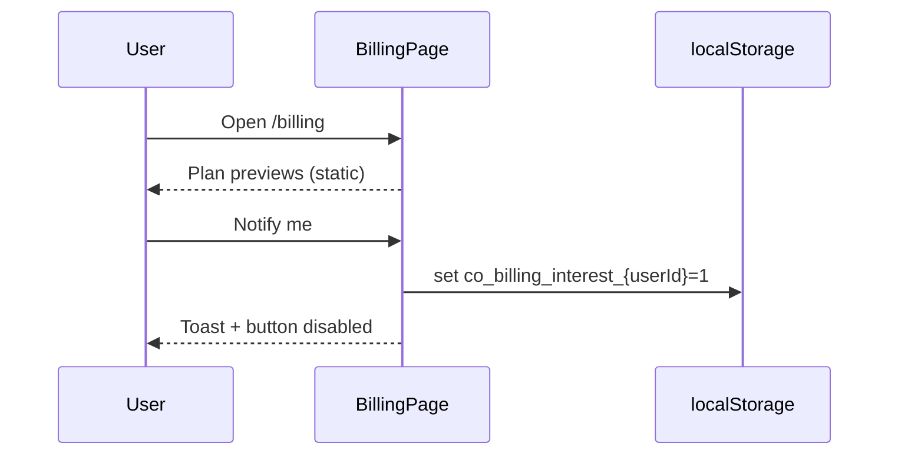

# Billing

## Overview

**Placeholder** — Stripe/billing backend not wired. Shows Free / Pro / Team plan previews and a local “notify me when Pro launches” interest toggle (localStorage only, no API).

## Route

| Item | Value |
|------|-------|
| Path | `/billing` |
| Guard | `ProtectedRoute` |
| Layout | `AppShell` |
| Lazy import | `BillingPage` in `App.tsx` |

## Main UI fields / actions

- **Coming soon banner:** Explains billing in progress; all features on Free plan
- **Plan cards:** Static `PLAN_PREVIEWS` (Free, Pro, Team) — not purchasable
- **Notify me:** Persists `co_billing_interest_{userId}` in `localStorage`; disabled when already registered or no user

## API endpoints

**None.** Comment in source: future `billingApi.registerInterest()` when `BillingController` exists.

Auth context only: `useAuth()` for `user.email` / `user.id` display.

## File map

| File | Role |
|------|------|
| `frontend/src/pages/BillingPage.tsx` | Placeholder UI |
| `frontend/src/context/AuthContext.tsx` | Current user (no billing calls) |

## Sequence diagram

## Edge cases

- **No user:** Notify button disabled (`!user`).
- **User switch:** `useEffect` re-reads localStorage key for new user id.
- **No payment methods, invoices, or subscription state** — intentionally omitted until backend ships.
- **Future migration:** Git history retains prior Stripe Elements UI per file comment.
