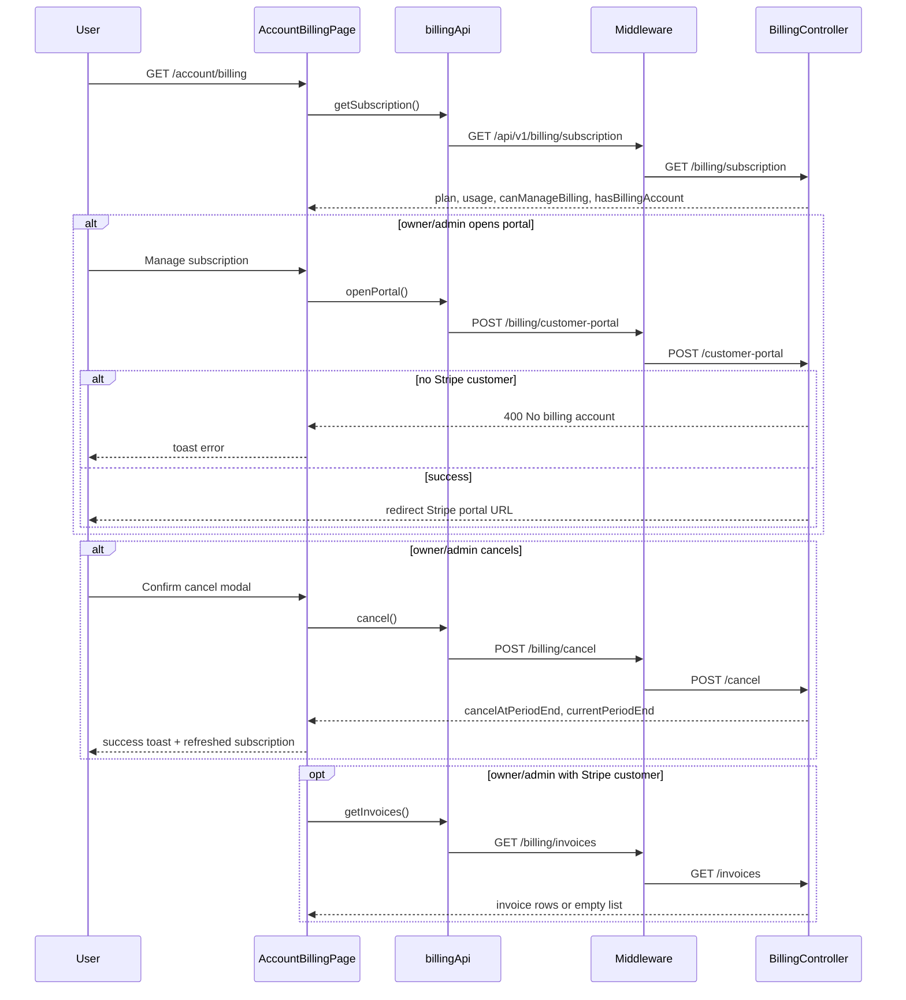
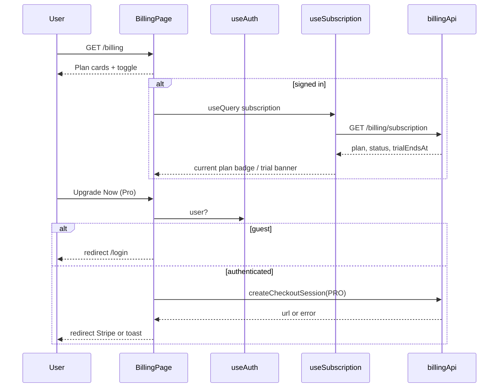

# Billing (Pricing)

## Overview

Public marketing pricing page for NewCareers at `/billing` (alias `/pricing`). Three **individual** plan tiers (Free, Pro, Elite), monthly/yearly toggle, current-plan badges, trial banner, and CTAs to get started or upgrade. Standalone layout (shared `MarketingNav` + footer, no `AppShell`).

## Route

| Property | Value |
|----------|-------|
| URL | `/billing` |
| Alias | `/pricing` → `/billing` (replace redirect) |
| Guard | none |
| Layout | standalone (`MarketingNav` + footer) |
| Redirects | — |

## Fields and inputs

| Field | Required | Validation | When shown |
|-------|----------|------------|------------|
| Billing interval | — | `monthly` \| `yearly` toggle | Always; updates displayed prices (yearly = 10% off monthly) |

## Actions

| Action | Trigger | Result |
|--------|---------|--------|
| Get Started Free | Free plan CTA | Navigate to `/get-started` |
| Upgrade Now | Paid plan CTA (guest) | Navigate to `/login` with `from: /billing` |
| Upgrade Now | Paid plan CTA (authenticated) | `billingApi.createCheckoutSession('PRO' \| 'ENTERPRISE')` → Stripe URL; toast on failure |
| Current Plan | Matching tier when signed in | Badge + disabled CTA |
| Trial banner | Signed-in + `status === TRIALING` | “X days left in your trial” under header |
| Monthly / Yearly | Toggle buttons | Updates displayed €/mo prices (yearly display-only until Stripe yearly prices) |
| Log In / Start Free | Nav | `/login`, `/get-started` |
| Features / Product / Company | Nav / footer | `/#features` on home |
| Legal | Footer | `/privacy` |
| Connect | Footer | `mailto:sales@newcareers.ai` |

## Auth and session

Public page — no guard. `useAuth()` gates checkout; `useSubscription()` (React Query, 5 min stale) loads plan/status/trial when signed in.

## API endpoints

| User action | Frontend | Middleware | Java |
|-------------|----------|------------|------|
| Load plan catalog | `GET /billing/plans` | public proxy | `GET /billing/plans` |
| Load current plan (signed in) | `GET /billing/subscription` | authGuard → proxy | `GET /billing/subscription` |
| Upgrade to Pro / Elite (signed in) | `POST /billing/checkout-session` `{ plan }` | authGuard → proxy | `POST /billing/checkout-session` |

Plan limit exceeded elsewhere in the app returns **402** with `PlanLimitErrorResponse`; `api.ts` emits `PlanLimitBanner` (mounted in `App.tsx`).

## Account billing (`/account/billing`)

Signed-in subscription management lives under account settings (not this public pricing page). See [account-settings/PAGE.md](../account-settings/PAGE.md).

| User action | Frontend | Middleware | Java |
|-------------|----------|------------|------|
| Load subscription + usage | `GET /billing/subscription` | `authGuard` → proxy | `GET /billing/subscription` |
| Open Stripe portal | `POST /billing/customer-portal` | `authGuard` → proxy | `POST /customer-portal` — 400 if no Stripe customer |
| Cancel at period end | `POST /billing/cancel` | `authGuard` → proxy | `POST /cancel` — owner/admin only |
| List invoices | `GET /billing/invoices` | `authGuard` → proxy | `GET /invoices` — owner/admin only |

### Account billing sequence

### Account billing edge cases

- **403 non-admin**: Member role sees subscription read-only; management and invoice actions are hidden (`canManageBilling: false`).
- **Portal 400**: No Stripe customer yet — upgrade via checkout first; UI hides portal CTA.
- **Cancel 502**: Stripe gateway failure — error toast; subscription unchanged.
- **Invoice errors**: Network/API failure shows banner; no customer returns `[]` not 501.
- **Trial / past due**: `StatusBannerStack` in `App.tsx` shows trial or payment banners app-wide.

## File map

### Frontend

| Role | Path |
|------|------|
| Public pricing page | `frontend/src/pages/BillingPage.tsx` |
| Account billing tab | `frontend/src/pages/account/AccountBillingPage.tsx` |
| Nav | `frontend/src/components/marketing/MarketingNav.tsx` |
| Hook | `frontend/src/hooks/useSubscription.ts` |
| Plan limit UX | `frontend/src/components/PlanLimitBanner.tsx`, `frontend/src/lib/planLimitEvents.ts` |
| Styles | `frontend/src/styles/pricing.css` |
| API | `frontend/src/services/billingApi.ts` |

## Sequence diagram

