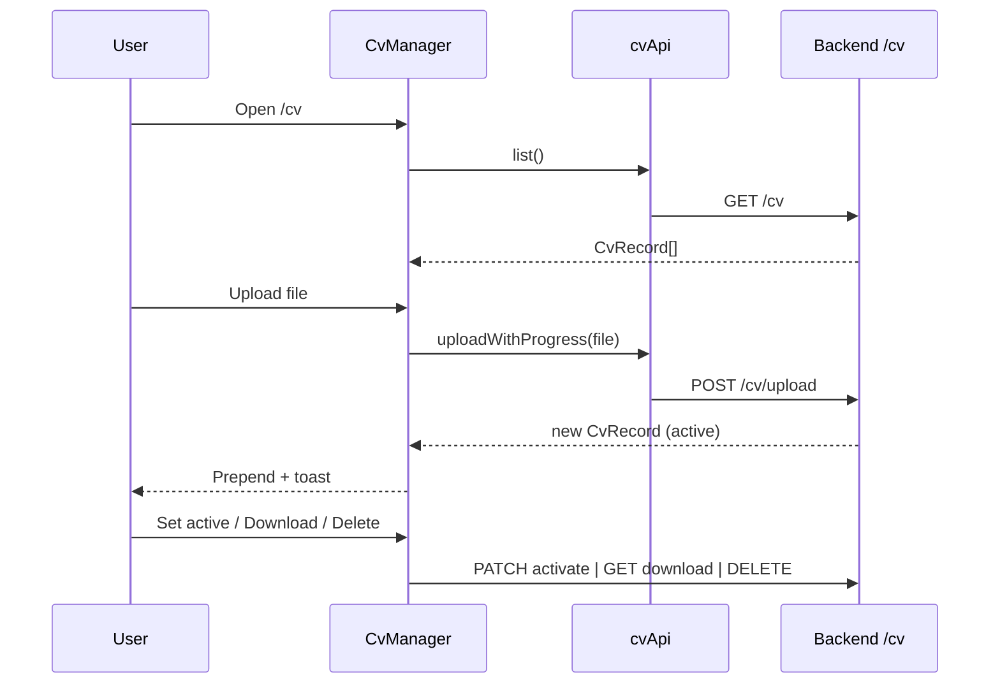

# CV Manager

## Overview

Upload and manage CV files (PDF/DOCX). One **active** CV drives all AI Skills. Drag-and-drop or file picker, progress upload, set active, download, delete (non-active only).

## Route

| Item | Value |
|------|-------|
| Path | `/cv` |
| Guard | `ProtectedRoute` |
| Layout | `AppShell` |
| Lazy import | `CvManager` in `App.tsx` |

## Main UI fields / actions

- **Upload CV:** file input + drop zone (PDF/DOCX, max 5 MB stated in UI)
- **Upload progress:** bar with cancel (`abort`)
- **Version cards:** name, active badge, relative time, size, set active (star), download, delete
- **Tips block:** Static CV tips (no API)

## API endpoints

| Method | Endpoint | Action |
|--------|----------|--------|
| GET | `/cv` | List versions (`cvApi.list`) |
| POST | `/cv/upload` | Upload with progress (`cvApi.uploadWithProgress`) |
| PATCH | `/cv/{id}/activate` | Set active (`cvApi.setActive`) |
| GET | `/cv/{id}/download` | Presigned/download URL (`cvApi.download`) |
| DELETE | `/cv/{id}` | Remove version (`cvApi.remove`) |

New upload sets uploaded file active in local state; server may also activate on upload.

## File map

| File | Role |
|------|------|
| `frontend/src/pages/CvManager.tsx` | Page + CvCard |
| `frontend/src/services/cvApi.ts` | HTTP client |
| `frontend/src/hooks/useFileUpload.ts` | Upload + progress + abort |

## Sequence diagram

## Edge cases

- **Wrong file type:** Client rejects non PDF/DOCX before upload.
- **Active CV:** Cannot delete; no star button when already active.
- **List load failure:** Toast only; empty list possible.
- **Upload error:** Red banner with message from `useFileUpload`.
- **Distinct from Resume Versions:** `/resume-versions` tracks outcomes; `/cv` is the Skills input CV.
- **Skills cache:** New upload or activate invalidates in-flight skill batches and clears `skill_runs` for the user on the backend (`CvService`); prior job-level cached outputs are not reused after CV change.
