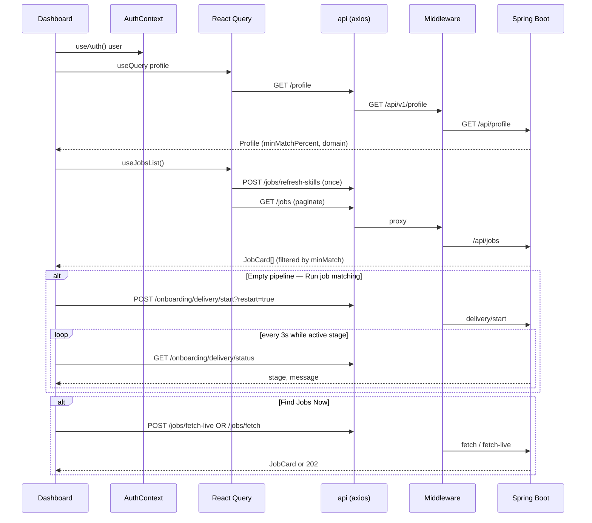

# Dashboard (Careers Home)

## Overview

Authenticated home screen after onboarding. `Dashboard.tsx` is a thin wrapper that loads the user profile, resolves a permit-intelligence domain key, and renders `CareersHomeDashboard` with an optional post-onboarding celebration (`?welcome=1` or `sessionStorage` flag `nc_welcome_pending`). The home layout shows a hero, a marquee of top job matches (up to 12), Irish permit intelligence, and weekly user analytics. Legacy pipeline tooling lives at `/pipeline`; this page focuses on discovery and momentum.

## Route

| Property | Value |
|----------|-------|
| URL | `/dashboard` |
| Query params | `welcome=1` — celebration hero after onboarding finish |
| Guard | `ProtectedRoute` (requires session + `user.onboarded`) |
| Layout | Full-width standalone (`useFullWidthLayout`); uses `DashboardTopNav`, not `AppShell` sidebar |
| Redirects | Onboarding completion → `/dashboard?welcome=1` when welcome flag is set |

## Fields and inputs

| Field | Required | Validation | When shown |
|-------|----------|------------|------------|
| *(none — read-only dashboard)* | — | — | — |

Interactive controls are buttons/links only (no form submission on this page).

## Actions

| Action | Trigger | Result |
|--------|---------|--------|
| View top matches | Hero CTA "View top matches" / "Go to Dashboard" | Smooth-scroll to `#top-matches`; clears welcome query flag |
| Refresh matches | "Refresh" link in Top Matches header | Re-fetches jobs list (`useJobsList` / `refetchJobs`) |
| View all matches | Link "View all matches" | Navigate to `/jobs` |
| Run job matching | "Run job matching" when pipeline empty | `POST /onboarding/delivery/start?restart=true`; polls delivery status every 3s |
| Find Jobs Now | Primary CTA in empty state | Empty pipeline → `fetchJobsOrchestrated(5)`; else `POST /jobs/fetch-live` (202 → poll delivery) |
| Adjust match threshold | Link when jobs exist but none pass `minMatchPercent` | Navigate to `/account` |
| Open job tracker | Link when `visibleMatches > 0` but marquee empty | Navigate to `/jobs` |
| Open skills coach | CTA on first match card | Navigate to `/jobs/:userJobId?tab=skills` |
| Open original posting | Via `TopMatchCard` | External `sourceUrl` when present |

## API endpoints

| User action | Frontend | Middleware (`/api/v1`) | Java (`/api`) |
|-------------|----------|------------------------|---------------|
| Load profile (domain key) | `GET /profile` | `GET /profile` | `ProfileController` `GET /profile` |
| Load top matches | `GET /jobs` (paginated `listAll`) | `GET /jobs` | `JobsController` `GET /jobs` |
| Refresh pipeline skills (first load) | `POST /jobs/refresh-skills` | `POST /jobs/refresh-skills` | `JobsController` `POST /jobs/refresh-skills` |
| Run onboarding job matching | `POST /onboarding/delivery/start` | `POST /onboarding/delivery/start` | `OnboardingController` `POST /delivery/start` |
| Poll matching progress | `GET /onboarding/delivery/status` | `GET /onboarding/delivery/status` | `OnboardingController` `GET /delivery/status` |
| Full job search (empty pipeline) | `POST /jobs/fetch?count=5` + poll | `POST /jobs/fetch` (rate-limited) | `JobsController` `POST /fetch` |
| Fetch one live job | `POST /jobs/fetch-live` | `POST /jobs/fetch-live` (rate-limited) | `JobsController` `POST /fetch-live` |
| Permit intelligence widget | `GET /analytics/permits/...` | `GET /analytics/permits/**` | `PermitAnalyticsController` |
| Weekly analytics tiles | `GET /analytics/summary`, `GET /analytics/time-series` | `GET /analytics/summary`, `GET /analytics/time-series` | `AnalyticsController` |
| Pipeline stats (secondary) | `GET /jobs/stats` | `GET /jobs/stats` | `JobsController` `GET /stats` |

## File map

### Frontend

| Role | Path |
|------|------|
| Page | `frontend/src/pages/Dashboard.tsx` |
| Main UI | `frontend/src/components/dashboard/CareersHomeDashboard.tsx` |
| Components | `frontend/src/components/dashboard/DashboardTopNav.tsx`, `TopMatchCard.tsx`, `DashboardUserAnalytics.tsx`, `frontend/src/components/analytics/DomainPermitWidget.tsx` |
| Hooks / services | `frontend/src/hooks/queries/useJobs.ts`, `useAnalytics.ts`, `usePermitAnalytics.ts`, `frontend/src/services/api.ts`, `permitAnalyticsService.ts`, `analyticsApi.ts` |
| Lib | `frontend/src/lib/pipelineJobSearch.ts`, `normalizeJobCard.ts`, `queryKeys.ts`, `utils/domainResolver.ts` |

### Middleware

| Role | Path |
|------|------|
| Routes | `middleware/src/routes/profile.routes.ts`, `jobs.routes.ts`, `onboarding.routes.ts`, `analytics.routes.ts` |

### Backend

| Role | Path |
|------|------|
| Controllers | `backend/src/main/java/com/careerops/controller/ProfileController.java`, `JobsController.java`, `OnboardingController.java`, `AnalyticsController.java`, `PermitAnalyticsController.java` |

## Sequence diagram

## Edge cases

- **Welcome state**: `?welcome=1` or `sessionStorage nc_welcome_pending`; cleared on scroll-to-matches; URL stripped via `navigate('/dashboard', { replace: true })`.
- **No matches**: Contextual copy from `emptyMatchesMessage()` based on delivery stage (`idle`, `failed`, active stages, `ready`, `ready_partial`), `visibleMatches`, `pipelineTotal`, and `minMatchPercent`.
- **SQL/stack traces hidden**: `sanitizeDeliveryError()` replaces JDBC/Hibernate errors with a friendly message.
- **Matching in flight**: Spinner + `deliveryStatus.message`; polls every 3s and invalidates jobs/discovery caches.
- **`fetch-live` 202**: Triggers `pollPipelineJobSearch()` then refetch jobs.
- **Profile min match filter**: Server applies `minMatchPercent`; jobs below threshold count toward `pipelineTotal` but not `visibleMatches`.
- **Refresh button bug**: Source calls `refetchRecommended()` which is undefined; intended behavior is `refetchJobs()` from `useJobsList` — may throw at runtime until fixed.
- **Unauthenticated / not onboarded**: `ProtectedRoute` redirects to `/login` or `/onboarding`.
