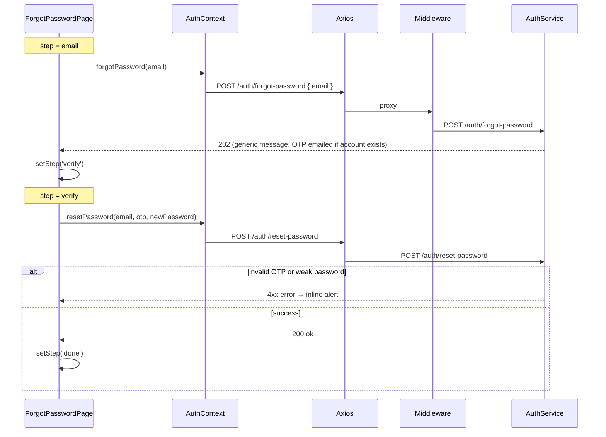

# Forgot Password

## Overview

Self-service password reset in three UI steps: enter email, verify 6-digit OTP and set new password, then confirmation with link to login. Uses the same OTP flow end-to-end with the backend. Guests only; does not reveal whether an email exists in the system.

## Route

| Property | Value |
|----------|-------|
| URL | `/forgot-password` |
| Guard | `GuestRoute` |
| Layout | Standalone (`AuthPageShell`) |
| Redirects | Logged-in user → `/dashboard` or `/onboarding` |

### Location state (from `/reset-password` legacy redirect)

| State key | Effect |
|-----------|--------|
| `step: 'verify'` | Opens directly on OTP + password step |
| `email` | Pre-fills email on verify step |

## Fields and inputs

### Step: `email`

| Field | Required | Validation | When shown |
|-------|----------|------------|------------|
| Email | Yes | HTML5 email; trimmed on submit | Email step |

### Step: `verify`

| Field | Required | Validation | When shown |
|-------|----------|------------|------------|
| 6-digit OTP | Yes | Exactly 6 digits (`OtpInput`) | Verify step |
| New password | Yes | Min 8 chars; strength score ≥ 3 (Fair+) | Verify step |
| Confirm password | Yes | Must match new password | Verify step |

Password strength labels: Too short, Weak, Fair, Strong (score from upper/lower/digit/symbol heuristics).

### Step: `done`

No inputs — confirmation message and "Sign in" button only.

## Actions

| Action | Trigger | Result |
|--------|---------|--------|
| Send verification code | Email form submit | `forgotPassword(email)` → advance to `verify` step |
| Resend code | Button on verify step | Re-sends OTP; 60s cooldown (`RESEND_COOLDOWN_SEC`) |
| Reset password | Verify form submit | `resetPassword(email, otp, password)` → `done` step |
| Use different email | Button on verify step | Return to `email` step, clear OTP |
| Sign in | Link / done CTA | Navigate to `/login` |
| Back to sign in | Footer link | Navigate to `/login` |

## Auth and session

Password reset does not establish a session. Successful reset only updates the password server-side; user must sign in separately.

Forgot-password always returns HTTP 202 with a generic message regardless of whether the email exists (middleware and backend enforce non-enumeration).

## API endpoints

| User action | Frontend | Middleware (`/api/v1`) | Java (`/api`) |
|-------------|----------|------------------------|---------------|
| Request OTP | `authApi.forgotPassword` | `POST /auth/forgot-password` | `POST /auth/forgot-password` |
| Reset with OTP | `authApi.resetPassword` | `POST /auth/reset-password` | `POST /auth/reset-password` |

Forgot request: `{ email }`. Reset request: `{ email, otp, newPassword }`.

Middleware forgot-password always responds `202` with: `"If that email exists in our system, we have sent a reset OTP."` even on backend errors (logged server-side).

## File map

### Frontend

| Role | Path |
|------|------|
| Page | `frontend/src/pages/ForgotPasswordPage.tsx` |
| OTP input | `frontend/src/components/auth/OtpInput.tsx` |
| Shell | `frontend/src/components/auth/AuthPageShell.tsx` |
| Auth methods | `frontend/src/context/AuthContext.tsx` (`forgotPassword`, `resetPassword`) |
| HTTP client | `frontend/src/services/api.ts` |
| Route guard | `frontend/src/components/ProtectedRoute.tsx` (`GuestRoute`) |

### Middleware

| Role | Path |
|------|------|
| Auth routes | `middleware/src/routes/auth.routes.ts` — `/forgot-password`, `/reset-password` |

### Backend

| Role | Path |
|------|------|
| Controller | `backend/src/main/java/com/careerops/controller/AuthController.java` |
| OTP + reset logic | `backend/src/main/java/com/careerops/service/AuthService.java` |
| Reset email | `backend/src/main/java/com/careerops/email/PasswordResetOtpEmail.java` |

## Sequence diagram

## Edge cases

- **Email enumeration prevented**: Success UI shown even if email unknown; same 202 response.
- **Resend cooldown**: 60 seconds between resend attempts; button disabled during cooldown.
- **Legacy `/reset-password` entry**: Redirects here with `state: { step: 'verify', email }` and optional `?email=` query preserved via state.
- **OTP length**: Client blocks submit unless exactly 6 digits.
- **Password mismatch**: Client-side check before API call.
- **Weak password**: Client requires strength score ≥ 3 before submit.
- **Rate limiting**: `authLimiter` on middleware; 429 on resend with retry messaging from backend.
- **Logged-in user**: `GuestRoute` redirects before page renders.
- **No auto-login**: After `done`, user must use `/login` manually.

## Related docs

- [shared/auth-infrastructure.md](../shared/auth-infrastructure.md)
- [shared/route-guards.md](../shared/route-guards.md)
- [reset-password/PAGE.md](../reset-password/PAGE.md)
