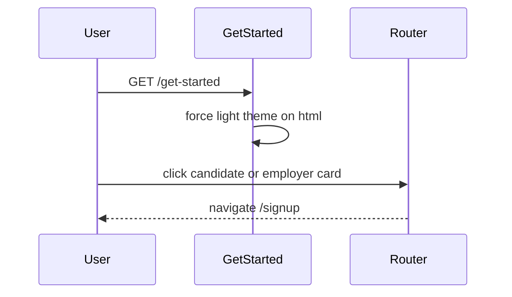

# Get Started

## Overview

Public path-selection page where visitors choose candidate vs employer onboarding. Both cards route to `/signup` today (employer-specific flow not yet split). Forces light theme for the duration of the visit. Accessible to everyone with no authentication required.

## Route

| Property | Value |
|----------|-------|
| URL | `/get-started` |
| Guard | none |
| Layout | standalone (`get-started-page` custom layout) |
| Redirects | — |

## Fields and inputs

| Field | Required | Validation | When shown |
|-------|----------|------------|------------|
| — | — | — | No form inputs; two `Link` cards only |

## Actions

| Action | Trigger | Result |
|--------|---------|--------|
| Get Started as Candidate | Candidate card click | Navigate to `/signup` |
| Get Started as Employer | Employer card click | Navigate to `/signup` |
| Sign in | Footer link | Navigate to `/login` |
| Logo | Header link | Navigate to `/` |
| Legal links | Footer nav | Navigate to `/privacy`, `/terms`, `/help` |
| Contact Sales | Footer link | Navigate to `/sales` (no route registered — 404) |

## Auth and session

N/A — public page. Does not check `useAuth()`.

On mount, adds `light` class to `document.documentElement` and removes it on unmount (does not remove `dark` class on cleanup — only removes `light`).

## API endpoints

| User action | Frontend | Middleware (`/api/v1`) | Java (`/api`) |
|-------------|----------|------------------------|---------------|
| — | — | — | No API calls on this page |

## File map

### Frontend

| Role | Path |
|------|------|
| Page | `frontend/src/pages/GetStarted.tsx` |
| Components | `frontend/src/components/PageMeta.tsx` |
| Styles | `frontend/src/styles/get-started.css` |

### Middleware

| Role | Path |
|------|------|
| Routes | — |

### Backend

| Role | Path |
|------|------|
| Controller | — |

## Sequence diagram

## Edge cases

- Candidate and employer paths are identical (`/signup`) — employer-specific signup not implemented.
- Footer `/sales` link has no route in `App.tsx` — resolves to 404.
- Linked from Home nav and hero CTAs at `/get-started`.

## Related docs

- [shared/auth-infrastructure.md](../shared/auth-infrastructure.md)
- [shared/route-guards.md](../shared/route-guards.md)
