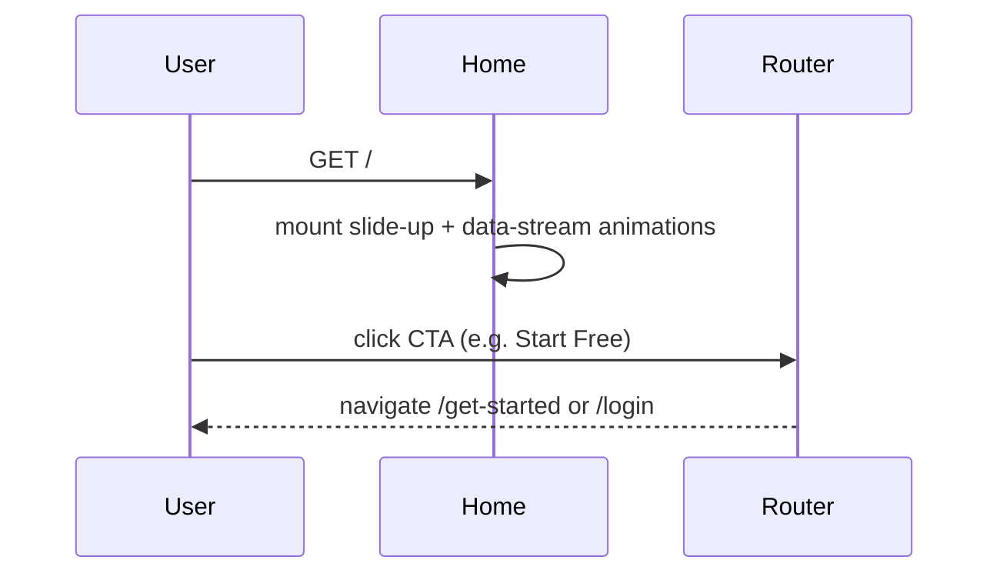

# Home

## Overview

Public marketing landing page for NewCareers. Split-hero layout with dark intelligence panel, six feature cards, three testimonial cards, and signup CTAs. Accessible to everyone with no authentication required. Renders a standalone layout (custom fixed nav + footer, no `AppShell`).

## Route

| Property | Value |
|----------|-------|
| URL | `/` |
| Guard | none |
| Layout | standalone (custom `TopNavBar` + footer) |
| Redirects | — |

## Fields and inputs

| Field | Required | Validation | When shown |
|-------|----------|------------|------------|
| — | — | — | Static page; no form inputs |

## Actions

| Action | Trigger | Result |
|--------|---------|--------|
| Start Free | Nav / hero CTA | Navigate to `/get-started` |
| See Plans | Hero secondary CTA | Navigate to `/pricing` (alias → `/billing`) |
| Log In | Nav / footer link | Navigate to `/login` |
| Features / How It Works | Nav / footer | Smooth scroll to `#features` |
| Pricing | Nav / footer | Navigate to `/pricing` |
| Blog | Nav / footer | Placeholder (`#`) |
| Privacy / Terms | Footer Legal | Navigate to `/privacy`, `/terms` |
| Connect | Footer Legal | `mailto:sales@newcareers.ai` |
| Mobile menu | Hamburger toggle | Opens/closes mobile nav drawer |

## Auth and session

N/A — public page. `AuthContext` may still bootstrap in the background via `App.tsx` providers, but the page does not read session state or gate content.

## API endpoints

| User action | Frontend | Middleware (`/api/v1`) | Java (`/api`) |
|-------------|----------|------------------------|---------------|
| — | — | — | No API calls on this page |

## File map

### Frontend

| Role | Path |
|------|------|
| Page | `frontend/src/pages/Home.tsx` |
| Components | `frontend/src/components/PageMeta.tsx` |
| Brand constants | `frontend/src/lib/brand.ts` |
| Styles | `frontend/src/styles/home.css` (landing animations + glass) |

### Middleware

| Role | Path |
|------|------|
| Routes | — |

### Backend

| Role | Path |
|------|------|
| Controller | — |

## Sequence diagram

## Edge cases

- Slide-up and data-stream animations respect `prefers-reduced-motion: reduce` (disabled in `home.css`).
- `PageMeta` title: `{BRAND_NAME} | Land Your Dream Job`.
- External dashboard preview image loaded from Google-hosted URL.
- Blog, Changelog, Careers, and Watch Demo are placeholders with no route/handler yet.
- Floating overlay cards on hero dashboard hidden on very small screens (`hidden sm:block`) to avoid overflow.

## Related docs

- [shared/auth-infrastructure.md](../shared/auth-infrastructure.md)
- [shared/route-guards.md](../shared/route-guards.md)
