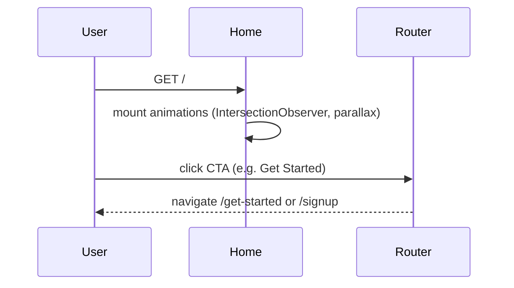

# Home

## Overview

Public marketing landing page for NewCareers. Presents product value, feature highlights, animated stats, and CTAs to sign up or get started. Accessible to everyone with no authentication required. Renders a standalone layout (custom nav + footer, no `AppShell`).

## Route

| Property | Value |
|----------|-------|
| URL | `/` |
| Guard | none |
| Layout | standalone (custom `TopNavBar` + footer) |
| Redirects | — |

## Fields and inputs

| Field | Required | Validation | When shown |
|-------|----------|------------|------------|
| — | — | — | Static page; no form inputs |

## Actions

| Action | Trigger | Result |
|--------|---------|--------|
| Get Started | Nav / hero CTA | Navigate to `/get-started` |
| Sign In | Nav link | Navigate to `/login` |
| Build Profile / Create Free Account | Feature / CTA sections | Navigate to `/signup` |
| For Employers | Hero secondary CTA | Navigate to `/employers` (no route registered — 404) |
| Contact Sales | Footer / CTA | `mailto:sales@newcareers.ai` |
| Anchor scroll | Nav links (`#jobs`, `#employers`, `#tips`, `#about`) | Smooth scroll to in-page sections |
| Legal links | Footer | Navigate to `/privacy`, `/terms`, `/help`, `/accessibility` |
| Mobile menu | Hamburger toggle | Opens/closes mobile nav drawer |

## Auth and session

N/A — public page. `AuthContext` may still bootstrap in the background via `App.tsx` providers, but the page does not read session state or gate content.

## API endpoints

| User action | Frontend | Middleware (`/api/v1`) | Java (`/api`) |
|-------------|----------|------------------------|---------------|
| — | — | — | No API calls on this page |

## File map

### Frontend

| Role | Path |
|------|------|
| Page | `frontend/src/pages/Home.tsx` |
| Components | `frontend/src/components/PageMeta.tsx` |
| Hooks / services | — |
| Styles | Tailwind utility classes (inline) |

### Middleware

| Role | Path |
|------|------|
| Routes | — |

### Backend

| Role | Path |
|------|------|
| Controller | — |

## Sequence diagram

## Edge cases

- Parallax and entrance animations respect `prefers-reduced-motion: reduce`.
- `/employers` link in hero has no matching route in `App.tsx` — users land on the catch-all 404.
- Brand name in UI is "NewCareers"; `PageMeta` title uses "NewCareers | Your Career Evolution Starts Here".
- External images loaded from Google-hosted URLs (platform preview, avatars).

## Related docs

- [shared/auth-infrastructure.md](../shared/auth-infrastructure.md)
- [shared/route-guards.md](../shared/route-guards.md)
