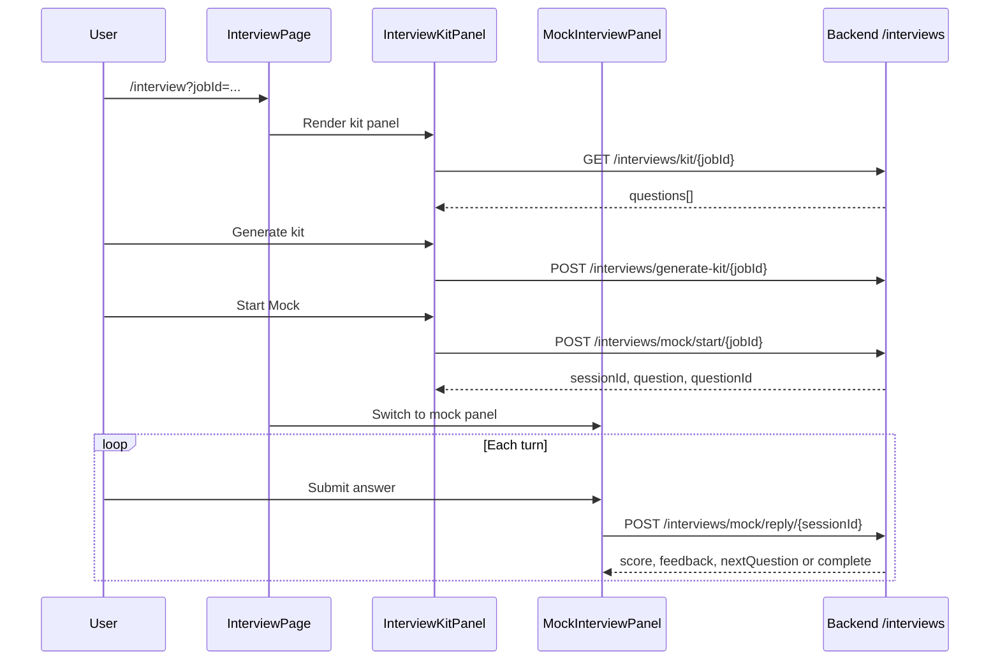

# Interview Command Center

## Overview

Job-scoped interview prep: AI kit (questions by skill area), mock interview Q&A with live scoring. Requires `?jobId=` query param (optional `company`, `role`). Without `jobId`, shows a pointer to open from Job Detail.

## Route

| Item | Value |
|------|-------|
| Path | `/interview` |
| Query | `jobId` (required), `company`, `role` |
| Guard | `ProtectedRoute` |
| Layout | `AppShell` |
| Lazy import | `InterviewPage` in `App.tsx` |

## Main UI fields / actions

- **No jobId:** Static help text only.
- **Kit view (`InterviewKitPanel`):** Generate kit, filter by skill area, expand questions, **Start Mock**
- **Mock view (`MockInterviewPanel`):** Answer textarea, submit turn, score/feedback per turn, final overall score; **← Back to Kit**

## API endpoints

Page delegates to child components via `interviewApi`:

| Method | Endpoint | Trigger |
|--------|----------|---------|
| GET | `/interviews/kit/{userJobId}` | Load existing kit |
| POST | `/interviews/generate-kit/{userJobId}` | Generate kit (body: companyName, roleTitle, jobDescription) |
| POST | `/interviews/mock/start/{userJobId}` | Start mock session |
| POST | `/interviews/mock/reply/{sessionId}` | Submit answer (body: questionId, answer) |

## File map

| File | Role |
|------|------|
| `frontend/src/pages/InterviewPage.tsx` | Query-param gate + kit/mock switch |
| `frontend/src/components/interview/InterviewKitPanel.tsx` | Kit + start mock |
| `frontend/src/components/interview/MockInterviewPanel.tsx` | Turn-by-turn mock |
| `frontend/src/services/interviewApi.ts` | HTTP client |

## Sequence diagram

## Edge cases

- **Missing `jobId`:** No API calls; empty-state message.
- **Empty jobDescription on generate:** Passed as `''` from page (kit may still generate from job context server-side).
- **Mock complete:** `onComplete` currently logs to console only.
- **Back to kit:** Clears local mock state; session remains on server.
- **Concurrent generate/start:** Buttons disabled while mutations pending.
