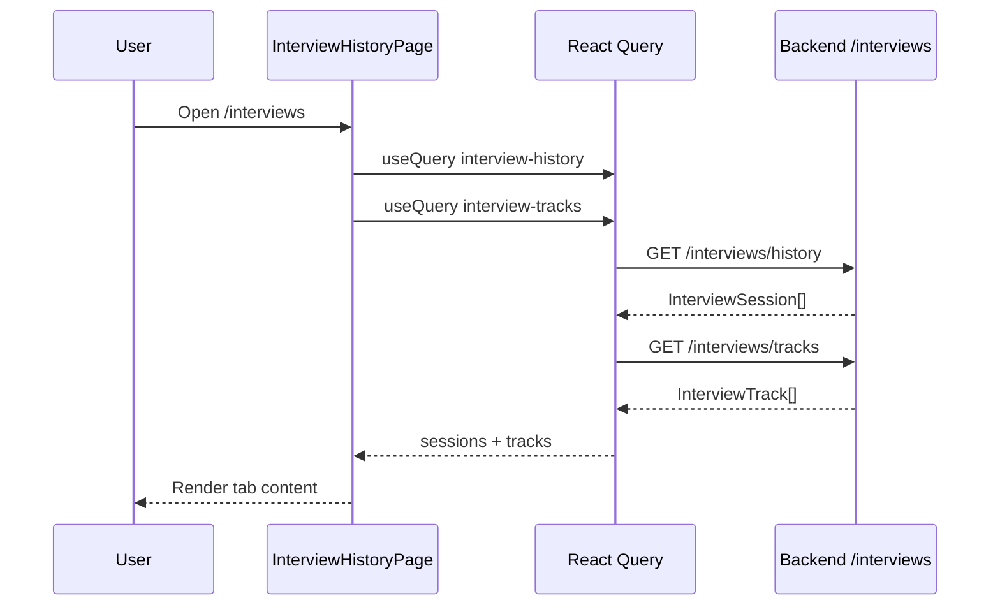

# Interview History

## Overview

Read-only dashboard of mock interview sessions and per-job interview pipeline tracks. Two tabs: **Mock Sessions** (scores, strengths/weaknesses) and **Pipeline Tracks** (company, role, stage, interview date).

## Route

| Item | Value |
|------|-------|
| Path | `/interviews` |
| Guard | `ProtectedRoute` (auth + onboarded) |
| Layout | `AppShell` (sidebar + top bar) |
| Lazy import | `InterviewHistoryPage` in `App.tsx` |

## Main UI fields / actions

- **Tabs:** `Mock Sessions` \| `Pipeline Tracks`
- **Session cards:** date, mode, status, overall score badge (0–10), strengths/weaknesses blocks
- **Track cards:** company, role, `currentStage` pill, optional interview date
- **No mutations** on this page (view only)

## API endpoints

| Method | Endpoint | Used for |
|--------|----------|----------|
| GET | `/interviews/history` | All mock sessions for user (`interviewApi.historyForUser`) |
| GET | `/interviews/tracks` | Interview pipeline tracks (`interviewApi.listTracks`) |

React Query keys: `interview-history`, `interview-tracks`.

## File map

| File | Role |
|------|------|
| `frontend/src/pages/InterviewHistoryPage.tsx` | Page component |
| `frontend/src/services/interviewApi.ts` | HTTP client |
| `frontend/src/App.tsx` | Route registration |
| `frontend/src/components/ProtectedRoute.tsx` | Auth + AppShell |
| `frontend/src/components/layout/AppShell.tsx` | Layout shell |

## Sequence diagram

## Edge cases

- **Empty sessions:** Dashed empty state; directs user to generate kit on a job.
- **Empty tracks:** Same; kit generation creates tracks.
- **Missing score:** `ScoreBadge` hidden when `overallScore` is null.
- **Unknown stage:** Falls back to gray pill styling.
- **Unauthenticated / not onboarded:** Redirect via `ProtectedRoute`.
