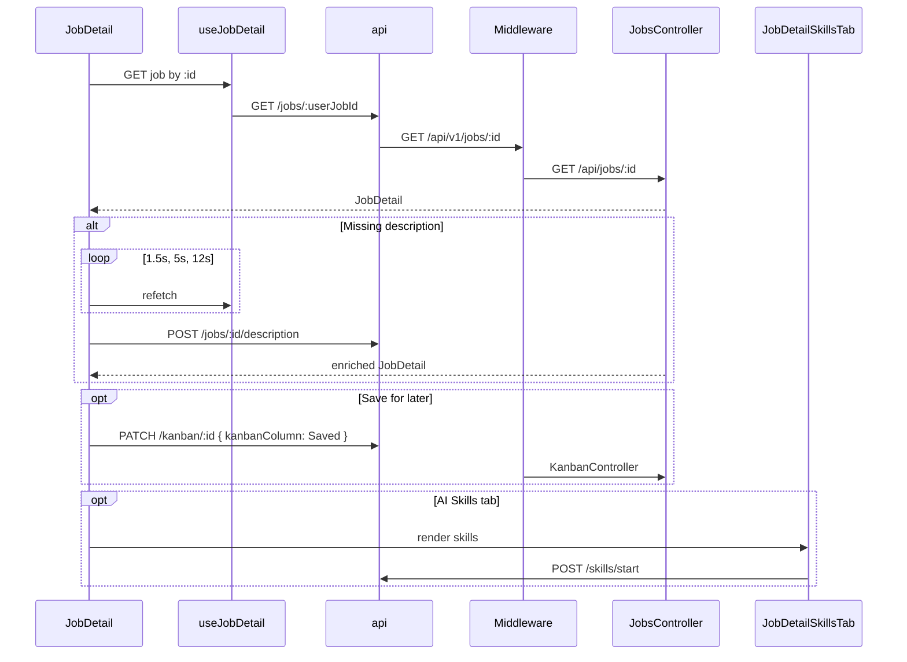

# Job Detail

## Overview

Single-job view for a pipeline role (`userJobId` from URL). Two tabs: **Overview** (description, AI match summary, CV tips) and **AI Skills** (full skills coach). Sidebar shows salary, apply/save/delete actions, match ring, and skill gap chips. Auto-retries description load and calls enrich endpoint when description is missing. Full-width layout with `DashboardTopNav`.

## Route

| Property | Value |
|----------|-------|
| URL | `/jobs/:id` (`id` = `userJobId`) |
| Query params | `tab=skills` — opens AI Skills tab on load |
| Guard | `ProtectedRoute` |
| Layout | Full-width standalone (`useFullWidthLayout`); `DashboardTopNav` |
| Redirects | Not found → link back to `/jobs`; delete success → `/jobs` |

## Fields and inputs

| Field | Required | Validation | When shown |
|-------|----------|------------|------------|
| Overview / AI Skills tabs | No | Toggle local `activeTab` | Always |
| Delete confirm | No | `ConfirmModal` | Delete Job |

No editable profile fields on this page; skills tab hosts skill-specific inputs inside `JobDetailSkillsTab`.

## Actions

| Action | Trigger | Result |
|--------|---------|--------|
| Apply now | Sidebar primary button | Opens `sourceUrl` in new tab; else toast |
| Save for later | Sidebar button | `PATCH /kanban/:id` → column `Saved` |
| Delete job | Sidebar → confirm | `DELETE /jobs/:id` → navigate `/jobs` |
| Switch tab | Tab buttons or `?tab=skills` | Overview ↔ AI Skills |
| Run / view evaluation | Buttons in overview or sidebar | Switches to skills tab; bumps `openEvaluationSignal` |
| Enrich description | Auto when description empty | Timed refetch then `POST /jobs/:id/description` |
| Refresh job | After skills / description load | `invalidateQueries` jobs.detail |

## API endpoints

| User action | Frontend | Middleware (`/api/v1`) | Java (`/api`) |
|-------------|----------|------------------------|---------------|
| Load job detail | `GET /jobs/:userJobId` | `GET /jobs/:userJobId` | `JobsController` `GET /{userJobId}` |
| Load profile (description section) | `GET /profile` | `GET /profile` | `ProfileController` `GET /profile` |
| Refresh pipeline skills | `POST /jobs/refresh-skills` (hook prefetch) | `POST /jobs/refresh-skills` | `JobsController` |
| Enrich description | `POST /jobs/:userJobId/description` | `POST /jobs/:userJobId/description` | `JobsController` `POST /{id}/description` |
| Save for later | `PATCH /kanban/:userJobId` | `PATCH /kanban/:userJobId` | `KanbanController` `PATCH /{userJobId}` |
| Delete job | `DELETE /jobs/:userJobId` | `DELETE /jobs/:userJobId` | `JobsController` `DELETE /{userJobId}` |
| AI skills (tab) | `POST /skills/start`, etc. | `middleware/src/routes/skills.routes.ts` | Skills backend |
| Evaluation progress (SSE) | Optional stream | Proxied | `JobEvaluationProgressController` |

## File map

### Frontend

| Role | Path |
|------|------|
| Page | `frontend/src/pages/JobDetail.tsx` |
| Components | `frontend/src/components/job-detail/JobDescriptionSection.tsx`, `JobDescriptionView.tsx`, `JobDetailSkillsTab.tsx`, `MatchSkillsLegend.tsx`, `JobEvaluationModal.tsx`, `frontend/src/components/dashboard/DashboardTopNav.tsx`, `frontend/src/components/ui/ConfirmModal.tsx` |
| Hooks / services | `frontend/src/hooks/queries/useJobs.ts` (`useJobDetail`), `frontend/src/services/api.ts` (`jobsApi`, `kanbanApi`, `profileApi`) |
| Lib | `frontend/src/lib/jobEvaluation.ts`, `plainJobDescription.ts`, `jobSource.ts`, `skillCatalog.ts` |

### Middleware

| Role | Path |
|------|------|
| Routes | `middleware/src/routes/jobs.routes.ts`, `kanban.routes.ts`, `profile.routes.ts`, `skills.routes.ts` |

### Backend

| Role | Path |
|------|------|
| Controllers | `backend/src/main/java/com/careerops/controller/JobsController.java`, `KanbanController.java`, `ProfileController.java`, `JobEvaluationProgressController.java` |

## Sequence diagram

## Edge cases

- **Invalid / missing id**: Loading spinner then "Job not found" with link to `/jobs`.
- **Heuristic evaluation**: `isHeuristicPlaceholderEvaluation` shows CTA to run full evaluation on overview.
- **CV tips**: Shown only when `hasActionableCvTips(job)`.
- **Optimistic saved column**: Local `savedColumn` overlays `kanbanColumn` until navigation away.
- **Apply without URL**: Toast "Apply via the original job posting."
- **Description polling**: Stops when `hasUsableJobDescription` true; final attempt triggers enrich POST.
- **Deep link**: `/jobs/:id?tab=skills` from dashboard "Open skills coach" CTA.
- **45s detail timeout**: `jobsApi.detail` uses extended axios timeout.
- **Delete in flight**: Save/delete buttons disabled while `saving` true.
