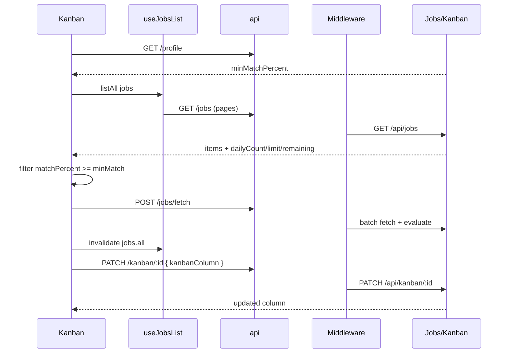

# Job Tracker (Kanban)

## Overview

Application pipeline tracker at `/jobs` (alias `/kanban` → redirect). Board and list views of jobs meeting the user's `minMatchPercent` profile setting. Supports stage changes (kanban columns), job fetch with daily caps, pipeline skill actions, delete with confirmation, and navigation to job detail. Uses full-width layout with `DashboardTopNav`.

## Route

| Property | Value |
|----------|-------|
| URL | `/jobs` |
| Legacy alias | `/kanban` → `/jobs` (replace) |
| Guard | `ProtectedRoute` |
| Layout | `DashboardLayout` (`DashboardTopNav` + page content) |
| Redirects | Job card click → `/jobs/:userJobId` |

## Fields and inputs

| Field | Required | Validation | When shown |
|-------|----------|------------|------------|
| View mode | No | `board` or `list` toggle | Header |
| List search | No | Filters title, company, location | List view only |
| List stage filter | No | ALL or kanban column | List view |
| List source filter | No | Derived from job sources | List view |
| Row stage select | No | `Discovered`, `Saved`, `Applied`, `Interview`, `Offer`, `Rejected` | List view per row |
| Delete confirm | No | `ConfirmModal` destructive | Delete action |

Board view uses drag-and-drop via `KanbanBoard` (column changes through board interactions).

## Actions

| Action | Trigger | Result |
|--------|---------|--------|
| Fetch jobs | Header button | `fetchJobsOrchestrated(5)`; invalidates jobs + delivery queries |
| Toggle board/list | View mode control | Local `viewMode` state |
| Open job | Board card or list "Open" | `navigate(/jobs/:userJobId)` |
| Change stage (list) | Stage `<select>` | Optimistic update → `PATCH /kanban/:id` |
| Delete job | Trash → confirm | `DELETE /jobs/:userJobId` |
| Pipeline skills | `PipelineSkillActions` | Quick skills (compare/triage/etc. via shared component) |
| Retry load | Error banner | `refetch()` on `useJobsList` |

## API endpoints

| User action | Frontend | Middleware (`/api/v1`) | Java (`/api`) |
|-------------|----------|------------------------|---------------|
| Load all jobs | `GET /jobs` (paginated `listAll`) | `GET /jobs` | `JobsController` `GET /jobs` |
| Load profile (min match) | `GET /profile` | `GET /profile` | `ProfileController` `GET /profile` |
| Refresh skills (first load) | `POST /jobs/refresh-skills` | `POST /jobs/refresh-skills` | `JobsController` `POST /refresh-skills` |
| Fetch more jobs | `POST /jobs/fetch?count=5` | `POST /jobs/fetch` (rate-limited) | `JobsController` `POST /fetch` |
| Move kanban column | `PATCH /kanban/:userJobId` | `PATCH /kanban/:userJobId` | `KanbanController` `PATCH /{userJobId}` |
| Delete job | `DELETE /jobs/:userJobId` | `DELETE /jobs/:userJobId` | `JobsController` `DELETE /{userJobId}` |
| Delivery status (after fetch) | `GET /onboarding/delivery/status` | `GET /onboarding/delivery/status` | `OnboardingController` |

## File map

### Frontend

| Role | Path |
|------|------|
| Page | `frontend/src/pages/Kanban.tsx` |
| Components | `frontend/src/components/kanban/KanbanBoard.tsx`, `PipelineSkillActions.tsx`, `frontend/src/components/dashboard/DashboardTopNav.tsx`, `frontend/src/components/ui/ConfirmModal.tsx`, `JobSourceBadge.tsx` |
| Hooks / services | `frontend/src/hooks/queries/useJobs.ts` (`useJobsList`, `useKanbanPatchMutation`), `frontend/src/services/api.ts` |
| Lib | `frontend/src/lib/pipelineJobSearch.ts`, `jobSource.ts`, `utils.ts` (`formatPulledAt`) |

### Middleware

| Role | Path |
|------|------|
| Routes | `middleware/src/routes/jobs.routes.ts`, `kanban.routes.ts`, `profile.routes.ts`, `onboarding.routes.ts` |

### Backend

| Role | Path |
|------|------|
| Controllers | `backend/src/main/java/com/careerops/controller/JobsController.java`, `KanbanController.java`, `ProfileController.java` |

## Sequence diagram

## Edge cases

- **Min match filter**: Client-side filter on `matchPercent >= profile.minMatchPercent` (default 60).
- **Daily cap**: `remaining <= 0` disables fetch; toast on 429 with limit message.
- **Empty tracker**: Empty state CTA to fetch; hidden while fetch in progress.
- **Saved under Discovered filter**: List stage filter `Discovered` includes `Saved` column jobs.
- **Optimistic stage change**: Reverts on patch failure via `setOptimisticJobs(null)`.
- **Fetch progress**: Banner with spinner and status message during orchestrated search.
- **Board empty but pipeline total > 0**: All jobs may be below min match — copy references account settings.
- **Legacy route**: `/kanban` redirects to `/jobs`.
