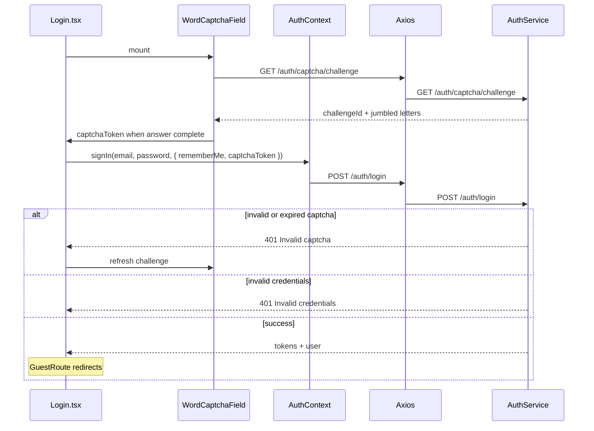

# Login

## Overview

Sign-in page for returning users. Supports email/password and Google OAuth, optional Remember Me, and a **built-in jumbled word CAPTCHA** below the password field (no Google reCAPTCHA iframe). Guests only; authenticated users are redirected into the app. Shows a session-expired banner when redirected from a silent refresh failure.

## Route

| Property | Value |
|----------|-------|
| URL | `/login` |
| Guard | `GuestRoute` |
| Layout | Standalone (`LoginPageShell` + `AuthIntelligencePanel` right panel) |
| Redirects | Logged-in + onboarded → `/dashboard` (or `from` path); logged-in + not onboarded → `/onboarding` |

### Query parameters

| Param | Effect |
|-------|--------|
| `?reason=session_expired` | Shows "Your session expired. Please sign in again." banner |
| `?email=` | Prefills the email field |

## Fields and inputs

Field order on the form: **Email → Password → Security check → Remember me → Submit**.

| Field | Required | Validation | When shown |
|-------|----------|------------|------------|
| Email | Yes | HTML5 `type="email"`, trimmed on submit | Always |
| Password | Yes | HTML5 `type="password"`, min length enforced server-side (8) | Always |
| Security check | Yes (prod) | User types jumbled characters left-to-right; case-insensitive | Production only (`LOGIN_WORD_CAPTCHA_REQUIRED`); hidden in local dev |
| Remember me | No | Checkbox; passed to `signIn` as `rememberMe: true` | Always |

Google sign-in does not use the word CAPTCHA.

### Security check UX

- On mount, `WordCaptchaField` fetches a new challenge from `GET /auth/captcha/challenge`.
- Server returns 5 jumbled characters with per-letter rotation/color.
- User types what they see; frontend builds `captchaToken` as `challengeId:answer`.
- **Refresh** loads a new challenge. Failed login also refreshes the challenge.

## Actions

| Action | Trigger | Result |
|--------|---------|--------|
| Sign in (email) | Form submit | Validates captcha client-side → `AuthContext.signIn` → `POST /auth/login` with `captchaToken` |
| Sign in (Google) | `LoginGoogleButton` credential | `AuthContext.signInWithGoogle` → `POST /auth/google` (no captcha) |
| Refresh security check | Button on captcha row | New `GET /auth/captcha/challenge` |
| Forgot password | Link | Navigate to `/forgot-password` |
| Sign up | Footer link | Navigate to `/signup` |
| Show/hide password | Eye toggle | Toggles input `type` |

## Auth and session

On successful login, middleware issues HttpOnly cookies and the frontend stores tokens:

| Remember me | Refresh token | Cookie behavior |
|-------------|---------------|-----------------|
| Unchecked | Returned in JSON body → `sessionStorage` via `tokenStore.set` | `co_refresh` session cookie (no max-age) |
| Checked | Not in JSON; HttpOnly `co_refresh` only | `co_refresh` + `co_remember` cookies, 30-day max-age |

Access token (`co_session`) is always a 15-minute HttpOnly cookie.

In **production** (and staging), every email login requires a valid `captchaToken`. In **local dev**, word CAPTCHA is disabled on both frontend and backend (`auth.login.word-captcha.required=false`). Failed login increments `failed_login_attempts`. At ≥5 failures, the account is locked for 15 minutes.

## API endpoints

| User action | Frontend | Middleware (`/api/v1`) | Java (`/api`) |
|-------------|----------|------------------------|---------------|
| Load captcha | `authApi.getWordCaptchaChallenge` | `GET /auth/captcha/challenge` | `GET /auth/captcha/challenge` |
| Email login | `authApi.login` | `POST /auth/login` | `POST /auth/login` |
| Google login | `authApi.google` | `POST /auth/google` | `POST /auth/google` |
| Session probe | `authApi.me` | `GET /auth/me` | `GET /auth/me` |

Login request body (email path): `{ email, password, rememberMe?, captchaToken? }` where `captchaToken` = `challengeId:answer` (required when word CAPTCHA is enabled).

## File map

### Frontend

| Role | Path |
|------|------|
| Page | `frontend/src/pages/Login.tsx` |
| Word CAPTCHA UI | `frontend/src/components/auth/WordCaptchaField.tsx` |
| Shell / intelligence panel | `frontend/src/components/auth/LoginPageShell.tsx`, `AuthIntelligencePanel.tsx` |
| Google button | `frontend/src/components/auth/LoginGoogleButton.tsx` |
| Copy constants | `frontend/src/components/auth/loginCopy.ts` |
| Auth state | `frontend/src/context/AuthContext.tsx` |
| HTTP client | `frontend/src/services/api.ts` |
| Route guard | `frontend/src/components/ProtectedRoute.tsx` (`GuestRoute`) |

### Middleware

| Role | Path |
|------|------|
| Auth routes | `middleware/src/routes/auth.routes.ts` |

### Backend

| Role | Path |
|------|------|
| Controller | `backend/src/main/java/com/careerops/controller/AuthController.java` |
| Login + brute-force | `backend/src/main/java/com/careerops/service/AuthService.java` |
| Word CAPTCHA | `backend/src/main/java/com/careerops/service/WordCaptchaService.java` |
| Google reCAPTCHA (onboarding only) | `backend/src/main/java/com/careerops/service/CaptchaService.java` |

## Sequence diagram

## Edge cases

- **Session expired redirect**: Axios interceptor sends users to `/login?reason=session_expired`.
- **Email prefill**: `?email=` pre-populates the field.
- **One-time challenge**: Each `challengeId` is consumed on verify; refresh or retry fetches a new one.
- **Challenge TTL**: 10 minutes server-side; expired challenges return invalid captcha.
- **Google-only account**: Server returns "This account uses Google Sign-In" for password login.
- **Account lockout**: 5+ failures → 15-minute lock.
- **No env keys required**: Unlike Google reCAPTCHA, login captcha needs no `VITE_RECAPTCHA_SITE_KEY`.

## Related docs

- [shared/auth-infrastructure.md](../shared/auth-infrastructure.md)
- [shared/route-guards.md](../shared/route-guards.md)
- [mandatory-fields.md](../mandatory-fields.md) — onboarding may still use Google reCAPTCHA
