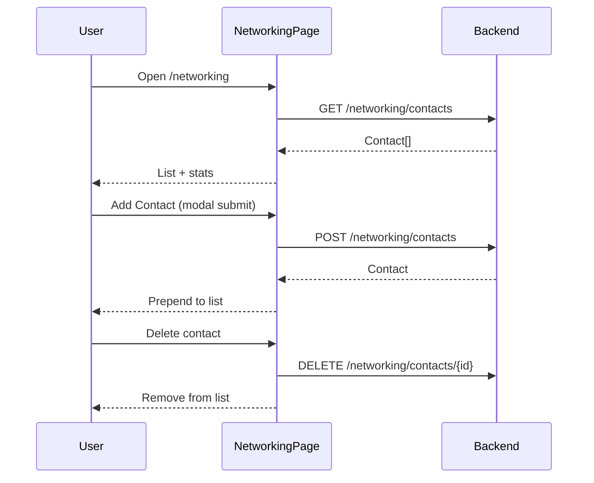

# Networking

## Overview

CRM-style contact list for recruiters, hiring managers, and peers. Search, stats, add via modal, delete with confirm. No inline edit of existing contacts.

## Route

| Item | Value |
|------|-------|
| Path | `/networking` |
| Guard | `ProtectedRoute` |
| Layout | `AppShell` |
| Lazy import | `NetworkingPage` in `App.tsx` |

## Main UI fields / actions

- **Header:** Add Contact
- **Search:** Filters name, company, roleTitle (client-side)
- **Stats:** Total contacts, warm/hot count, replied+meeting count
- **Contact card:** Name, temperature, pipeline stage, role @ company, notes, mailto/LinkedIn links, delete
- **Add Contact modal:** name*, company, roleTitle, email, linkedinUrl, contactType, relationshipTemperature, pipelineStage, notes

## API endpoints

| Method | Endpoint | Action |
|--------|----------|--------|
| GET | `/networking/contacts` | List contacts |
| POST | `/networking/contacts` | Create contact |
| DELETE | `/networking/contacts/{id}` | Remove contact |

Uses shared `api` axios instance (`@/services/api`).

## File map

| File | Role |
|------|------|
| `frontend/src/pages/NetworkingPage.tsx` | Page + AddContactModal |
| `frontend/src/services/api.ts` | Axios client |

## Sequence diagram

## Edge cases

- **Load failure:** Page still renders with empty list (no dedicated error UI).
- **Add without name:** Toast error; no request.
- **Delete cancel:** `window.confirm` aborts.
- **Search no matches:** Empty state with search-specific copy.
- **Optional fields:** Sent as `null` when blank.
