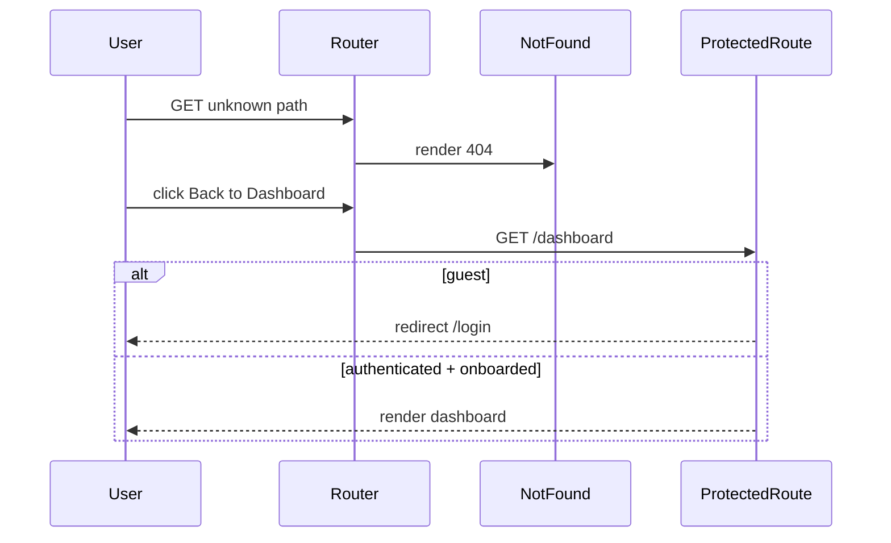

# Page Not Found (404)

## Overview

Catch-all error page for unknown routes. Renders outside `AppShell` (no sidebar or dashboard chrome). Offers a primary CTA back to `/dashboard` and secondary support links. Accessible to everyone; unauthenticated users clicking "Back to Dashboard" are redirected to `/login` by `ProtectedRoute`.

## Route

| Property | Value |
|----------|-------|
| URL | `*` (any unmatched path) |
| Guard | none |
| Layout | standalone (`not-found-page` custom layout) |
| Redirects | — |

## Fields and inputs

| Field | Required | Validation | When shown |
|-------|----------|------------|------------|
| — | — | — | No form inputs |

## Actions

| Action | Trigger | Result |
|--------|---------|--------|
| Back to Dashboard | Primary CTA | Navigate to `/dashboard` (guests → `/login` via guard) |
| Contact Support | Footer link | `mailto:support@newcareers.ai` |
| Report a Bug | Footer link | `mailto:support@newcareers.ai?subject=Bug%20report` |
| Privacy / Terms | Footer links | Navigate to `/privacy`, `/terms` |

## Auth and session

N/A on the 404 page itself. The dashboard CTA inherits normal `ProtectedRoute` behavior when followed.

## API endpoints

| User action | Frontend | Middleware (`/api/v1`) | Java (`/api`) |
|-------------|----------|------------------------|---------------|
| — | — | — | No API calls on this page |

## File map

### Frontend

| Role | Path |
|------|------|
| Page | `frontend/src/pages/NotFound.tsx` |
| Components | `frontend/src/components/PageMeta.tsx` |
| Styles | `frontend/src/styles/not-found.css` |
| Router | `frontend/src/App.tsx` (catch-all `path="*"`) |

### Middleware

| Role | Path |
|------|------|
| Routes | — |

### Backend

| Role | Path |
|------|------|
| Controller | — |

## Sequence diagram

## Edge cases

- Registered in `App.tsx` as the final `path="*"` route inside `RouteWithBoundary`.
- Mouse parallax on background "404" text disabled when `prefers-reduced-motion: reduce`.
- Common orphan/broken links (e.g. `/employers`, `/sales`) resolve here.
- Illustration loaded from external Google-hosted URL.

## Related docs

- [shared/auth-infrastructure.md](../shared/auth-infrastructure.md)
- [shared/route-guards.md](../shared/route-guards.md)
