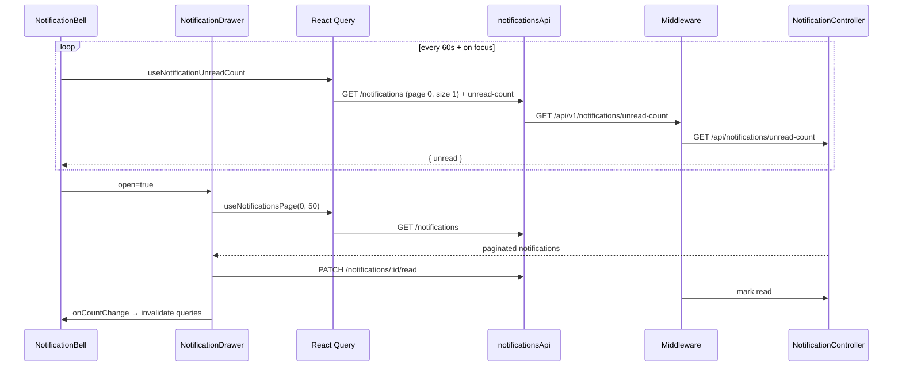

# Notifications (Bell + Drawer)

## Overview

Global notification UI embedded in `TopBar` (AppShell layout). Not a standalone route. `NotificationBell` shows an unread badge (polls every 60s) and opens `NotificationDrawer`, a right-side slide-over listing up to 50 notifications with type-specific icons, relative timestamps, mark-read, mark-all-read, and clear-all actions.

## Route

| Property | Value |
|----------|-------|
| URL | *(none — component only)* |
| Mount point | `frontend/src/components/layout/TopBar.tsx` (AppShell pages) |
| Guard | Inherited from parent route (`ProtectedRoute` + AppShell) |
| Layout | Fixed header control; drawer overlays current page |
| Redirects | N/A |

**Note:** Full-width pages (`/dashboard`, `/account`, `/jobs`, `/jobs/:id`) use `DashboardTopNav` and do **not** render `NotificationBell`.

## Fields and inputs

| Field | Required | Validation | When shown |
|-------|----------|------------|------------|
| *(none)* | — | — | Read-only list; click unread row to mark read |

## Actions

| Action | Trigger | Result |
|--------|---------|--------|
| Open drawer | Bell button click | `NotificationDrawer` open; fetches page 0 size 50 |
| Close drawer | Backdrop, X button, or `onClose` | Drawer closes; invalidates notification queries |
| Mark one read | Click unread list item | `PATCH /notifications/:id/read`; local optimistic update |
| Mark all read | Header button when unread > 0 | `PATCH /notifications/mark-all-read` |
| Clear all | Trash button when items exist | `DELETE /notifications` |
| Refresh count | 60s poll + tab focus/visibility | `useNotificationUnreadCount` refetch |

## API endpoints

| User action | Frontend | Middleware (`/api/v1`) | Java (`/api`) |
|-------------|----------|------------------------|---------------|
| List + unread count | `GET /notifications?page&size` + `GET /notifications/unread-count` | Same paths | `NotificationController` `GET /`, `GET /unread-count` |
| Mark one read | `PATCH /notifications/:id/read` | `PATCH /notifications/:id/read` | `NotificationController` `PATCH /{id}/read` |
| Mark all read | `PATCH /notifications/mark-all-read` | `PATCH /notifications/mark-all-read` | `NotificationController` `PATCH /mark-all-read` |
| Clear all | `DELETE /notifications` | `DELETE /notifications` | `NotificationController` `DELETE /` |

## File map

### Frontend

| Role | Path |
|------|------|
| Bell | `frontend/src/components/notifications/NotificationBell.tsx` |
| Drawer | `frontend/src/components/notifications/NotificationDrawer.tsx` |
| Host | `frontend/src/components/layout/TopBar.tsx` |
| Hooks / services | `frontend/src/hooks/queries/useNotifications.ts`, `frontend/src/services/notificationsApi.ts` |
| Types | `frontend/src/types/notification.ts` |

### Middleware

| Role | Path |
|------|------|
| Routes | `middleware/src/routes/notifications.routes.ts` |

### Backend

| Role | Path |
|------|------|
| Controller | `backend/src/main/java/com/careerops/controller/NotificationController.java` |

## Sequence diagram

## Edge cases

- **Badge cap**: Displays `99+` when unread > 99.
- **Polling paused in background**: `refetchIntervalInBackground: false`; refreshes on `visibilitychange` and window `focus`.
- **Drawer fetch gated**: `useNotificationsPage` only runs when `open === true`.
- **Local optimistic state**: `localItems` overrides server list until next open reset.
- **API errors swallowed**: `markRead` / `markAllRead` / `clearAll` use `.catch(() => {})` — UI may desync briefly.
- **Notification types**: `SKILL_COMPLETE`, `INTERVIEW_REMINDER`, `JOB_MATCH`, `WEEKLY_DIGEST`, `SYSTEM` (unknown → SYSTEM styling).
- **Not on full-width routes**: Users on dashboard/jobs/account job-detail never see the bell unless layout changes.
