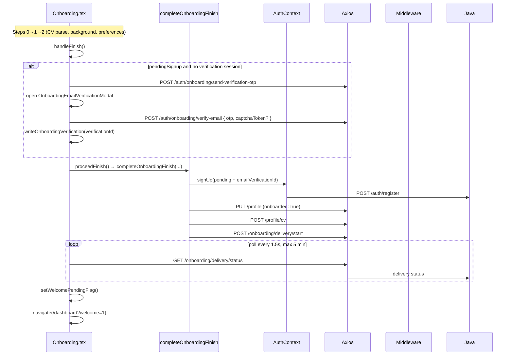

# Onboarding

## Overview

Three-step profile setup for new users: basic info + CV upload, work/education background, then job preferences. Uses deferred signup — guests enter with `pendingSignup` in sessionStorage; account is created on finish after email OTP verification. Polls job-delivery status and redirects to `/dashboard?welcome=1` when matching completes.

## Route

| Property | Value |
|----------|-------|
| URL | `/onboarding` |
| Guard | `OnboardingRoute` |
| Layout | Full-width standalone (`OnboardingPageShell`, no AppShell sidebar) |
| Redirects | No pending signup + no user → `/signup`; already onboarded → `/dashboard` or `/dashboard?welcome=1` if welcome flag set |

## Fields and inputs

### Step 0 — Basic info (`BasicInfoStep`)

| Field | Required | Validation | When shown |
|-------|----------|------------|------------|
| Full name | Yes | Non-empty trim | Step 0 |
| Headline | No | Free text; may prefill from CV parse | Step 0 |
| Years of experience | Yes | Selected value | Step 0 |
| Location | Yes | Default "Dublin, Ireland" | Step 0 |
| LinkedIn | No | Valid URL when provided; shown before CV upload | Step 0 |
| Portfolio website | No | Valid URL when provided; persisted as `websiteUrl` | Step 0 |
| GitHub | No | Valid URL when provided | Step 0 |
| CV file | Yes | PDF or DOCX, max 5 MB | Step 0 |

Empty link fields may be prefilled from CV header text after parse (user-entered values take precedence).

### Step 1 — Experience (collapsible sections)

Three collapsible sections: **Work Experience**, **Education**, and **Projects**. Each section shows an entry count badge and expands by default when CV parse found rows in that section.

| Section | Fields per entry | Required | When shown |
|---------|------------------|----------|------------|
| Work Experience | Job title, company, start/end date, location, "I currently work here", description | No* | Step 1 |
| Education | School/university, degree (smart combobox: B.Tech/MSc/etc.), field of study, graduation year, location | No* | Step 1 |
| Projects | Project name, project link (GitHub/demo URL), location, project details | No* | Step 1 |

\*Prefilled from `parse-cv`; user can add/remove entries. Projects are saved to `portfolioItems` on finish (via `addPortfolioItem` after profile update).

**Degree combobox:** Parsed free-text degrees (e.g. `BSc`, `B.Tech`, `MSc`) map to level labels; users can type or pick from the list.

**Finish flow for projects:** `completeOnboardingFinish` calls `profileApi.addPortfolioItem` per non-empty project row (URLs normalized to `https://`).

### Step 2 — Preferences (`PreferencesStep`)

| Field | Required | Validation | When shown |
|-------|----------|------------|------------|
| Target roles, tech stack | No | Multi-select chips | Step 2 |
| Work types | No | Default includes Full-time | Step 2 |
| Work settings (remote/hybrid) | No | `mergeWorkSettings` | Step 2 |
| Salary range | No | Min/max in k, currency | Step 2 |
| Availability | No | Default "2 weeks notice" | Step 2 |
| Sponsorship, match %, job age | No | Filter toggles | Step 2 |

CV is uploaded on Step 0 only; finish still requires `cvFile` in wizard state (no re-upload UI on Step 2).

### Email verification modal

| Field | Required | Validation | When shown |
|-------|----------|------------|------------|
| 6-digit OTP | Yes | Exactly 6 digits | Modal before finish (deferred signup, unverified email) |
| reCAPTCHA | Conditional | Required when `CAPTCHA_ENABLED` | Modal submit |

## Actions

| Action | Trigger | Result |
|--------|---------|--------|
| Continue (step 0) | Basic info submit | `authApi.parseOnboardingCv` → map to work/education/projects → advance to step 1 |
| Continue (step 1) | Experience form submit | Optional invalid project URL toast; advance to step 2 |
| Back | Buttons on steps 1–2 | Return to previous step |
| Complete profile / Find my jobs | `PreferencesStep.onComplete` → `handleFinish` | Email verify modal (if needed) → `proceedFinish` |
| Verify email | Modal OTP submit | `authApi.verifyOnboardingEmail` → `writeOnboardingVerification` → `proceedFinish` |
| Finish pipeline | `completeOnboardingFinish` | register → update profile → upload CV → start delivery → poll status |
| Skip to dashboard | Radar loader / eval modal close | `finishToDashboard` → `/dashboard?welcome=1` |

### `completeOnboardingFinish` order

1. **Register** (if `pendingSignup`): `signUp` with `emailVerificationId` from session
2. **Save profile**: `profileApi.update` with `onboarded: true` (work + education JSONB, including `location`, `degreeLevel`, `degreeTitle`)
3. **Upload CV**: `profileApi.uploadCv`
4. **Save projects**: `profileApi.addPortfolioItem` per onboarding project row
5. **Start delivery**: `onboardingApi.startDelivery`
5. Caller polls `onboardingApi.deliveryStatus` until `ready` or `readyPartial`

## Auth and session

| Artifact | Key / mechanism | Purpose |
|----------|-----------------|---------|
| Pending signup | `co_pending_signup_v1` (sessionStorage) | Credentials until register on finish |
| Email verification | `co_onboarding_verification_v1` (sessionStorage, 20 min TTL) | `verificationId` after OTP |
| CV parse draft | `onboardingCvDraft` helpers | Parsed markdown + counts between steps |
| Welcome flag | `nc_welcome_pending` (localStorage) | Dashboard celebration after first finish |
| Tokens | Created at register step inside finish flow | `ensureFreshSession` refreshes before profile save for existing users |

Session expiry during onboarding: toast + `redirectOnSessionExpired('/onboarding')` → signup with `?reason=session_expired`.

## API endpoints

| User action | Frontend | Middleware (`/api/v1`) | Java (`/api`) |
|-------------|----------|------------------------|---------------|
| Parse CV (step 0) | `authApi.parseOnboardingCv` | `POST /auth/onboarding/parse-cv` | `POST /auth/onboarding/parse-cv` |
| Send verification OTP | `authApi.sendOnboardingVerificationOtp` | `POST /auth/onboarding/send-verification-otp` | `POST /auth/onboarding/send-verification-otp` |
| Resend OTP | `authApi.resendOnboardingVerificationOtp` | `POST /auth/onboarding/resend-verification-otp` | `POST /auth/onboarding/resend-verification-otp` |
| Verify email | `authApi.verifyOnboardingEmail` | `POST /auth/onboarding/verify-email` | `POST /auth/onboarding/verify-email` |
| Register account | `authApi.signup` via `signUp` | `POST /auth/signup` | `POST /auth/register` |
| Update profile | `profileApi.update` | `PUT /profile` | `PUT /profile` |
| Upload CV | `profileApi.uploadCv` | `POST /profile/cv` | `POST /profile/cv` |
| Start job delivery | `onboardingApi.startDelivery` | `POST /onboarding/delivery/start` | `POST /onboarding/delivery/start` |
| Poll delivery | `onboardingApi.deliveryStatus` | `GET /onboarding/delivery/status` | `GET /onboarding/delivery/status` |
| Refresh session | `authApi.refresh` | `POST /auth/refresh` | `POST /auth/refresh` |

## File map

### Frontend

| Role | Path |
|------|------|
| Page | `frontend/src/pages/Onboarding.tsx` |
| Finish orchestration | `frontend/src/lib/completeOnboardingFinish.ts` |
| Pending signup | `frontend/src/lib/pendingSignup.ts` |
| Verification session | `frontend/src/lib/onboardingVerification.ts` |
| CV draft | `frontend/src/lib/onboardingCvDraft.ts` |
| CV → form mapping | `frontend/src/lib/mapCvParseToOnboarding.ts` |
| Profile payload builder | `frontend/src/lib/buildOnboardingProfilePayload.ts` |
| Session expiry helpers | `frontend/src/lib/onboardingSession.ts` |
| Step components | `BasicInfoStep.tsx`, `ExperienceStep.tsx`, `WorkExperienceSection.tsx`, `EducationSection.tsx`, `ProjectsSection.tsx`, `CollapsibleOnboardingSection.tsx`, `DegreeCombobox.tsx`, `PreferencesStep.tsx`, `OnboardingStepper.tsx`, `OnboardingPageShell.tsx` |
| Email modal | `frontend/src/components/onboarding/OnboardingEmailVerificationModal.tsx` |
| Delivery UI | `frontend/src/components/onboarding/JobSearchRadarLoader.tsx`, `JobEvaluationProgressModal.tsx` |
| Welcome flag | `frontend/src/components/dashboard/CareersHomeDashboard.tsx` |
| Auth state | `frontend/src/context/AuthContext.tsx` |
| HTTP client | `frontend/src/services/api.ts` |
| Route guard | `frontend/src/components/ProtectedRoute.tsx` (`OnboardingRoute`) |
| Styles | `frontend/src/styles/onboarding.css` |

### Middleware

| Role | Path |
|------|------|
| Auth onboarding routes | `middleware/src/routes/auth.routes.ts` |
| Delivery routes | `middleware/src/routes/onboarding.routes.ts` |

### Backend

| Role | Path |
|------|------|
| Auth controller | `backend/src/main/java/com/careerops/controller/AuthController.java` |
| Onboarding controller | `backend/src/main/java/com/careerops/controller/OnboardingController.java` |
| Profile controller | `backend/src/main/java/com/careerops/controller/ProfileController.java` |
| Email verification | `backend/src/main/java/com/careerops/service/OnboardingEmailVerificationService.java` |
| CV parse | `backend/src/main/java/com/careerops/service/OnboardingCvParseService.java` |
| Job delivery | `backend/src/main/java/com/careerops/service/OnboardingDeliveryService.java` |
| Registration | `backend/src/main/java/com/careerops/service/AuthService.java` |

## Sequence diagram

## Edge cases

- **No pending signup as guest**: `OnboardingRoute` sends to `/signup`.
- **Already onboarded**: Redirect to dashboard (with welcome query if flag set).
- **CV required twice**: Step 0 and finish both enforce `cvFile` presence.
- **CV parse finds no roles**: Toast warning; user adds experience manually.
- **Email verification resends**: Max 3 resends; cooldown from `retryAfterSeconds` (default 300s on resend).
- **Verification TTL**: 20 minutes in sessionStorage; expired → finish fails with "Email verification required."
- **Delivery timeout**: After 5 minutes, toast suggests continuing to dashboard; overlay may stay with partial progress.
- **Delivery failure**: `JobSearchRadarLoader` shows retry or continue to dashboard; profile already saved.
- **Session expired mid-flow**: `AUTH_LOGGED_OUT_EVENT` or 401 → redirect to signup with expired reason.
- **Google users**: If already signed in without pending signup, finish skips register and only saves profile.
- **Username collision on register**: `AuthContext.signUp` retries with random suffix on 409 username conflict.
- **Eval progress modal**: WebSocket progress via `useJobEvaluationProgress`; auto-navigates 1.5s after complete.

## Related docs

- [shared/auth-infrastructure.md](../shared/auth-infrastructure.md)
- [shared/route-guards.md](../shared/route-guards.md)
- [signup/PAGE.md](../signup/PAGE.md)
