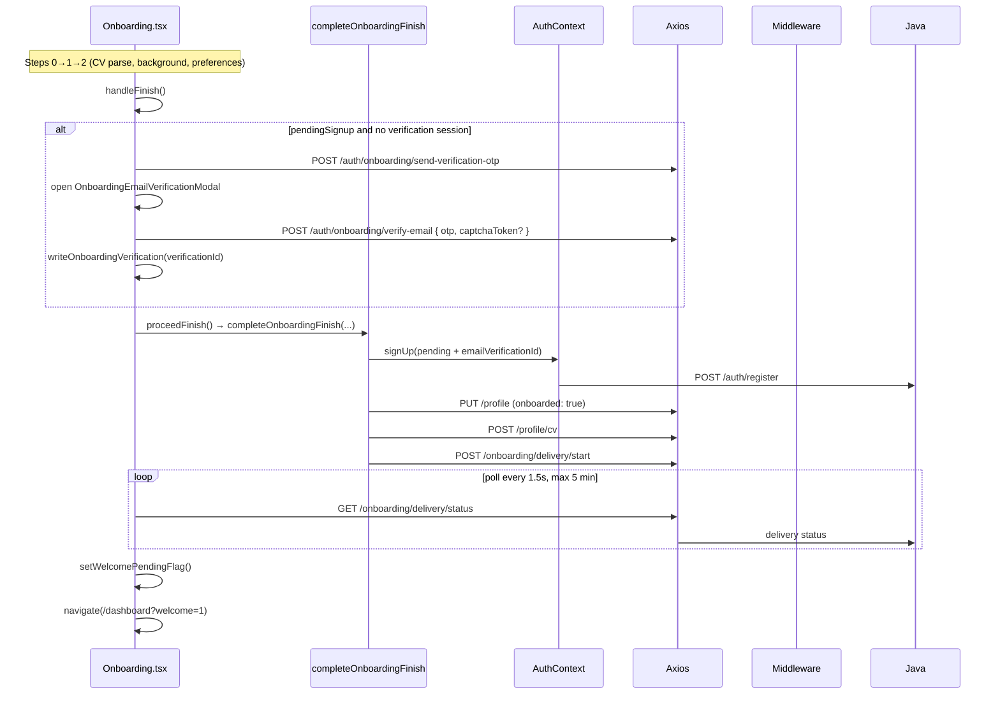

# Onboarding

## Overview

Three-step profile setup for new users: basic info + CV upload, work/education background, then job preferences. Uses deferred signup — guests enter with `pendingSignup` in sessionStorage; account is created on finish after email OTP verification. Polls job-delivery status and redirects to `/dashboard?welcome=1` when matching completes.

**Steps 1–3 (this doc’s user-facing numbering vs React `step` index):**

| User step | UI component | Code `step` |
|-----------|--------------|-------------|
| Step 1 — Basic info + CV | `BasicInfoStep` | `0` |
| Step 2 — Experience | `ExperienceStep` | `1` |
| Step 3 — Preferences | `PreferencesStep` | `2` |

Finish (register, org provisioning, upload original CV, job delivery) runs after step 3 preferences.

## Route

| Property | Value |
|----------|-------|
| URL | `/onboarding` |
| Guard | `OnboardingRoute` |
| Layout | Full-width standalone (`OnboardingPageShell`, no AppShell sidebar) |
| Redirects | No pending signup + no user → `/signup`; already onboarded → `/dashboard` or `/dashboard?welcome=1` if welcome flag set |

## Fields and inputs

### Step 0 — Basic info (`BasicInfoStep`)

| Field | Required | Validation | When shown |
|-------|----------|------------|------------|
| Full name | Yes | Non-empty trim | Step 0 |
| Headline | Yes | Non-empty trim; may prefill from CV parse | Step 0 |
| Years of experience | Yes | Selected value | Step 0 |
| Location | Yes | Default "Dublin, Ireland" | Step 0 |
| LinkedIn | No | Valid URL when provided; shown before CV upload | Step 0 |
| Portfolio website | No | Valid URL when provided; persisted as `websiteUrl` | Step 0 |
| GitHub | No | Valid URL when provided | Step 0 |
| CV file | Yes | PDF or DOCX, max 5 MB | Step 0 |

Empty link fields may be prefilled from CV header text after parse (user-entered values take precedence).

**CV parse at Continue (Step 0 / Basic Info):**

- `POST /auth/onboarding/parse-cv` with `signupIntentId`, `email`, and optional `captchaToken` (prod/staging). Frontend Axios timeout **180s**.
- Server validates **magic bytes** (PDF/DOCX), max 5 MB, extracts text via `CvParserService`.
- Requires `signupIntent.aiProcessingAccepted` (enforced at signup intent creation and again in `assertEligibleForCvParse`).
- **AI path** (when consent + `onboarding.cv.ai-parse.enabled` + NVIDIA configured): `OnboardingCvAiParseService` → `NvidiaService` feature `onboarding-cv-parse` on **fast tier** (default `nvidia/nemotron-3-nano-30b-a3b`) with **`enable_thinking: false`** (`NvidiaRequestSupport`) so JSON content is not consumed by reasoning tokens.
- AI prompt: `SYSTEM_PROMPT` JSON schema + user `CV TEXT:\n` (max 14,000 chars). `OnboardingRoleCatalog` hints target role titles.
- **AI timeout**: `onboarding.cv.ai-parse.timeout.ms` (default 60s). On timeout/failure: regex fallback when `onboarding.cv.regex.enabled=true`; else **422** (AI-only mode).
- **Regex path** (default): section parsers + `buildMarkdown()`; when AI succeeds, AI fields are primary and regex fills empty sections only.
- **Google users** (no signup intent): regex-only (`aiAllowed=false`).
- **`cvMarkdown`**: returned as a **string in the JSON response** — not written as a `.md` file on disk. Stored in `careerops_onboarding_cv_draft` (sessionStorage, truncated 32 KB). Persisted to DB (`user_cv.cv_markdown`) later at delivery stage `normalizing_cv` via `CvNormalizationService.normalizeAndStore`.

**Parse response fields (in addition to existing work/education/projects):**

| Field | Purpose |
|-------|---------|
| `extractedTechStack` | Canonical skills (max 40) for Step 3 chip prefill |
| `extractedTargetRoles` | Forward-looking job search titles (max 8) for Step 3 role chip prefill (AI path only) |
| `parseSource` | `"ai"` or `"regex"` |
| `parseWarnings` | Optional user-facing notices (e.g. AI fallback) |

### Step 1 — Experience (collapsible sections)

Three collapsible sections: **Work Experience**, **Education**, and **Projects**. Each section shows an entry count badge and expands by default when CV parse found rows in that section.

| Section | Fields per entry | Required | When shown |
|---------|------------------|----------|------------|
| Work Experience | Job title, company, start/end date, location, "I currently work here", description | No* | Step 1 |
| Education | School/university, degree (smart combobox: B.Tech/MSc/etc.), field of study, graduation year, location | No* | Step 1 |
| Projects | Project name, project link (GitHub/demo URL), location, project details | No* | Step 1 |

\*Prefilled from `parse-cv`; user can add/remove entries. Projects are saved to `portfolioItems` on finish (via `addPortfolioItem` after profile update).

**Project links:** Parser extracts one primary URL per project into **Project link** (repo preferred over live demo). Supports `Title | Link` placeholders when the real URL appears on following lines or in bullets (`GitHub: …`, bare `github.com/user/repo`, etc.). URL is removed from project details to avoid duplication. AI and regex paths both normalize to `https://`.

When `parseSource === "ai"` and any section has rows, `ExperienceStep` shows a review banner asking the user to verify dates and titles. **User edits on this step are authoritative** for the form; session `cvMarkdown` may differ until a future finish/upload optimization.

**Degree combobox:** Parsed free-text degrees (e.g. `BSc`, `B.Tech`, `MSc`) map to level labels; users can type or pick from the list.

**Finish flow for projects:** `completeOnboardingFinish` calls `profileApi.addPortfolioItem` per non-empty project row (URLs normalized to `https://`).

### Step 2 — Preferences (`PreferencesStep`)

| Field | Required | Validation | When shown |
|-------|----------|------------|------------|
| Target roles | Yes (gate) | At least one role chip required to finish; `extractedTargetRoles` auto-select on AI parse | Step 2 |
| Tech stack | No | Multi-select chips; `extractedTechStack` auto-select on first AI parse | Step 2 |
| Work types | No | Default includes Full-time | Step 2 |
| Work settings (remote/hybrid) | No | `mergeWorkSettings` | Step 2 |
| Salary range | No | Min/max in k, currency | Step 2 |
| Availability | No | Default "2 weeks notice" | Step 2 |
| Sponsorship, match %, job age | No | Filter toggles | Step 2 |

CV is uploaded on Step 0 only; finish still requires `cvFile` in wizard state (no re-upload UI on Step 2).

When tech was auto-filled from the CV, `PreferencesStep` shows helper copy: *"Skills detected from your CV — add or remove any time."* Skills not in `SUGGESTED_TECH` still appear as selected chips.

When roles were auto-filled from the CV (AI parse), helper copy: *"Roles suggested from your CV — add or remove any time."* Custom role titles from AI that are not in `SUGGESTED_ROLES` still appear as selected chips.

### Email verification modal

| Field | Required | Validation | When shown |
|-------|----------|------------|------------|
| 8-digit OTP | Yes | Exactly 8 digits | Modal before finish (deferred signup only; skipped for Google users) |
| reCAPTCHA | Conditional | Required when `CAPTCHA_ENABLED` | Modal submit |

## Actions

| Action | Trigger | Result |
|--------|---------|--------|
| Continue (step 0) | Basic info submit | `authApi.parseOnboardingCv` → map to work/education/projects + `selectedTech` + `selectedRoles` → advance to step 1 |
| Continue (step 1) | Experience form submit | Optional invalid project URL toast; advance to step 2 |
| Back | Buttons on steps 1–2 | Return to previous step |
| Complete profile / Find my jobs | `PreferencesStep.onComplete` → `handleFinish` | Email verify modal (if needed) → `proceedFinish` |
| Verify email | Modal OTP submit | `authApi.verifyOnboardingEmail` → `writeOnboardingVerification` → `proceedFinish` |
| Finish pipeline | `completeOnboardingFinish` | register → update profile → upload CV → start delivery → poll status |
| Skip to dashboard | Radar loader / eval modal close | `finishToDashboard` → `/dashboard?welcome=1` |

### `completeOnboardingFinish` order

1. **Register** (if `pendingSignup`): `signUp` with `emailVerificationId` from session — atomic intent consume, reCAPTCHA when configured, **`OrgProvisioningService.provisionForNewUser`** (personal workspace + free subscription + `primaryBillingOrganizationId`)
2. **Save profile**: `profileApi.update` with `onboarded: true` (work + education JSONB, including `location`, `degreeLevel`, `degreeTitle`)
3. **Upload CV**: `profileApi.uploadCv` — **original PDF/DOCX file**, not the step-0 `cvMarkdown` draft
4. **Save projects**: `profileApi.addPortfolioItem` per onboarding project row
5. **Start delivery**: `onboardingApi.startDelivery` (`@PlanGated("ai_skill_run")`)
6. Caller polls `onboardingApi.deliveryStatus` until `ready` or `readyPartial`; delivery pipeline runs `normalizing_cv` → persists `cv_markdown` to DB

## Auth and session

| Artifact | Key / mechanism | Purpose |
|----------|-----------------|---------|
| Pending signup | `co_pending_signup_v2` (sessionStorage) | Signup intent id, email, consents, and client expiry until register on finish |
| Email verification | `co_onboarding_verification_v2` (sessionStorage, 15 min TTL) | `verificationId` after OTP; bound to email + optional `signupIntentId` |
| CV parse draft | `careerops_onboarding_cv_draft` (sessionStorage) | In-memory `cvMarkdown` string + counts + `extractedTechStack` + `extractedTargetRoles` + `parseSource` between steps (truncated 32 KB); **not a disk file** |
| Welcome flag | `nc_welcome_pending` (sessionStorage) | Dashboard celebration after first finish |
| Tokens | Created at register step inside finish flow | `ensureFreshSession` refreshes before profile save for existing users |

Session expiry during onboarding: toast + `redirectOnSessionExpired('/onboarding')` → signup with `?reason=session_expired`.

## API endpoints

| User action | Frontend | Middleware (`/api/v1`) | Java (`/api`) |
|-------------|----------|------------------------|---------------|
| Parse CV (step 0) | `authApi.parseOnboardingCv` | `POST /auth/onboarding/parse-cv` | `POST /auth/onboarding/parse-cv` |
| Send verification OTP | `authApi.sendOnboardingVerificationOtp` | `POST /auth/onboarding/send-verification-otp` | `POST /auth/onboarding/send-verification-otp` |
| Resend OTP | `authApi.resendOnboardingVerificationOtp` | `POST /auth/onboarding/resend-verification-otp` | `POST /auth/onboarding/resend-verification-otp` |
| Verify email | `authApi.verifyOnboardingEmail` | `POST /auth/onboarding/verify-email` | `POST /auth/onboarding/verify-email` |
| Register account | `authApi.signup` via `signUp` | `POST /auth/signup` | `POST /auth/register` |
| Update profile | `profileApi.update` | `PUT /profile` | `PUT /profile` |
| Upload CV | `profileApi.uploadCv` | `POST /profile/cv` | `POST /profile/cv` |
| Start job delivery | `onboardingApi.startDelivery` | `POST /onboarding/delivery/start` | `POST /onboarding/delivery/start` |
| Poll delivery | `onboardingApi.deliveryStatus` | `GET /onboarding/delivery/status` | `GET /onboarding/delivery/status` |
| SSE eval progress | `useJobEvaluationProgress` | `GET /api/jobs/evaluation-progress` | `JobEvaluationProgressController` |
| Refresh session | `authApi.refresh` | `POST /auth/refresh` | `POST /auth/refresh` |

## File map

### Frontend

| Role | Path |
|------|------|
| Page | `frontend/src/pages/Onboarding.tsx` |
| Finish orchestration | `frontend/src/lib/completeOnboardingFinish.ts` |
| Pending signup | `frontend/src/lib/pendingSignup.ts` |
| Verification session | `frontend/src/lib/onboardingVerification.ts` |
| CV draft | `frontend/src/lib/onboardingCvDraft.ts` |
| Tech chip merge | `frontend/src/lib/mergeUniqueChipValues.ts` |
| CV → form mapping | `frontend/src/lib/mapCvParseToOnboarding.ts` |
| Profile payload builder | `frontend/src/lib/buildOnboardingProfilePayload.ts` |
| Session expiry helpers | `frontend/src/lib/onboardingSession.ts` |
| Step components | `BasicInfoStep.tsx`, `ExperienceStep.tsx`, `WorkExperienceSection.tsx`, `EducationSection.tsx`, `ProjectsSection.tsx`, `CollapsibleOnboardingSection.tsx`, `DegreeCombobox.tsx`, `PreferencesStep.tsx`, `OnboardingStepper.tsx`, `OnboardingPageShell.tsx` |
| Email modal | `frontend/src/components/onboarding/OnboardingEmailVerificationModal.tsx` |
| Delivery UI | `frontend/src/components/onboarding/JobSearchRadarLoader.tsx`, `JobEvaluationProgressModal.tsx` |
| Welcome flag | `frontend/src/components/dashboard/CareersHomeDashboard.tsx` |
| Auth state | `frontend/src/context/AuthContext.tsx` |
| HTTP client | `frontend/src/services/api.ts` |
| Route guard | `frontend/src/components/ProtectedRoute.tsx` (`OnboardingRoute`) |
| Styles | `frontend/src/styles/onboarding.css` |

### Middleware

| Role | Path |
|------|------|
| Auth onboarding routes | `middleware/src/routes/auth.routes.ts` |
| Delivery routes | `middleware/src/routes/onboarding.routes.ts` |

### Backend

| Role | Path |
|------|------|
| Auth controller | `backend/src/main/java/com/careerops/controller/AuthController.java` |
| Onboarding controller | `backend/src/main/java/com/careerops/controller/OnboardingController.java` |
| Profile controller | `backend/src/main/java/com/careerops/controller/ProfileController.java` |
| Email verification | `backend/src/main/java/com/careerops/service/OnboardingEmailVerificationService.java` |
| CV parse orchestration | `backend/.../OnboardingCvParseService.java` |
| CV AI parse | `backend/.../OnboardingCvAiParseService.java` |
| CV AI validation | `backend/.../OnboardingCvParseResultValidator.java` |
| NVIDIA request opts | `backend/.../NvidiaRequestSupport.java` |
| Role catalog | `backend/.../OnboardingRoleCatalog.java` |
| CV normalization | `backend/.../CvNormalizationService.java` |
| Job delivery | `backend/src/main/java/com/careerops/service/OnboardingDeliveryService.java` |
| Org provisioning | `backend/src/main/java/com/careerops/service/OrgProvisioningService.java` |
| Registration | `backend/src/main/java/com/careerops/service/AuthService.java` |

## Sequence diagram

## Entry paths (deferred vs Google)

| Aspect | Deferred signup (email) | Google user |
|--------|-------------------------|-------------|
| Arrives from | `/signup` → signup-intent | `/login` → Google OAuth |
| `pendingSignup` | Yes | No |
| JWT at start | No until register | Yes |
| Email OTP at finish | Required | Skipped |
| Register at finish | `signUp()` consumes intent | `ensureFreshSession()` only |
| CV parse AI path | Yes (intent + AI consent) | Regex-only (no intent) |

## Edge cases

- **AI parse unavailable**: Regex fallback when `ONBOARDING_CV_REGEX_ENABLED=true`; `parseWarnings` toast. When regex disabled (AI-only), AI failure/timeout returns **422** and user cannot advance.
- **Nemotron thinking tokens**: Fast skills set `enable_thinking: false`; without this, Nemotron 3 Nano exhausts `max_tokens` on reasoning and returns truncated/empty JSON.
- **Empty tech list**: Step 3 chips unchanged; user selects manually.
- **Dev without signup intent**: `parse-cv` uses regex only (`aiAllowed=false`); prod/staging require signup session + AI consent.
- **cvMarkdown not a file**: Step 0 produces a string only; DB markdown is written at delivery `normalizing_cv`, not at parse-cv.
- **Re-parse on Step 1**: Tech prefill runs only once per session (`techPrefilledRef`); user edits preserved.
- **No pending signup as guest**: `OnboardingRoute` sends to `/signup`.
- **Already onboarded**: Redirect to dashboard (with welcome query if flag set).
- **CV required twice**: Step 0 and finish both enforce `cvFile` presence.
- **CV parse finds no roles**: Toast warning; user adds experience manually.
- **Email verification resends**: Max 3 resends; cooldown from `retryAfterSeconds` (default 300s on resend).
- **Verification TTL**: 15 minutes in sessionStorage (`co_onboarding_verification_v2`); expired → finish fails with "Email verification required."
- **Delivery timeout**: After 5 minutes polling, toast suggests continuing to dashboard; overlay may stay with partial progress.
- **Dual progress UI**: HTTP poll (1.5s) + SSE `evaluation-progress`; either `ready` from poll or SSE `COMPLETE` can trigger dashboard redirect.
- **Plan limit 402**: CV upload or delivery start may return `PLAN_LIMIT_EXCEEDED`; `completeOnboardingFinish` surfaces `plan_limit`; Onboarding navigates to `/account/billing`; profile may already be saved.
- **Delivery failure**: `JobSearchRadarLoader` shows retry or continue to dashboard; profile already saved.
- **Session expired mid-flow**: `AUTH_LOGGED_OUT_EVENT` or 401 → redirect to signup with expired reason.
- **Google users**: If already signed in without pending signup, finish skips register and only saves profile.
- **Username collision on register**: `AuthContext.signUp` retries with random suffix on 409 username conflict.
- **Eval progress modal**: SSE via `useJobEvaluationProgress`; auto-navigates 1.5s after `COMPLETE`.
- **Registered email OTP decoy**: Send returns 202 but no email sent (anti-enumeration).

## Environment variables

| Variable | Default | Purpose |
|----------|---------|---------|
| `ONBOARDING_CV_AI_PARSE_ENABLED` | `true` | Enable NVIDIA AI at step 0 Continue |
| `ONBOARDING_CV_AI_PARSE_TIMEOUT_MS` | `60000` | Backend AI wait before fallback/422 |
| `ONBOARDING_CV_REGEX_ENABLED` | `true` | `false` = AI-only (no regex fallback on failure) |
| `NVIDIA_API_KEY` | — | Required for AI parse path |
| `NVIDIA_MODEL_FAST` | `nvidia/nemotron-3-nano-30b-a3b` | Model for `onboarding-cv-parse` |

See also [mandatory-fields.md](../mandatory-fields.md).

## Related docs

- [signup-onboarding-pipeline.docx](../signup-onboarding/signup-onboarding-pipeline.docx) — full combined pipeline reference with phased sequence diagrams (DOCX)
- [shared/auth-infrastructure.md](../shared/auth-infrastructure.md)
- [shared/route-guards.md](../shared/route-guards.md)
- [signup/PAGE.md](../signup/PAGE.md)
- [login/login-pipeline.docx](../login/login-pipeline.docx) — Google login entry to onboarding
