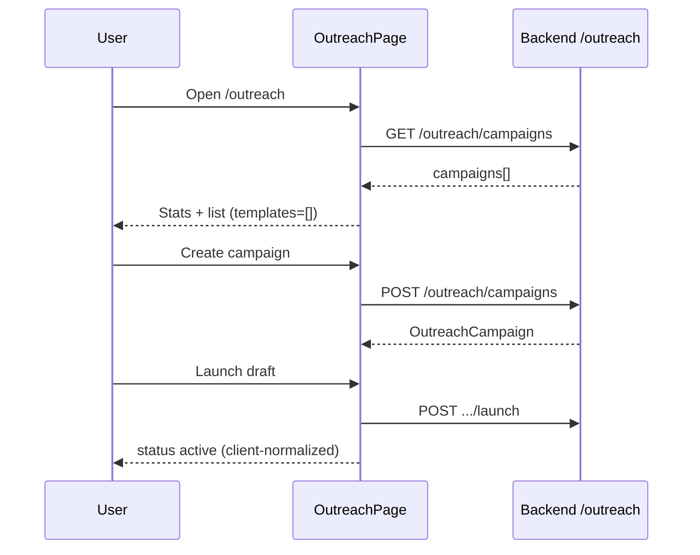

# Outreach

## Overview

Campaign manager for recruiter/hiring-manager outreach. Create campaigns (LinkedIn or email channel), launch drafts, view sent/open/reply metrics. **Templates tab is UI-only** — backend does not expose template CRUD; list always empty on load.

## Route

| Item | Value |
|------|-------|
| Path | `/outreach` |
| Guard | `ProtectedRoute` |
| Layout | `AppShell` |
| Lazy import | `OutreachPage` in `App.tsx` |

## Main UI fields / actions

- **Header:** New Campaign
- **Stats:** active campaigns, messages sent, avg reply rate
- **Tabs:** Campaigns \| Templates
- **Create modal:** name*, channel (linkedin/email), optional template picker (mock-only toast if selected)
- **Campaign card:** status, channel, sent/total, open/reply rates, Launch (draft), Delete
- **Templates:** Empty state explaining backend gap; delete shows error toast

## API endpoints

| Method | Endpoint | Action |
|--------|----------|--------|
| GET | `/outreach/campaigns` | List campaigns |
| POST | `/outreach/campaigns` | Create (`name`, `campaignType` = channel) |
| POST | `/outreach/campaigns/{id}/launch` | Launch draft |
| DELETE | `/outreach/campaigns/{id}?confirm=true` | Delete campaign |

Not used on page: sequences, messages, send-time, unsubscribe endpoints in `outreachApi.ts`.

## File map

| File | Role |
|------|------|
| `frontend/src/pages/OutreachPage.tsx` | Page + modals/cards |
| `frontend/src/services/outreachApi.ts` | HTTP client |

## Sequence diagram

## Edge cases

- **Channel inference:** From first sequence channel or campaignType string.
- **Open/reply rates:** Computed client-side from messages when present.
- **Launch UI:** Forces `status: 'active'` locally after success.
- **Template selection on create:** Extra toast that templates not wired.
- **Delete campaign:** Requires confirm query param server-side.
