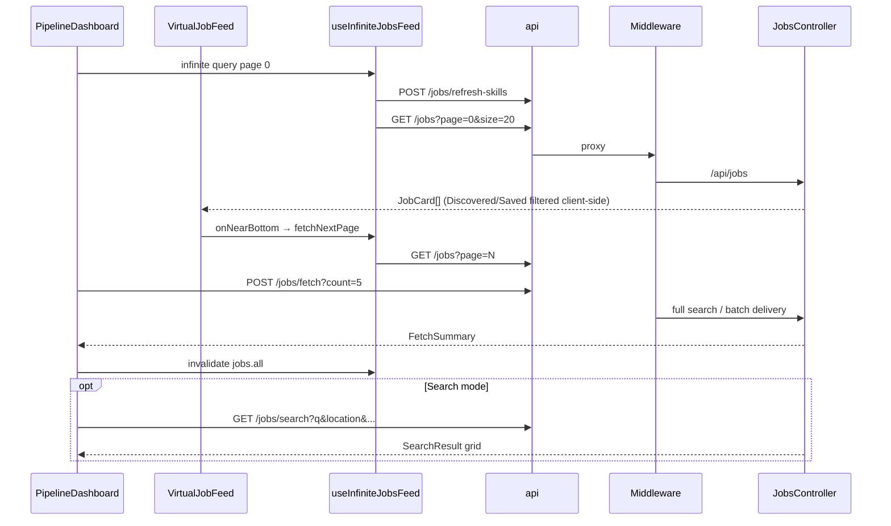

# Job Pipeline (Pipeline Dashboard)

## Overview

Primary job-discovery and pipeline management view labeled "Your Daily Mission" in UI. Virtualized infinite feed of Discovered/Saved matches, discovery search, Compare/Triage AI skills, live job fetch, market scan, planner sidebar, recommended jobs, onboarding product tour, and weekly progress stats. Rendered inside `AppShell` at `/pipeline` (legacy dashboard UI; home discovery is `/dashboard`).

## Route

| Property | Value |
|----------|-------|
| URL | `/pipeline` |
| Guard | `ProtectedRoute` |
| Layout | `AppShell` (Sidebar + TopBar + scrollable main) |
| Redirects | None |

## Fields and inputs

| Field | Required | Validation | When shown |
|-------|----------|------------|------------|
| Job search (`JobSearchBar`) | No | q, location, salary, remote, sponsorship params | Above feed |
| Source filter | No | Dropdown from loaded job sources | When not in search mode and >1 source |
| Search pagination | No | Page within `totalPages` | Search results mode |
| Planner job picker | No | Opens drawer for selected `userJobId` | Via `PlannerWidget` |

Internal filter state (`search`, `minMatch`, salary filters) exists but several are fixed at defaults in current code.

## Actions

| Action | Trigger | Result |
|--------|---------|--------|
| Compare jobs | Skill button (needs ≥2 Discovered/Saved) | `skillsApi.compare` top 5 IDs → `ComparePanel` |
| Triage pipeline | Skill button (needs ≥1 job) | `skillsApi.triage` → `TriagePanel` |
| Fetch live jobs | Header button | Empty feed → `getMore()`; else `POST /jobs/fetch-live` |
| Scan for new jobs | Header button | `fetchJobsOrchestrated` (5 or `remaining`); invalidates jobs cache |
| Search jobs | `JobSearchBar` submit | `GET /jobs/search` with params; replaces feed with results grid |
| Clear search | X control | Resets to pipeline feed |
| Paginate search | Prev/Next | `discoveryApi.search` with page param |
| Open planner | `PlannerWidget` | Slide-over `JobPlannerPanel` for job |
| Infinite scroll | Near bottom of `VirtualJobFeed` | `fetchNextPage` via `useInfiniteJobsFeed` |
| Product tour | First visit (localStorage) | `ProductTour` with `DASHBOARD_TOUR_STEPS` |

## API endpoints

| User action | Frontend | Middleware (`/api/v1`) | Java (`/api`) |
|-------------|----------|------------------------|---------------|
| Infinite pipeline feed | `GET /jobs?page&size=20` | `GET /jobs` | `JobsController` `GET /jobs` |
| Refresh skills (page 0) | `POST /jobs/refresh-skills` | `POST /jobs/refresh-skills` | `JobsController` `POST /refresh-skills` |
| Scan / fetch batch | `POST /jobs/fetch?count` | `POST /jobs/fetch` (rate-limited) | `JobsController` `POST /fetch` |
| Fetch live single job | `POST /jobs/fetch-live` | `POST /jobs/fetch-live` | `JobsController` `POST /fetch-live` |
| Search pipeline | `GET /jobs/search` | `GET /jobs/search` | `JobsController` `GET /search` |
| Recommended widget | `GET /jobs/recommended` | `GET /jobs/recommended` | `JobsController` `GET /recommended` |
| Compare skill | `POST /skills/start` (compare) | `POST /skills/start` | Skills controller (proxied) |
| Triage skill | `POST /skills/start` (triage) | `POST /skills/start` | Skills controller (proxied) |
| Weekly stats | `GET /analytics/summary` | `GET /analytics/summary` | `AnalyticsController` `GET /summary` |
| Onboarding checklist | `GET /onboarding/checklist` | `GET /onboarding/checklist` | `OnboardingController` |
| Planner tasks | Planner API (`plannerApi.ts`) | Planner routes (proxied) | Planner backend |

## File map

### Frontend

| Role | Path |
|------|------|
| Page | `frontend/src/pages/PipelineDashboard.tsx` |
| Components | `frontend/src/components/jobs/VirtualJobFeed.tsx`, `frontend/src/components/discovery/JobSearchBar.tsx`, `RecommendedJobsWidget.tsx`, `frontend/src/components/skills/ComparePanel.tsx`, `TriagePanel.tsx`, `SkillButton.tsx`, `frontend/src/components/planner/*`, `frontend/src/components/onboarding/ProductTour.tsx`, `FirstApplicationChecklist.tsx` |
| Hooks / services | `frontend/src/hooks/queries/useJobs.ts` (`useInfiniteJobsFeed`, `useFetchLiveJobMutation`, `useAnalyticsSummary`), `frontend/src/hooks/useScrollPrefetch.ts`, `frontend/src/services/discoveryApi.ts`, `skillsApi.ts`, `analyticsApi.ts` |
| Lib | `frontend/src/lib/pipelineJobSearch.ts` |

### Middleware

| Role | Path |
|------|------|
| Routes | `middleware/src/routes/jobs.routes.ts`, `skills.routes.ts`, `analytics.routes.ts`, `onboarding.routes.ts` |

### Backend

| Role | Path |
|------|------|
| Controllers | `backend/src/main/java/com/careerops/controller/JobsController.java`, `AnalyticsController.java`, `OnboardingController.java` |

## Sequence diagram

## Edge cases

- **Empty feed**: "Scan the Market Now" when no active filters; disabled when `remaining <= 0`.
- **Daily limits**: UI shows `dailyCount / dailyLimit`; scan disabled when no remaining quota.
- **Compare locked**: Fewer than 2 jobs in Discovered/Saved columns.
- **Triage locked**: Zero jobs in pipeline.
- **Missing skills banner**: Top 5 unmatched skills appearing in ≥2 jobs (amber alert).
- **Search vs feed**: Mutually exclusive UI modes; clearing search restores virtualized feed.
- **Product tour**: `localStorage` key `NewCareers_dashboard_tour_done`; auto-starts after 800ms once.
- **Virtualized height**: Fixed `FEED_HEIGHT = 660` (~3 card rows).
- **Rate limits**: `fetch` and `fetch-live` use middleware `fetchLimiter`; 429 surfaces via toast.
