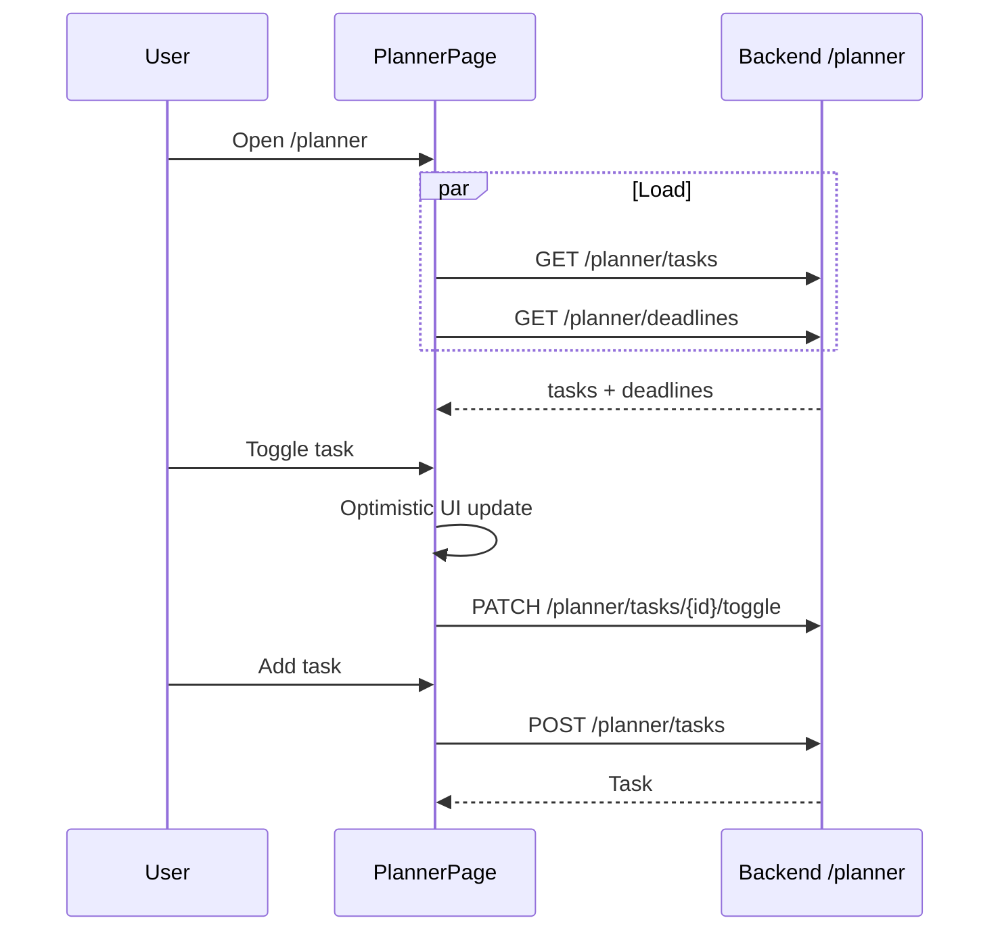

# Planner

## Overview

Personal task list plus read-only **upcoming deadlines** (interviews, assessments, etc.). Add tasks with priority and due date; toggle complete; delete. Deadlines loaded from API but not created on this page.

## Route

| Item | Value |
|------|-------|
| Path | `/planner` |
| Guard | `ProtectedRoute` |
| Layout | `AppShell` |
| Lazy import | `PlannerPage` in `App.tsx` |

## Main UI fields / actions

- **Header:** today’s date, Add Task toggle
- **New task form:** title*, priority (high/medium/low), due date (optional)
- **Upcoming deadlines:** title, event type badge, date label (urgent styling ≤2 days)
- **Pending tasks:** circle toggle, title, due hint, priority dot, delete on hover
- **Completed tasks:** strikethrough list, toggle to reopen

## API endpoints

Page uses raw `api` paths (not `plannerApi.ts` job-scoped helpers):

| Method | Endpoint | Action |
|--------|----------|--------|
| GET | `/planner/tasks` | List tasks |
| GET | `/planner/deadlines` | List deadlines |
| POST | `/planner/tasks` | Create task |
| PATCH | `/planner/tasks/{id}/toggle` | Toggle completed |
| DELETE | `/planner/tasks/{id}` | Delete task |

Note: `plannerApi.ts` also exposes `/planner/upcoming`, job-scoped tasks/deadlines — unused here.

## File map

| File | Role |
|------|------|
| `frontend/src/pages/PlannerPage.tsx` | Page UI |
| `frontend/src/services/api.ts` | Axios client |
| `frontend/src/services/plannerApi.ts` | Alternate planner endpoints (not used by page) |

## Sequence diagram

## Edge cases

- **Toggle/delete API failure:** Toast; toggle is optimistic (may desync until reload).
- **No pending tasks:** “All caught up!” message.
- **Empty deadlines:** Section hidden.
- **Due date formatting:** “Tomorrow” / urgent red for ≤2 days or past.
- **Load errors:** `finally` sets loading false even on failure (empty lists).
