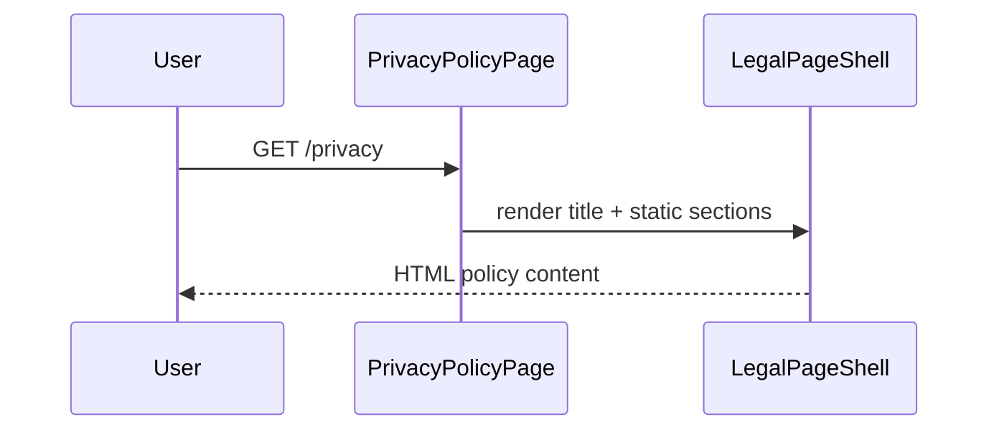

# Privacy Policy

## Overview

Static GDPR-oriented privacy policy for NewCareers job seekers in Ireland. Describes data collection, third-party processors, and user rights. Public legal page wrapped in `LegalPageShell`. Accessible to everyone.

## Route

| Property | Value |
|----------|-------|
| URL | `/privacy` |
| Guard | none |
| Layout | standalone (`LegalPageShell`) |
| Redirects | `/legal/privacy` → `/privacy` (replace) |

## Fields and inputs

| Field | Required | Validation | When shown |
|-------|----------|------------|------------|
| — | — | — | Read-only content; support email mailto link only |

## Actions

| Action | Trigger | Result |
|--------|---------|--------|
| Contact support | Email link | Opens `mailto:` to `SUPPORT_EMAIL` from `@/lib/brand` |
| Brand home | Header logo | Navigate to `/` |
| Cross-legal nav | Header links | Navigate to `/privacy`, `/terms`, `/help`, `/accessibility` |

## Auth and session

N/A — public static page. Account data-export and consent controls referenced in copy live under protected `/account` settings.

## API endpoints

| User action | Frontend | Middleware (`/api/v1`) | Java (`/api`) |
|-------------|----------|------------------------|---------------|
| — | — | — | No API calls on this page |

## File map

### Frontend

| Role | Path |
|------|------|
| Page | `frontend/src/pages/legal/PrivacyPolicyPage.tsx` |
| Shell | `frontend/src/pages/legal/LegalPageShell.tsx` |
| Components | `frontend/src/components/PageMeta.tsx` |
| Constants | `frontend/src/lib/brand.ts` (`SUPPORT_EMAIL`, `legalPaths`) |

### Middleware

| Role | Path |
|------|------|
| Routes | — |

### Backend

| Role | Path |
|------|------|
| Controller | — |

## Sequence diagram

## Edge cases

- Last updated date is hardcoded: June 2026.
- Lists processors: Anthropic, Google (Gemini), NVIDIA, Resend, Supabase.
- Legacy `/legal/privacy` alias preserved for old bookmarks and emails.

## Related docs

- [shared/auth-infrastructure.md](../shared/auth-infrastructure.md)
- [shared/route-guards.md](../shared/route-guards.md)
