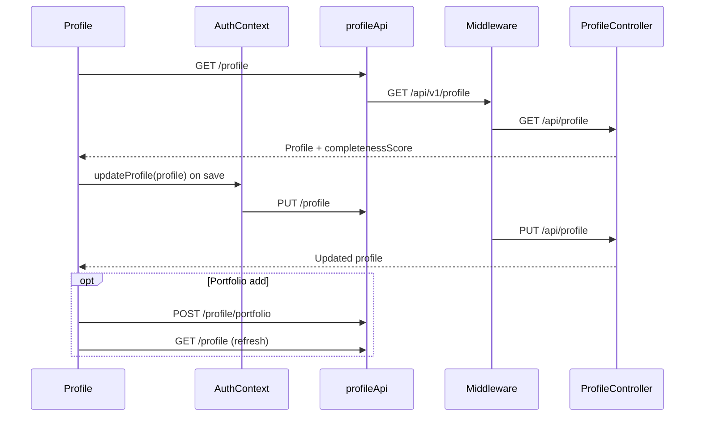

# Profile

## Overview

Legacy-style profile editor inside AppShell (sidebar + TopBar with notifications). Lets users view completeness score and edit location, career goals, salary, tech stack, CV, and portfolio items. Identity fields (name, email) are read-only from `AuthContext`. Distinct from `/account`, which is the primary settings surface for job-matching preferences and GDPR.

## Route

| Property | Value |
|----------|-------|
| URL | `/profile` |
| Guard | `ProtectedRoute` |
| Layout | `AppShell` (Sidebar + TopBar + main content area) |
| Redirects | None |

## Fields and inputs

| Field | Required | Validation | When shown |
|-------|----------|------------|------------|
| Full name | — | Read-only | Identity |
| Email | — | Read-only | Identity |
| Location | No | Free text | Location & preferences |
| Open to remote | No | Checkbox | Location & preferences |
| Target job title | No | Free text | Career goal |
| Target roles | No | Tag input (Enter to add) | Career goal |
| Sectors | No | Tag input | Career goal |
| Work types | No | Tag input | Career goal |
| Salary min / max | No | Number (£/yr labels in UI) | Salary expectations |
| Visa sponsorship | No | Checkbox | Salary expectations |
| Tech stack | No | Tag input | Skills & tech stack |
| CV file | No | `.pdf`, `.docx` | Active CV |
| Portfolio title | Yes (add item) | Non-empty trim | Portfolio modal |
| Portfolio URL | No | URL text | Portfolio modal |
| Portfolio location | No | Free text | Portfolio modal |
| Portfolio description | No | Textarea | Portfolio modal |

## Actions

| Action | Trigger | Result |
|--------|---------|--------|
| Save changes | Header or footer button | `updateProfile(profile)` via AuthContext |
| Upload CV | File picker | `POST /profile/cv`; reload profile |
| Add portfolio item | Modal submit | `POST /profile/portfolio`; reload profile |
| Remove portfolio item | Trash on row | `DELETE /profile/portfolio/:itemId`; local state update |
| Add tag | Enter or + button | Local profile state |

## API endpoints

| User action | Frontend | Middleware (`/api/v1`) | Java (`/api`) |
|-------------|----------|------------------------|---------------|
| Load profile | `GET /profile` | `GET /profile` | `ProfileController` `GET /profile` |
| Save profile | `PUT /profile` (via `updateProfile`) | `PUT /profile` | `ProfileController` `PUT /profile` |
| Upload CV | `POST /profile/cv` | `POST /profile/cv` | `ProfileController` `POST /cv` |
| Add portfolio | `POST /profile/portfolio` | `POST /profile/portfolio` | `ProfileController` `POST /portfolio` |
| Delete portfolio | `DELETE /profile/portfolio/:itemId` | `DELETE /profile/portfolio/:itemId` | `ProfileController` `DELETE /portfolio/{itemId}` |

## File map

### Frontend

| Role | Path |
|------|------|
| Page | `frontend/src/pages/Profile.tsx` |
| Layout | `frontend/src/components/layout/AppShell.tsx`, `TopBar.tsx`, `Sidebar.tsx` |
| Hooks / services | `frontend/src/context/AuthContext.tsx`, `frontend/src/services/api.ts` (`profileApi`) |
| Types | `frontend/src/types/index.ts` (`Profile`, `PortfolioItem`) |

### Middleware

| Role | Path |
|------|------|
| Routes | `middleware/src/routes/profile.routes.ts` |

### Backend

| Role | Path |
|------|------|
| Controller | `backend/src/main/java/com/careerops/controller/ProfileController.java` |

## Sequence diagram

## Edge cases

- **Loading state**: Full-page `PageLoader` until initial `GET /profile` completes.
- **Load failure**: Toast only; page may render with null profile edge cases avoided by loading gate.
- **Completeness bar**: Color thresholds at 50% and 80% from `completenessScore`.
- **Portfolio add**: Requires title; URL/description optional.
- **No optimistic save**: Save button shows brief "Saved!" state; errors toast generic message.
- **Overlap with /account**: Many preference fields exist on Account Settings; Profile is a slimmer, tag-based editor.
