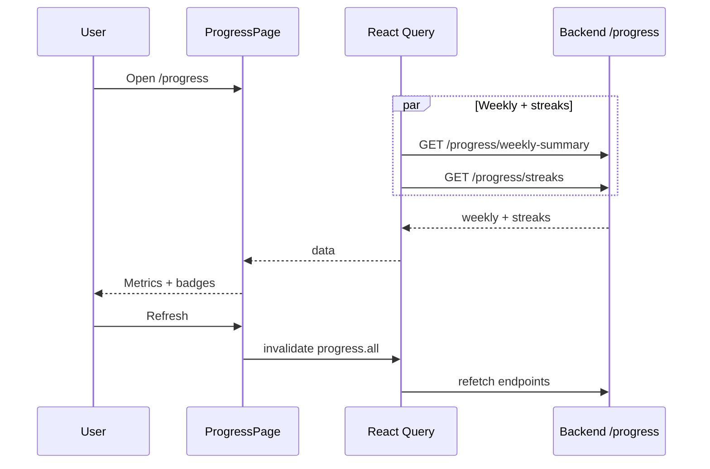

# Progress

## Overview

Gamified job-search metrics: daily streaks, weekly activity summary, all-time totals, and earned/locked badges. Manual refresh invalidates progress queries.

## Route

| Item | Value |
|------|-------|
| Path | `/progress` |
| Guard | `ProtectedRoute` |
| Layout | `AppShell` |
| Lazy import | `ProgressPage` in `App.tsx` |

## Main UI fields / actions

- **Refresh:** Invalidates `queryKeys.progress.all`
- **Streak cards:** current daily streak, longest daily streak
- **This week:** jobs reviewed, applications submitted, interviews scheduled, responses, offers (date range from API)
- **All-time:** total jobs reviewed, total applications
- **Badges grid:** icon, label, earned/locked (only if badges array non-empty)

## API endpoints

| Method | Endpoint | Hook / client |
|--------|----------|---------------|
| GET | `/progress/weekly-summary` | `useWeeklyProgress` → `progressApi.getWeeklySummary` |
| GET | `/progress/streaks` | `useProgressStreaks` → `progressApi.getStreaks` |

Not called on page: `POST /progress/activity`, `GET /progress/history`, `GET /progress/full`.

## File map

| File | Role |
|------|------|
| `frontend/src/pages/ProgressPage.tsx` | Page UI |
| `frontend/src/hooks/queries/useProgress.ts` | React Query hooks |
| `frontend/src/services/progressApi.ts` | HTTP client |
| `frontend/src/lib/queryKeys.ts` | Cache keys |

## Sequence diagram

## Edge cases

- **Either query errors or null data:** “Progress unavailable” + Retry (requires both `weekly` and `streaks`).
- **No badges:** Badge section omitted entirely.
- **Metric coloring:** Applications/offers green when &gt; 0.
- **Loading:** Full-page `PageLoader` until both queries settle.
