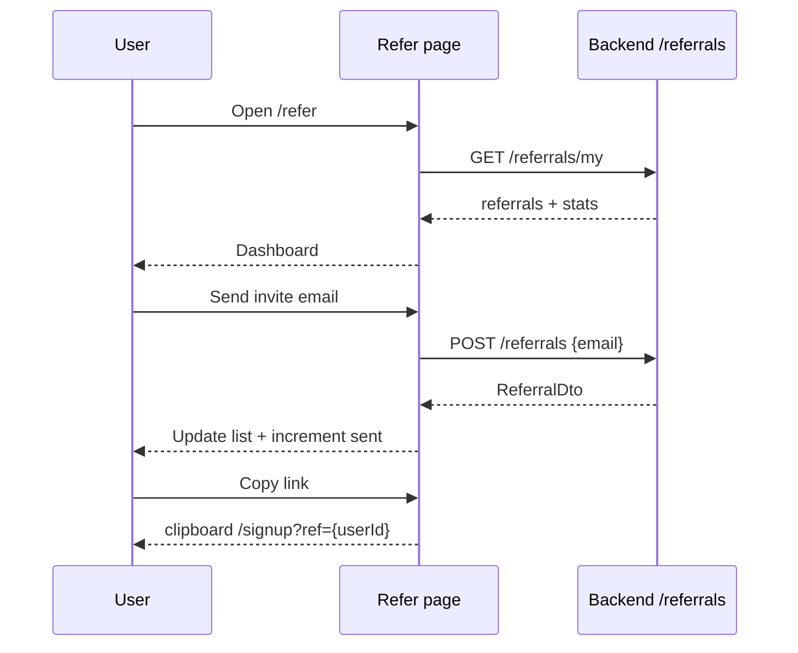

# Refer a Friend

## Overview

Referral program UI: stats, shareable signup link (`?ref={userId}`), email invites, referral history with status. Copy link + social share (X, LinkedIn).

## Route

| Item | Value |
|------|-------|
| Path | `/refer` |
| Guard | `ProtectedRoute` |
| Layout | `AppShell` |
| Lazy import | `Refer` in `App.tsx` |

## Main UI fields / actions

- **Hero:** Reward copy (1 free month Pro per qualified referral)
- **Stats:** invites sent, signed up, rewards earned
- **Referral link:** Read-only URL + Copy
- **Share:** X intent, LinkedIn share-offsite
- **Invite by email:** email input + Send Invite
- **Referrals list:** referee email, date, status badge (pending / signed_up / rewarded)

## API endpoints

| Method | Endpoint | Action |
|--------|----------|--------|
| GET | `/referrals/my` | List + stats (`referralsApi.getMyReferrals`) |
| POST | `/referrals` | Create invite (`referralsApi.createReferral`, body: `{ email }`) |

Not used on page: `GET /referrals/validate/{token}` (signup flow).

Referral code = `user.id` (client-side link construction).

## File map

| File | Role |
|------|------|
| `frontend/src/pages/Refer.tsx` | Page UI |
| `frontend/src/services/referralsApi.ts` | HTTP client |
| `frontend/src/context/AuthContext.tsx` | User id for link |

## Sequence diagram

## Edge cases

- **Load failure:** Toast; page may show with null stats.
- **Invalid email:** Client regex validation before POST.
- **Copy without user:** Toast “Sign in to get your referral link.”
- **Empty referrals:** List section hidden.
- **Optimistic stats bump:** `sent` incremented locally on successful invite.
