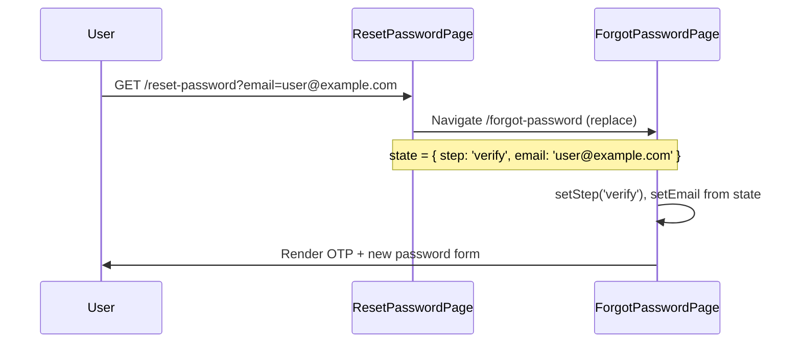

# Reset Password (legacy redirect)

## Overview

Legacy route kept for bookmarks and password-reset emails that still link to `/reset-password`. Does not render UI — immediately redirects to `/forgot-password` with router state that opens the OTP verification step. The full reset flow lives on the forgot-password page.

## Route

| Property | Value |
|----------|-------|
| URL | `/reset-password` |
| Guard | `GuestRoute` |
| Layout | None (instant redirect) |
| Redirects | Always → `/forgot-password` with `replace` |

### Query parameters

| Param | Effect |
|-------|--------|
| `?email=` | Passed through to forgot-password via `location.state.email` |

## Fields and inputs

N/A — no form rendered on this route.

## Actions

| Action | Trigger | Result |
|--------|---------|--------|
| Redirect | Page mount | `<Navigate to="/forgot-password" state={{ step: 'verify', email }} />` |

## Auth and session

N/A. No API calls. No session changes.

## API endpoints

None on this route. See [forgot-password/PAGE.md](../forgot-password/PAGE.md) for OTP and reset endpoints.

## File map

### Frontend

| Role | Path |
|------|------|
| Redirect page | `frontend/src/pages/ResetPasswordPage.tsx` |
| Actual reset UI | `frontend/src/pages/ForgotPasswordPage.tsx` |
| Route registration | `frontend/src/App.tsx` |
| Route guard | `frontend/src/components/ProtectedRoute.tsx` (`GuestRoute`) |

### Middleware

No dedicated route — requests never hit middleware from this page.

### Backend

No dedicated endpoint — legacy path is frontend-only.

## Sequence diagram

## Edge cases

- **Missing email param**: Redirects with `email: ''`; user can use "Use a different email" to return to step 1.
- **Logged-in user**: `GuestRoute` redirects to app before `ResetPasswordPage` mounts.
- **Bookmark preservation**: Route intentionally not removed so old links continue to work.
- **No server-side `/reset-password`**: Password reset emails should prefer `/forgot-password`; backend email template references forgot-password base URL.

## Related docs

- [forgot-password/PAGE.md](../forgot-password/PAGE.md)
- [shared/route-guards.md](../shared/route-guards.md)
