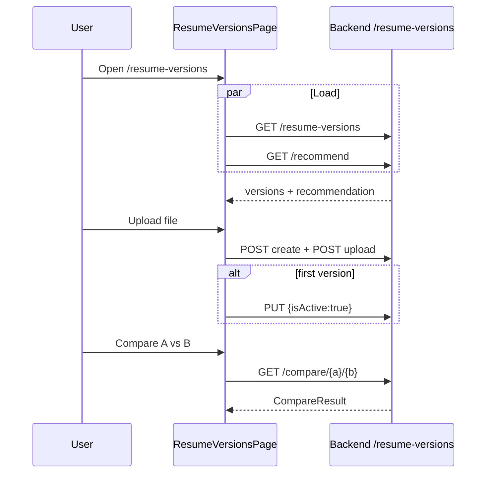

# Resume Versions

## Overview

Track multiple resume files with application/interview/offer stats, outcomes, AI recommendation, and pairwise compare. Overlaps conceptually with CV Manager but focuses on **version analytics** and outcomes (`/resume-versions` vs `/cv`).

## Route

| Item | Value |
|------|-------|
| Path | `/resume-versions` |
| Guard | `ProtectedRoute` |
| Layout | `AppShell` |
| Lazy import | `ResumeVersionsPage` in `App.tsx` |

## Main UI fields / actions

- **Upload Version:** PDF/DOCX; first upload auto-activates
- **AI recommendation banner:** best version + reason
- **Compare panel (≥2 versions):** select A/B, Compare → stats + recommendation text
- **Version card:** name, active/favorite/outcome badges, tags, counts, download, set active, record outcome, delete (non-active)
- **Outcome picker:** interview \| offer \| rejected \| unknown

## API endpoints

| Method | Endpoint | Action |
|--------|----------|--------|
| GET | `/resume-versions` | List |
| GET | `/resume-versions/recommend` | AI pick (optional `roleType`) |
| POST | `/resume-versions` + POST `/{id}/upload` | Create + file upload with progress |
| PUT | `/resume-versions/{id}` | Update (e.g. `isActive: true`) |
| GET | `/resume-versions/{id}/download` | Download URL |
| POST | `/resume-versions/{id}/outcome` | Record outcome |
| DELETE | `/resume-versions/{id}` | Delete version |
| GET | `/resume-versions/compare/{leftId}/{rightId}` | Compare two |

## File map

| File | Role |
|------|------|
| `frontend/src/pages/ResumeVersionsPage.tsx` | Page UI |
| `frontend/src/services/resumeVersionsApi.ts` | HTTP client |
| `frontend/src/hooks/useFileUpload.ts` | Upload progress |

## Sequence diagram

## Edge cases

- **Recommend fetch fails on load:** Silently ignored (`catch → null`).
- **Compare cleared:** Changing A/B clears prior compare result.
- **Delete during compare:** Clears compare if deleted id involved.
- **Active version:** Cannot delete; activate button hidden when active.
- **Upload rollback:** `resumeVersionsApi` may delete created record if upload fails mid-flight.
- **Download:** Opens presigned URL in new tab.
