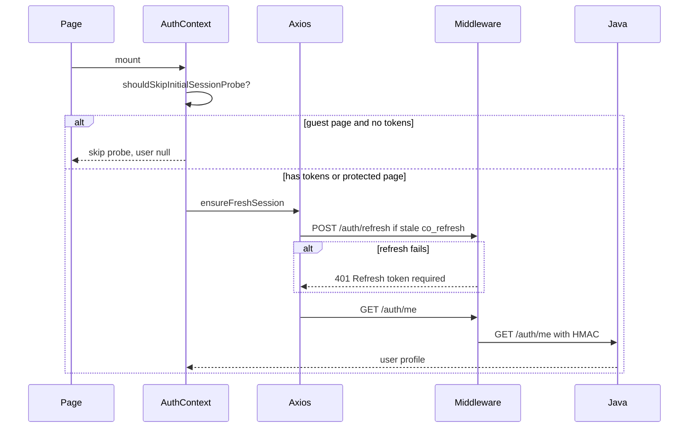

# Auth infrastructure

Cross-cutting authentication stack used by Login, Signup, Onboarding, and all protected pages.

## Layers

| Layer | Role | Key file |
|-------|------|----------|
| UI | Pages call `useAuth()` | `frontend/src/context/AuthContext.tsx` |
| Token store | Access token metadata in memory; refresh token in HttpOnly cookie only | `frontend/src/lib/tokenStore.ts` |
| HTTP client | Axios + CSRF + silent refresh | `frontend/src/services/api.ts` |
| BFF | Cookies, validation, proxy | `middleware/src/routes/auth.routes.ts` |
| Backend | JWT issue, user lookup | `backend/.../AuthController.java`, `AuthService.java` |

## Cookies

| Cookie | Purpose | Lifetime |
|--------|---------|----------|
| `co_session` | Access JWT | 15 minutes |
| `co_refresh` | Refresh JWT | Session or 30 days (remember me) |
| `co_remember` | Flag: persistent refresh | 30 days when remember me |
| `co_csrf` | CSRF token for mutating requests | Session |

## Session bootstrap on mount

On `/auth/me` failure after a refresh attempt, `AuthContext.refresh` clears `tokenStore` and user state (fail-closed).

Guest pages (`/login`, `/signup`, `/forgot-password`) skip the initial `/auth/me` probe when no tokens exist. Deferred signup stores a server-side **signup intent** plus email, consents, and client expiry in `sessionStorage` only; it never stores the plaintext password in the browser.

## Signup intent (deferred registration)

| Step | Storage | API |
|------|---------|-----|
| Signup form submit | `sessionStorage`: `{ signupIntentId, email, consents, expiresAt }` | `POST /auth/signup-intent` |
| Onboarding finish | consumes intent + email verification | `POST /auth/register` with `signupIntentId` |

Signup intent handoff expires after 30 minutes. Onboarding email verification has its own 20-minute client-side handoff TTL and server-side OTP expiry.

## Silent 401 refresh

`frontend/src/services/api.ts` response interceptor:

1. Request fails with 401
2. Single-flight `POST /auth/refresh`
3. On success: retry original request, emit `co:auth:refreshed`
4. On failure: clear tokens, emit `co:auth:logged-out`, redirect — on `/onboarding` with pending signup intent → `/signup?reason=session_expired`, otherwise `/login?reason=session_expired`

## PWA / service worker

Auth and profile API responses are excluded from Workbox runtime cache (`/api/v1/auth/*`, `/api/v1/profile/*`).

## Remember me

| Mode | Refresh storage | TTL |
|------|-----------------|-----|
| Unchecked | HttpOnly `co_refresh` session cookie | Browser session |
| Checked | HttpOnly `co_refresh` + `co_remember` cookies | 30 days |

Access token handling is identical in both modes.

## CSRF

Mutating requests include `X-CSRF-Token` from `co_csrf` cookie. Middleware validates on protected routes.

## Internal HMAC (middleware → Java)

Every proxied request includes:

- `X-Timestamp`
- `X-Signature` (HMAC-SHA256 of timestamp + body)
- `X-Internal-User-Id` (when authenticated)

Secret: `APP_INTERNAL_SECRET` — must match in repo `.env` (Java) and `middleware/.env`.

### Production trust boundary (H-3)

| Rule | Enforcement |
|------|-------------|
| Java port **not public** | Deploy Java on a private network only; browsers hit middleware. See `application-prod.properties`. |
| **BFF-only access** | `InternalTrustFilter` + `HmacVerificationFilter` reject unsigned requests on non-public paths. |
| **HMAC required** | Missing or stale signature → `401 Unauthorized`. Public paths: `/health`, auth signup/login/refresh, etc. (`PublicPathPolicy`). |
| User identity | Middleware sets `X-Internal-User-Id` after JWT validation — Java does not re-verify access JWT on protected routes. |

**Ops checklist:** no public load balancer to `:8080`; rotate `APP_INTERNAL_SECRET` with middleware; never expose Swagger on prod (`PublicPathPolicy` disables it).

## Refresh token storage (M-7)

| Token | At-rest form | Rationale |
|-------|--------------|-----------|
| Refresh token (raw) | Never stored — returned once to client/cookie | Stolen DB row cannot be replayed without the raw value |
| Refresh token (DB) | SHA-256 hash of raw token | Intentional fast lookup hash; 48-byte random raw token gives sufficient entropy offline |
| OTP (onboarding/reset) | HMAC-SHA256 via `OtpHashService` (peppered) | Slow offline guessing; pepper in env |

Refresh rotation binds each token to User-Agent + /24 subnet hash (`bindingHash`). On mismatch → **401** and entire token family revoked (M-9 hard reject).

## Dev bypass guard (M-35)

| Flag | Scope | UI |
|------|-------|-----|
| `VITE_DEV_BYPASS_GUARDS=true` | Development only (`env.ts`: `IS_DEV && !IS_PROD`) | `DevModeBanner` orange bar when active |
| Production build | Forced `false` via `vite.config.ts` `define` strip | Banner never shipped |

## Verified low-severity controls (L-1, L-7, L-12, L-15)

| ID | Control | Verification |
|----|---------|--------------|
| L-1 | Login word CAPTCHA off in dev, on in staging/prod | `application-dev.properties`, `application-staging.properties`, `application-prod.properties`; `env.ts` `LOGIN_WORD_CAPTCHA_REQUIRED` |
| L-7 | CORS explicit origins + credentials | `CorsConfig.java` — ops must keep `cors.allowed.origins` tight per environment |
| L-12 | Admin UI guard is UX-only | `ProtectedRoute.tsx` `AdminRoute`; backend `@PreAuthorize` on admin APIs |
| L-15 | Client JWT expiry check is advisory | `jwt.ts` — signature verified only on middleware/Java |

## Trusted proxy / client IP (M-2, N-6)

Java and middleware must agree on when `X-Forwarded-For` is trusted:

| Component | Resolver | Env |
|-----------|----------|-----|
| Java | `TrustedProxyIpResolver` | `TRUSTED_PROXY=true\|1` or loopback peer |
| Middleware | `middleware/src/trustedClientIp.ts` | Same `TRUSTED_PROXY` |

When untrusted, middleware forwards `req.socket.remoteAddress` to Java for rate limits and refresh binding.

## JWT verification

Middleware verifies access tokens with `JWT_PUBLIC_KEY` (must match Java `JWT_PUBLIC_KEY_PEM`).

Public JWKS: `GET /.well-known/jwks.json` (middleware proxy).

## Events

| Event | When |
|-------|------|
| `co:auth:refreshed` | Silent refresh succeeded |
| `co:auth:logged-out` | Refresh failed or explicit logout |

## Related

- [route-guards.md](./route-guards.md)
- [mandatory-fields.md](../mandatory-fields.md) — env vars for auth to work in dev/prod
