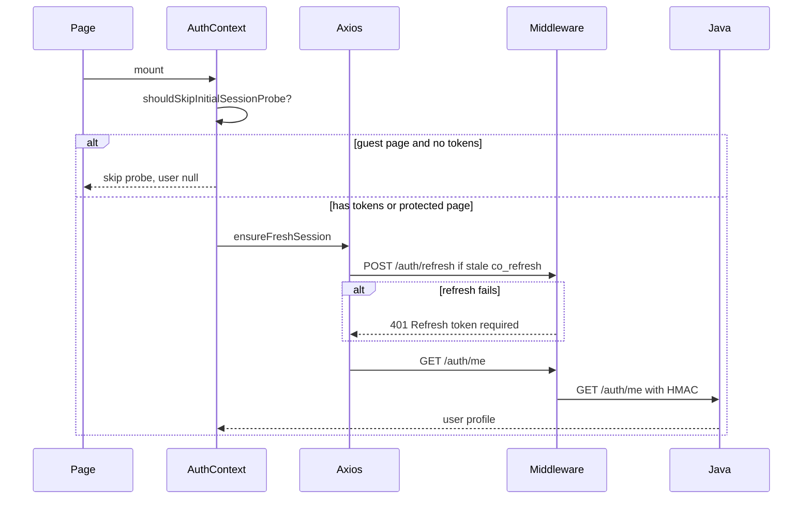

# Auth infrastructure

Cross-cutting authentication stack used by Login, Signup, Onboarding, and all protected pages.

## Layers

| Layer | Role | Key file |
|-------|------|----------|
| UI | Pages call `useAuth()` | `frontend/src/context/AuthContext.tsx` |
| Token store | Access in memory; refresh in sessionStorage or HttpOnly cookie | `frontend/src/lib/tokenStore.ts` |
| HTTP client | Axios + CSRF + silent refresh | `frontend/src/services/api.ts` |
| BFF | Cookies, validation, proxy | `middleware/src/routes/auth.routes.ts` |
| Backend | JWT issue, user lookup | `backend/.../AuthController.java`, `AuthService.java` |

## Cookies

| Cookie | Purpose | Lifetime |
|--------|---------|----------|
| `co_session` | Access JWT | 15 minutes |
| `co_refresh` | Refresh JWT | Session or 30 days (remember me) |
| `co_remember` | Flag: persistent refresh | 30 days when remember me |
| `co_csrf` | CSRF token for mutating requests | Session |

## Session bootstrap on mount

Guest pages (`/login`, `/signup`, `/forgot-password`) skip the initial `/auth/me` probe when no tokens exist. This avoids unnecessary refresh attempts.

## Silent 401 refresh

`frontend/src/services/api.ts` response interceptor:

1. Request fails with 401
2. Single-flight `POST /auth/refresh`
3. On success: retry original request, emit `co:auth:refreshed`
4. On failure: clear tokens, emit `co:auth:logged-out`, redirect to `/login?reason=session_expired`

## Remember me

| Mode | Refresh storage | TTL |
|------|-----------------|-----|
| Unchecked | `refreshToken` in response JSON → `sessionStorage` | ~1 day (session cookie) |
| Checked | HttpOnly `co_refresh` cookie only | 30 days |

Access token handling is identical in both modes.

## CSRF

Mutating requests include `X-CSRF-Token` from `co_csrf` cookie. Middleware validates on protected routes.

## Internal HMAC (middleware → Java)

Every proxied request includes:

- `X-Timestamp`
- `X-Signature` (HMAC-SHA256 of timestamp + body)
- `X-Internal-User-Id` (when authenticated)

Secret: `APP_INTERNAL_SECRET` — must match in repo `.env` (Java) and `middleware/.env`.

## JWT verification

Middleware verifies access tokens with `JWT_PUBLIC_KEY` (must match Java `JWT_PUBLIC_KEY_PEM`).

Public JWKS: `GET /.well-known/jwks.json` (middleware proxy).

## Events

| Event | When |
|-------|------|
| `co:auth:refreshed` | Silent refresh succeeded |
| `co:auth:logged-out` | Refresh failed or explicit logout |

## Related

- [route-guards.md](./route-guards.md)
- [mandatory-fields.md](../mandatory-fields.md) — env vars for auth to work in dev/prod
