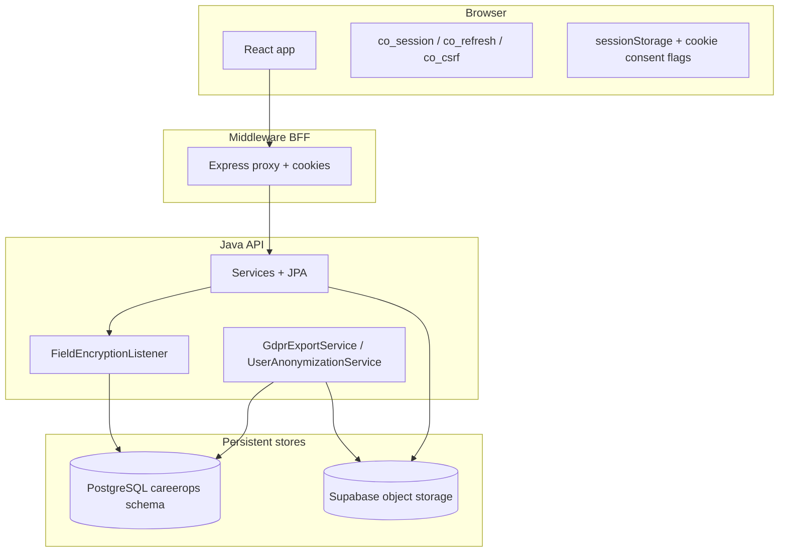
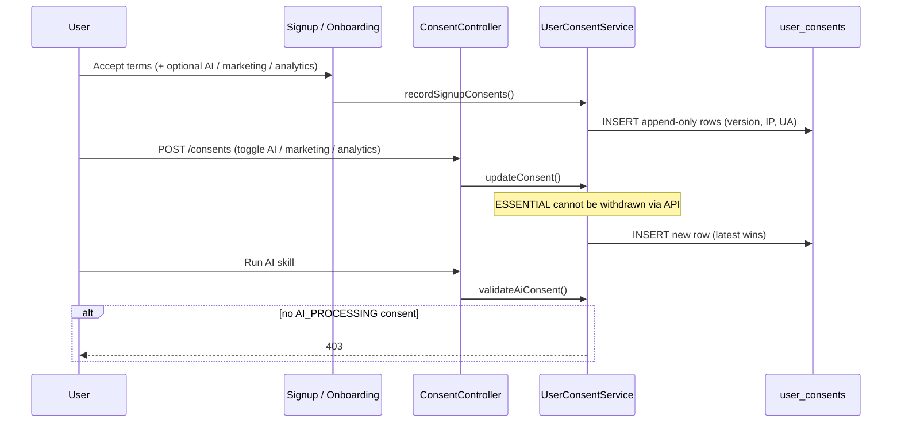
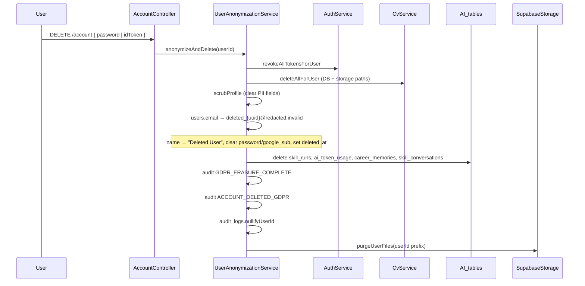

# GDPR data storage

How CareerOps stores personal data in PostgreSQL and object storage, and how that maps to GDPR requirements. This is the technical companion to the public [privacy policy](../privacy/PAGE.md) and the in-app controls on [account settings](../account-settings/PAGE.md).

**Schema:** all application tables live in PostgreSQL schema `careerops` (Flyway migrations under `backend/src/main/resources/db/migration/`).

**Last reviewed:** June 2026.

---

## GDPR principles → implementation

| GDPR principle | How CareerOps implements it |
|----------------|----------------------------|
| **Lawfulness & transparency** | Signup requires **ESSENTIAL** consent (Terms). Optional consents recorded at signup and in `/account`. Public policy at `/privacy`. |
| **Purpose limitation** | Data is collected for job search, CV management, AI career tools, and account operation — not repurposed without consent. |
| **Data minimisation** | Passwords stored as bcrypt hashes only. Export omits `password_hash`, `google_sub`, and raw CV bytes. OTPs stored hashed. |
| **Accuracy** | Users edit profile and preferences via `/account` and onboarding. |
| **Storage limitation** | Scheduled retention cleanup (audit logs, password-reset tokens, expired refresh tokens, consents for deleted users). Skill-run cache TTLs. |
| **Integrity & confidentiality** | Per-user AES-GCM field encryption for selected PII; TLS in transit; HMAC-signed API requests; role-based access. |
| **Accountability** | Append-only `user_consents` and `audit_logs`; export and deletion events audited. |

---

## Storage architecture



| Store | What it holds | GDPR notes |
|-------|---------------|------------|
| **PostgreSQL `careerops`** | Users, profiles, jobs pipeline, consents, audit trail, AI run history, networking, etc. | Primary system of record. EU-hosted Postgres recommended for production (see privacy policy processors). |
| **Supabase Storage** | CV files, application assets, resume versions (when configured) | Purged on account deletion via `SupabaseStorageService.purgeUserFiles`. Metadata also in `user_cvs.storage_path`. |
| **Browser** | Access token (memory), refresh token (sessionStorage or HttpOnly cookie), pending signup, analytics cookie consent flag | Not server DB; cleared on sign-out. See [auth-infrastructure.md](./auth-infrastructure.md). |

### Browser sessionStorage — UX handoff only (M-26 / M-33)

Some onboarding and OAuth flows stash **non-authoritative** handoff state in `sessionStorage`. The server always re-validates before any mutation.

| Key / module | Contents | Authoritative store | Cleared when |
|--------------|----------|---------------------|--------------|
| `co_pending_signup_v2` (`pendingSignup.ts`) | `signupIntentId`, email, consents | `signup_intents` table (server) | Login, signup finish, sign-out |
| `co_onboarding_verification_v1` (`onboardingVerification.ts`) | `emailVerificationId`, intent binding | `email_verifications` (hashed OTP) | Consumed on register / TTL |
| `co_google_consents_v1` (`pendingGoogleConsents.ts`) | Consent booleans for Google | `user_consents` rows on successful `/auth/google` | Login success / sign-out |

**GDPR note:** These keys are **not** proof of consent or verified email. They exist so multi-step UI can resume after navigation. XSS could tamper with handoff flags — server endpoints reject invalid intents, unconsumed verification IDs, and missing terms. Consent records are written only after successful authenticated API calls with validated payloads.

---

## Personal data categories

### 1. Identity & authentication (`users`)

| Column | Personal data? | Storage treatment |
|--------|----------------|-------------------|
| `email`, `name`, `username` | Yes | `name` encrypted at rest (per-user DEK). Email/username plaintext for login lookup. |
| `password_hash` | Credential | bcrypt; never exported; cleared on deletion. |
| `google_sub` | Identifier | Cleared on deletion; never exported. |
| `failed_login_attempts`, `locked_until` | Security metadata | Retained while account active. |
| `email_verified_at`, `last_login_at`, `locale` | Account metadata | Exported; anonymized on deletion. |
| `deleted_at` | Erasure marker | Soft-delete: row kept, PII replaced (see erasure below). |

JPA hides soft-deleted users: `@SQLRestriction("deleted_at IS NULL")` on `User`.

### 2. Profile & preferences (`user_profiles`)

One row per user (`user_id` UNIQUE, `ON DELETE CASCADE`).

| Data | Format | Encryption |
|------|--------|------------|
| `location`, `goal_title`, `goal_location` | TEXT | AES-GCM per user |
| `target_roles`, `tech_stack`, `sectors`, `work_types` | `text[]` | Plaintext arrays |
| `work_experience`, `education`, `portfolio_items` | JSONB | Plaintext JSON |
| `salary_min`, `salary_max`, `min_match_percent`, visa flags | Scalar / boolean | Plaintext |
| `onboarded`, `experience_level`, availability | Flags / enums | Plaintext |

Profile PII is **scrubbed** on account deletion (location, roles, salary, work history, education, portfolio, goals).

### 3. CVs (`user_cvs`)

| Column | Notes |
|--------|-------|
| `file_name`, `parsed_text`, `cv_markdown`, `vector_json` | Derived personal data from uploaded CV |
| `storage_path` | Pointer to Supabase object |
| `file_data` | Legacy `bytea` fallback in dev; not included in GDPR export |

**Erasure:** all rows deleted; Supabase objects removed (`CvService.deleteAllForUser`).

### 4. Consent records (`user_consents`)

Append-only trail — **latest row per `consent_type` is authoritative**.

| `consent_type` | Required? | Withdrawable? | Governs |
|----------------|-----------|---------------|---------|
| `ESSENTIAL` | Yes (signup) | No (via API) | Terms of service / core processing |
| `AI_PROCESSING` | No (opt-in/out) | Yes | Skills, Gemini, Claude, NVIDIA agent calls |
| `MARKETING` | No | Yes | Marketing email |
| `ANALYTICS` | No | Yes | `analytics_events`, onboarding analytics |

Each row stores `version`, `accepted`, `accepted_at`, `ip_address`, `user_agent` for demonstrable consent.

Legacy `users.ai_processing_consent` is **deprecated** (V114); `user_consents` is source of truth.

### 5. Job pipeline (`user_jobs`, `jobs`)

| Table | Personal link |
|-------|---------------|
| `user_jobs` | `user_id`, `notes`, kanban state, match scores — linked to anonymized UUID after deletion |
| `jobs` | Mostly non-personal job listings (shared catalogue) |

### 6. AI & activity history

| Table | Content | Consent gate |
|-------|---------|--------------|
| `skill_runs` | AI skill outputs (JSON), TTL cache per skill (`SkillRunCachePolicy`: 24h default, 48h tailor-resume) | `AI_PROCESSING` |
| `analytics_events` | Event type + JSONB metadata | `ANALYTICS` |
| `onboarding_events` | Funnel telemetry | `ANALYTICS` |
| `ai_token_usage` | Token counts per run | Operational; tied to `user_id`; included in GDPR export |
| `memory_embeddings` | Agent memory vectors | `AI_PROCESSING` |
| `career_memories` | Agent memory CRUD (`/agent-memory`) | `AI_PROCESSING`; deleted on account erasure |

### Job evaluation cache (`AiEvalCacheService`)

In-memory light/deep eval cache (`eval::light::` / `eval::deep::` keys) was **removed**. Public methods are no-op stubs pending DB/Redis wiring. Job-card match scores and deep reports rely on `user_jobs.score_breakdown` and `skill_runs` DB cache instead.

### 7. Networking & outreach

| Table | PII examples |
|-------|--------------|
| `network_contacts` | Contact name, email, LinkedIn, company |
| `contact_interactions` | Notes, interaction history |
| `outreach_*` | Campaign copy, message bodies |

Networking/outreach tables reference `user_id` and are **not individually scrubbed** by the current erasure service; they remain attached to the anonymized account UUID. By contrast, AI personal data (`skill_runs`, `ai_token_usage`, `career_memories`, `skill_conversations`) is **hard-deleted** on erasure. Identity fields in `users` / `user_profiles` / CVs are removed so the UUID alone is not relinkable to a living identity without other leaks.

### 8. Security & session artefacts

| Table | Purpose | Retention |
|-------|---------|-----------|
| `refresh_tokens` | Hashed refresh JWTs | Deleted when expired (nightly) or on logout / password change / account deletion |
| `password_resets` | Hashed reset tokens | 30 days, then cron purge |
| `email_verifications` | Hashed OTP, email, attempt counts | Short-lived; consumed rows inactive |
| `user_keys` | Wrapped per-user DEK | One row per user; retained with anonymized account |

### 9. Audit & compliance (`audit_logs`)

Stores `action`, `ip_address`, `user_agent`, JSONB `metadata`, optional `user_id`.

| Action examples | Meaning |
|-----------------|---------|
| `CONSENT_RECORDED` | Consent change |
| `DATA_EXPORT_REQUESTED` | Portability export |
| `ACCOUNT_DELETED_GDPR` | Erasure completed |
| `GDPR_RETENTION_CLEANUP` | Nightly retention job |

On erasure, historical rows are **detached**: `audit_logs.user_id` set to `NULL` (user reference removed, event retained).

---

## Encryption at rest

Per-user envelope encryption for selected PII fields:

```
APP_MASTER_KEK (env: app.master.kek)
    └── wraps DEK in user_keys.encrypted_dek (per user_id)
            └── encrypts users.name, user_profiles.location,
                user_profiles.goal_title, user_profiles.goal_location
```

| Component | File |
|-----------|------|
| JPA listener | `backend/.../persistence/FieldEncryptionListener.java` |
| Codec | `backend/.../security/AesGcmCodec.java` |
| Key provisioning | `backend/.../service/UserKeyService.java` |
| Migration (column widths) | `V115__widen_encrypted_pii_columns.sql` |
| Key table | `V116__user_keys.sql` |

Ciphertext is stored as Base64 in `TEXT` columns. Legacy global key fallback may apply to rows encrypted before per-user keys (see `AesFieldEncryptor`).

---

## Consent lifecycle



| Entry point | Service method |
|-------------|----------------|
| Email signup | `AuthService.register` → `recordSignupConsents` |
| Google signup | `AuthService.createGoogleUser` → `recordSignupConsents` |
| Account settings | `ConsentController` → `updateConsent`; AI withdrawal → `UserConsentController` → `withdrawAiConsent` |
| AI skills | `UserConsentService.validateAiConsent` |
| Marketing email | `requireMarketingConsent` |
| Analytics | `hasAnalyticsConsent` / `requireAnalyticsConsent` |

Frontend: `frontend/src/components/gdpr/PrivacySettingsSection.tsx`  
API: `GET /consents`, `POST /consents`, `DELETE /user/consent/ai` (proxied via middleware).

---

## Data subject rights (in-app)

| Right | GDPR article | User action | Backend |
|-------|--------------|-------------|---------|
| **Access / portability** | Art. 15, 20 | **Export my data** on `/account` | `GET /account/export` → `GdprExportService` |
| **Erasure** | Art. 17 | **Delete account** (password or Google re-auth) | `DELETE` or `POST /account/delete` → `UserAnonymizationService` |
| **Restrict processing** | Art. 18 | Turn off AI / marketing / analytics consents | `POST /consents`; AI off → `DELETE /user/consent/ai` |
| **Withdraw consent** | Art. 7(3) | Turn off AI processing (Account privacy) | `DELETE /user/consent/ai` → `withdrawAiConsent` (append-only row + 30-day `skill_runs` purge) |
| **Object** | Art. 21 | Withdraw marketing / analytics | Same consent toggles |
| **Information** | Art. 13–14 | Read `/privacy` | Static legal page |

### Export contents (`my-data.json`)

Included: `UserExport` (no secrets), full `UserProfile`, CV metadata (`parsed_text`, `cv_markdown`, paths — **not** `file_data`), `user_jobs`, `audit_logs`, all `user_consents`, **`skill_runs`** (full JSON `output` + `resumeHtml` for tailored CVs), **`token_usage`** (feature, model, tokens used, date).

Excluded: `password_hash`, `google_sub`, raw CV bytes.

### Erasure sequence



**Soft-delete model:** the `users` row is retained with pseudonymous identifiers for referential integrity. `@SQLRestriction` prevents the account from authenticating or appearing in normal queries.

---

## Retention schedule (automated)

Cron: `CronJobService.runGdprRetentionCleanup` — **03:00 Europe/Dublin** daily.

| Dataset | Retention | Mechanism |
|---------|-----------|-----------|
| `audit_logs` | **365 days** | `deleteByCreatedAtBefore` |
| `password_resets` | **30 days** | `deleteByCreatedAtBefore` |
| `refresh_tokens` | Until `expires_at` | `deleteByExpiresAtBefore` (+ logout paths) |
| `user_consents` for deleted users | **30 days** after `users.deleted_at` | `deleteForUsersDeletedBefore` |
| `skill_runs` | **90-day global cap** (`created_at`); 24–48h cache TTL while active (`expires_at`); **30-day per-user purge on AI consent withdrawal**; **deleted on account erasure** | `deleteByCreatedAtBefore` in `runGdprRetentionCleanup`; `pruneExpiredSkillRuns`; `deleteByUserIdAndCreatedAtBefore`; `deleteAllByUserId` |
| `email_verifications` | Until consumed / expired | Application logic |

Each cleanup run writes `GDPR_RETENTION_CLEANUP` to `audit_logs` with deletion counts (`auditLogsDeleted`, `passwordResetsDeleted`, `refreshTokensDeleted`, `userConsentsDeleted`, `skillRunsDeleted`).

---

## Tables linked to `user_id` (reference)

All foreign keys to `users(id)` use `ON DELETE CASCADE` where defined — relevant only on **hard** delete. Current erasure uses **soft delete**, so child rows typically remain unless explicitly removed by a service.

| Domain | Tables |
|--------|--------|
| Core | `user_profiles`, `user_jobs`, `user_cvs`, `user_consents`, `user_keys`, `refresh_tokens` |
| AI | `skill_runs`, `batch_skill_runs`, `memory_embeddings`, `ai_token_usage` |
| Career ops | `application_tasks`, `application_runs`, `resume_versions`, `resume_version_assets`, `job_watchlists`, `watchlist_runs` |
| Interviews | `interview_tracks`, `interview_sessions` |
| Networking | `network_contacts`, `contact_interactions`, `outreach_campaigns`, `outreach_messages`, `outreach_sequences` |
| Collaboration | `shared_workspaces`, `workspace_members`, `shared_notes` |
| Analytics | `analytics_events`, `onboarding_events`, `feature_adoption_events`, `weekly_progress_snapshots`, `user_streaks`, `daily_activity_log` |
| Other | `notifications`, `referrals`, `seen_jobs`, `experiment_assignments`, `deadline_events` |

**Non-personal / aggregate:** `jobs`, `permit_*`, `experiments`, `feature_flags`, `daily_fetch_log`.

---

## Environment variables (operators)

| Variable | Purpose |
|----------|---------|
| `APP_MASTER_KEK` / `app.master.kek` | Wraps per-user DEKs in `user_keys` |
| `APP_ENCRYPTION_KEY` | Legacy global encryption fallback |
| Supabase URL + service key | CV / asset storage and purge |
| `e2e.test.email` | Dev-only test account bypass (not production GDPR surface) |

See also [mandatory-fields.md](../mandatory-fields.md).

---

## Code map

| Concern | Path |
|---------|------|
| Export | `backend/.../service/GdprExportService.java`, `dto/GdprExportDtos.java` |
| Erasure | `backend/.../service/UserAnonymizationService.java` |
| Consent | `UserConsentService.java`, `ConsentController.java`, `UserConsentController.java` |
| Account API | `AccountController.java` |
| Skill cache | `SkillRunCachePolicy.java`, `SkillRunRepository.java`, `SkillService.java` |
| NVIDIA tokens | `NvidiaService.java` (`SKILL_MAX_TOKENS` per skill) |
| Retention cron | `backend/.../service/CronJobService.java` |
| CV purge | `backend/.../service/CvService.java`, `SupabaseStorageService.java` |
| Migrations | `V113__user_consents.sql`, `V114__gdpr_ai_processing_consent.sql`, `V115__*`, `V116__user_keys.sql` |
| UI | `frontend/src/components/gdpr/PrivacySettingsSection.tsx` |
| Middleware proxy | `account.routes.ts`, `consents.routes.ts`, `user.consent.routes.ts` |

---

## Related docs

- [privacy/PAGE.md](../privacy/PAGE.md) — public-facing policy
- [account-settings/PAGE.md](../account-settings/PAGE.md) — export, consent toggles, delete account
- [signup/PAGE.md](../signup/PAGE.md) — signup consent capture
- [auth-infrastructure.md](./auth-infrastructure.md) — tokens and cookies
- [mandatory-fields.md](../mandatory-fields.md) — deployment configuration
