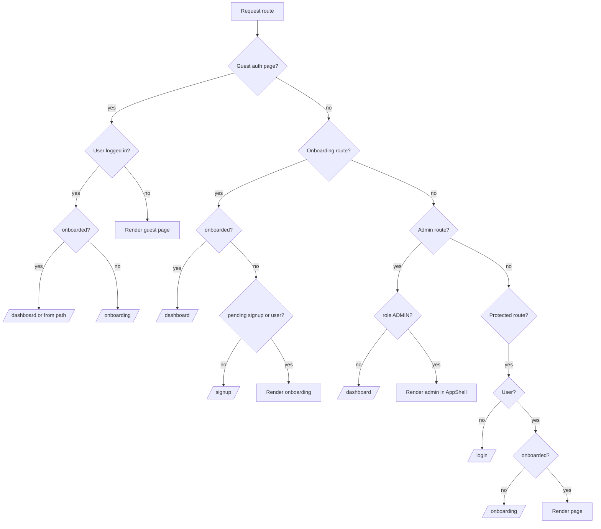

# Route guards

All guards live in `frontend/src/components/ProtectedRoute.tsx` and wrap route groups in `frontend/src/App.tsx`.

## Guard types

| Guard | Routes | Allows | Redirects when blocked |
|-------|--------|--------|------------------------|
| None | `/`, `/get-started`, legal pages, `*` | Everyone | — |
| `GuestRoute` | `/login`, `/signup`, `/forgot-password`, `/reset-password` | Guests only | Logged-in → `/dashboard` or `/onboarding` (or `from` path) |
| `OnboardingRoute` | `/onboarding` | Guests with pending signup OR signed-in non-onboarded | No pending signup → `/signup`; onboarded → `/dashboard` |
| `ProtectedRoute` | All app pages | Signed-in + onboarded | No user → `/login`; not onboarded → `/onboarding` |
| `AdminRoute` | `/admin/experiments` | `user.role === 'ADMIN'` | No user → `/login`; non-admin → `/dashboard` + toast |

## Redirect decision tree

## Full-width layout (no AppShell sidebar)

`ProtectedRoute` skips `AppShell` for these paths:

- `/onboarding`
- `/welcome`
- `/dashboard`
- `/account`
- `/jobs`, `/kanban` (redirects to `/jobs`)
- `/jobs/:id`

All other protected routes render inside `AppShell` (sidebar + top bar + notification bell).

## Legacy route aliases

| From | To |
|------|-----|
| `/register` | `/signup` |
| `/kanban` | `/jobs` |
| `/legal/privacy` | `/privacy` |
| `/legal/terms` | `/terms` |
| `/legal/help` | `/help` |
| `/legal/accessibility` | `/accessibility` |
| `/reset-password` | `/forgot-password` (preserves `?email=`) |
| `/welcome` | `/dashboard?welcome=1` |

## Public auth paths

These paths are excluded from `from` redirect after login:

`/login`, `/signup`, `/register`, `/forgot-password`, `/reset-password`

## Loading state

All guards show `PageLoader` while `AuthContext.loading` is true.
