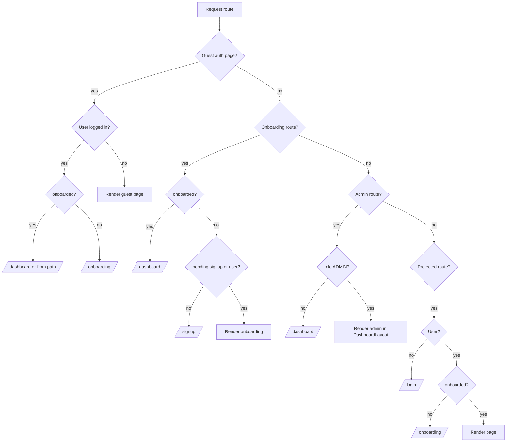

# Route guards

All guards live in `frontend/src/components/ProtectedRoute.tsx` and wrap route groups in `frontend/src/App.tsx`.

## Guard types

| Guard | Routes | Allows | Redirects when blocked |
|-------|--------|--------|------------------------|
| None | `/`, `/get-started`, `/billing`, `/pricing`, legal pages, `*` | Everyone | — |
| `GuestRoute` | `/login`, `/signup`, `/forgot-password`, `/reset-password` | Guests only | Logged-in → `/dashboard` or `/onboarding` (or `from` path) |
| `OnboardingRoute` | `/onboarding` | Guests with pending signup OR signed-in non-onboarded | No pending signup → `/signup`; onboarded → `/dashboard` |
| `ProtectedRoute` | All app pages | Signed-in + onboarded | No user → `/login`; not onboarded → `/onboarding` |
| `AdminRoute` | `/admin/saas`, `/admin/experiments` | `user.role === 'ADMIN'` | No user → `/login`; non-admin → `/dashboard` + toast |

## Redirect decision tree

## App layout (`DashboardLayout`)

Authenticated routes render inside `DashboardLayout` (`DashboardTopNav` + page content via `<Outlet />`).

**Layout-less paths** (no top nav):

- `/onboarding`
- `/welcome` (redirects to `/dashboard?welcome=1`)

All other protected routes — including `/dashboard`, `/jobs`, `/account`, `/skills`, admin — use `DashboardLayout`.

## Legacy route aliases

| From | To |
|------|-----|
| `/register` | `/signup` |
| `/pricing` | `/billing` |
| `/kanban` | `/jobs` |
| `/legal/privacy` | `/privacy` |
| `/legal/terms` | `/terms` |
| `/legal/help` | `/help` |
| `/legal/accessibility` | `/accessibility` |
| `/reset-password` | `/forgot-password` (preserves `?email=`) |
| `/welcome` | `/dashboard?welcome=1` |

## Public auth paths

These paths are excluded from `from` redirect after login:

`/login`, `/signup`, `/register`, `/forgot-password`, `/reset-password`

## Loading state

All guards show `PageLoader` while `AuthContext.loading` is true.

## Billing RBAC (subscription API)

| Action | Who can do it | API signal |
|--------|---------------|------------|
| View subscription and usage | Any **active** org member | `GET /billing/subscription` always allowed when authenticated |
| View invoices | Org **owner** or **admin** with a Stripe customer | UI enables invoice fetch only when `canManageBilling` and `hasBillingAccount` are true |
| Checkout, portal, cancel | Org **owner** or **admin** only | `canManageBilling: true` in subscription response; mutations return 403 otherwise |
| Stripe portal / payment method | Owner/admin **and** `hasBillingAccount: true` (Stripe customer exists) | UI gates portal buttons on both flags |

Multi-org users: billing resolves `users.primary_billing_organization_id` when set and the user is an active member; otherwise falls back to the first owned org membership.

## Plan limits (API enforcement, not route guards)

Frontend route guards (`ProtectedRoute`, etc.) do **not** block navigation when a plan limit is exceeded. Limits are enforced on the **Java API** via `@PlanGated` + `PlanEnforcementService`:

| Mechanism | Behavior |
|-----------|----------|
| `PlanGatingAspect` | Intercepts `@PlanGated` controller methods before execution |
| `PlanEnforcementService` | Compares org usage vs `PlanLimit.forPlan(effectivePlan)` |
| Over limit | HTTP **402 Payment Required** with `PlanLimitErrorResponse` (`error: PLAN_LIMIT_EXCEEDED`, `feature`, `currentPlan`, `upgradeUrl`) |
| Frontend UX | `api.ts` intercepts 402 → `emitPlanLimitExceeded` → `PlanLimitBanner` in `App.tsx` |
| Enforcement switch | `SAAS_BILLING_ENFORCEMENT_ENABLED=false` disables limits; `true` enables them in every profile, including dev/test |

Gated features include `ai_skill_run`, `cv_upload`, `job_application`, and team invites (`team_member` via `OrgService`).

Users can always open protected pages; hitting a gated action (e.g. run skill, upload CV, auto-apply) triggers the 402 + upgrade banner — not a route redirect.
