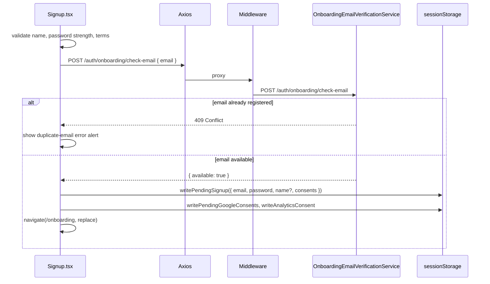

# Signup

## Overview

First step of deferred signup: collects name, email, password, and consent checkboxes but does **not** create an account yet. Validates email availability via API, then stores credentials in `sessionStorage` (`pendingSignup`) and navigates to `/onboarding`. Account registration happens on onboarding finish. Guests only.

## Route

| Property | Value |
|----------|-------|
| URL | `/signup` (canonical); `/register` redirects here |
| Guard | `GuestRoute` |
| Layout | Standalone (`SignupPageShell`) |
| Redirects | Logged-in user → `/dashboard` or `/onboarding` per `loginRedirectTarget` |

### Query parameters

| Param | Effect |
|-------|--------|
| `?reason=session_expired` | Clears tokens, pending signup, verification; shows "sign-up session expired" banner |

## Fields and inputs

| Field | Required | Validation | When shown |
|-------|----------|------------|------------|
| Full name | Yes | Non-empty trim | Always |
| Email | Yes | HTML5 email; trimmed on submit | Always |
| Password | Yes | Client strength: min 8 chars; score ≥3 (Good/Strong) to proceed | Always |
| Terms of Service + Privacy Policy | Yes | `termsAccepted` must be true | Always |
| AI processing consent | No | Optional; stored in pending signup | Always |
| Marketing emails | No | Optional | Always |
| Analytics consent | No | Optional; also written to local cookie consent | Always |

Password strength labels: Too short (<8), Weak, Fair (not acceptable), Good, Strong (acceptable).

## Actions

| Action | Trigger | Result |
|--------|---------|--------|
| Continue to profile | Form submit | `authApi.checkSignupEmail` → `writePendingSignup` → `navigate('/onboarding')` |
| Duplicate email | 409 / "already exists" | Shows inline error alert (no login handoff link) |
| Sign in (footer) | Link | Navigate to `/login` |
| Open legal docs | Terms/Privacy links | New tab to `/terms`, `/privacy` |

On submit success, consents are also persisted via `writePendingGoogleConsents` and `writeAnalyticsConsent` for Google OAuth path consistency.

## Auth and session

No account is created on this page. Credentials live in tab-scoped session storage:

| Key | Storage | TTL |
|-----|---------|-----|
| `co_pending_signup_v1` | `sessionStorage` | Until onboarding finish, sign-out, or session-expired cleanup |

`OnboardingRoute` requires `hasPendingSignup()` for guests without a user session.

Session-expired cleanup (`?reason=session_expired`): clears `tokenStore`, `pendingSignup`, `onboardingVerification`, and best-effort `authApi.logout()`.

## API endpoints

| User action | Frontend | Middleware (`/api/v1`) | Java (`/api`) |
|-------------|----------|------------------------|---------------|
| Check email available | `authApi.checkSignupEmail` | `POST /auth/onboarding/check-email` | `POST /auth/onboarding/check-email` |
| Logout (session expired cleanup) | `authApi.logout` | `POST /auth/logout` | `POST /auth/logout` |

Check-email success: `{ available: true }`. Duplicate email: HTTP 409 from backend (surfaced as inline "already registered" UI, not generic error).

Actual registration (`POST /auth/register`) is deferred to onboarding finish — see [onboarding/PAGE.md](../onboarding/PAGE.md).

## File map

### Frontend

| Role | Path |
|------|------|
| Page | `frontend/src/pages/Signup.tsx` |
| Shell | `frontend/src/components/auth/SignupPageShell.tsx` |
| Pending signup store | `frontend/src/lib/pendingSignup.ts` |
| Google consent handoff | `frontend/src/lib/pendingGoogleConsents.ts` |
| Analytics consent | `frontend/src/lib/cookieConsent.ts` |
| Verification cleanup | `frontend/src/lib/onboardingVerification.ts` |
| HTTP client | `frontend/src/services/api.ts` |
| Route guard | `frontend/src/components/ProtectedRoute.tsx` (`GuestRoute`) |

### Middleware

| Role | Path |
|------|------|
| Check-email route | `middleware/src/routes/auth.routes.ts` — `POST /onboarding/check-email` |

### Backend

| Role | Path |
|------|------|
| Controller | `backend/src/main/java/com/careerops/controller/AuthController.java` |
| Email availability | `backend/src/main/java/com/careerops/service/OnboardingEmailVerificationService.java` |
| Registration (deferred) | `backend/src/main/java/com/careerops/service/AuthService.java` — `signup` |

## Sequence diagram

## Edge cases

- **Deferred account creation**: Closing the tab loses `pendingSignup`; user must restart from signup.
- **Duplicate email**: Shows an inline error; editing the email field clears the message.
- **Weak password**: Blocked client-side before any API call.
- **Terms not accepted**: Blocked client-side; only required consent checkbox.
- **Session expired on signup URL**: Wipes all signup handoff state; user re-enters form.
- **Logged-in user**: `GuestRoute` redirects away before form is usable.
- **No CAPTCHA on signup page**: Email verification CAPTCHA happens later in onboarding modal.
- **Legacy `/register`**: Permanent redirect to `/signup` in `App.tsx`.

## Related docs

- [shared/auth-infrastructure.md](../shared/auth-infrastructure.md)
- [shared/route-guards.md](../shared/route-guards.md)
- [onboarding/PAGE.md](../onboarding/PAGE.md)
