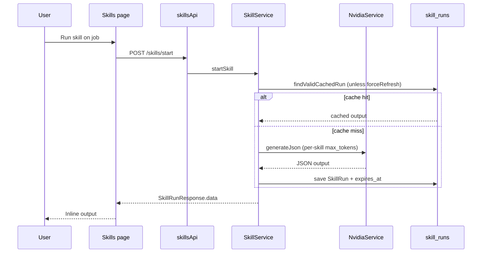

# AI Skills Coach

## Overview

Run nine AI skills per saved job role from an accordion list. Each skill: **Run** (sync start) and **PDF** download. Inline output preview after successful run.

Backend orchestration lives in `SkillService` — bundled `SKILL.md` execution via `SkillMdExecutorService` + `NvidiaService` (single-turn JSON), with DB-backed result caching in `skill_runs`.

## Route

| Item | Value |
|------|-------|
| Path | `/skills` |
| Guard | `ProtectedRoute` |
| Layout | `AppShell` |
| Lazy import | `Skills` in `App.tsx` |

## Main UI fields / actions

- **Job accordion:** title, company, location; expand/collapse
- **Skills (per job):** evaluate, tailor-resume, cover-letter, prep-interview, culture-fit, salary-negotiation, linkedin-optimize, outreach, apply
- **Run:** Starts skill, shows formatted JSON/text output
- **PDF:** Downloads skill report blob
- **Close:** Clears inline output for that skill key

## Backend behavior (relevant to UI)

| Topic | Behavior |
|-------|----------|
| **Result cache** | Job-scoped skills cache in `skill_runs` via `SkillRunRepository.findValidCachedRun` — 24h TTL (48h for `tailor-resume`). Cacheable: evaluate, research, prep-interview, apply, outreach, tailor-resume. Pass `forceRefresh: true` to bypass. |
| **Eval feed cache** | `AiEvalCacheService` in-memory cache removed; light/deep job-card eval cache is inactive until DB/Redis wiring. |
| **NVIDIA tokens** | `NvidiaService` uses per-skill `max_tokens` (e.g. tailor-resume 5000, evaluate 1200); default 4096 for other features. |
| **Completion notify** | Email + in-app notification only for: evaluate, research, prep-interview, tailor-resume, cover-letter, outreach. |
| **AI consent** | `UserConsentService.validateAiConsent()` — 403 if `AI_PROCESSING` not accepted. |
| **runAllSkills** | `PROFILE_INCOMPLETE` on one skill increments `failed` and continues; does not clear other results. |
| **Conversations** | Stale `pending_answer` rows deleted by targeted `deleteByUserIdAndSkillAndUserJobIdAndStatus` before new run. |

## API endpoints

| Method | Endpoint | Action |
|--------|----------|--------|
| GET | `/jobs?page=&size=` | Job list (`useJobsList` → `jobsApi.list`) |
| POST | `/skills/start` | Run skill (`skillsApi.start`, 180s–420s timeout) |
| GET | `/skills/pdf/{userJobId}/{skillName}` | PDF blob (`skillsApi.downloadSkillPdf`) |

## File map

| File | Role |
|------|------|
| `frontend/src/pages/Skills.tsx` | Page UI + SKILL_LIST |
| `frontend/src/services/skillsApi.ts` | Skill HTTP layer |
| `frontend/src/hooks/queries/useJobs.ts` | `useJobsList` |
| `frontend/src/services/api.ts` | `jobsApi` |
| `backend/.../service/SkillService.java` | Orchestration, cache, notifications |
| `backend/.../service/SkillMdExecutorService.java` | SKILL.md single-turn execution |
| `backend/.../service/NvidiaService.java` | NVIDIA NIM HTTP + per-skill token limits |
| `backend/.../service/SkillRunCachePolicy.java` | Cacheable skills + TTL hours |

## Sequence diagram

## Edge cases

- **No jobs:** Empty dashed state; skills unusable.
- **First job auto-expanded:** On load when jobs exist.
- **Skill failure:** Toast; no output panel.
- **Long-running skills:** tailor-resume uses extended timeout server-side; AI call runs outside long DB write transactions on conversation resume.
- **401/403 on PDF:** `withFreshSessionRetry` refreshes session once.
- **Cached result:** Second run within TTL returns instantly unless user forces refresh.
- **No AI consent:** 403 with message to enable in Account → Privacy.
- **Daily token budget exhausted:** Budget-degradable skills (evaluate, tailor-resume) may fall back to local drafts.

## Related docs

- [job-detail/PAGE.md](../job-detail/PAGE.md) — same skills tab embedded per job
- [shared/gdpr-data-storage.md](../shared/gdpr-data-storage.md) — `skill_runs` retention and export
- [account-settings/PAGE.md](../account-settings/PAGE.md) — AI consent toggle / withdrawal
