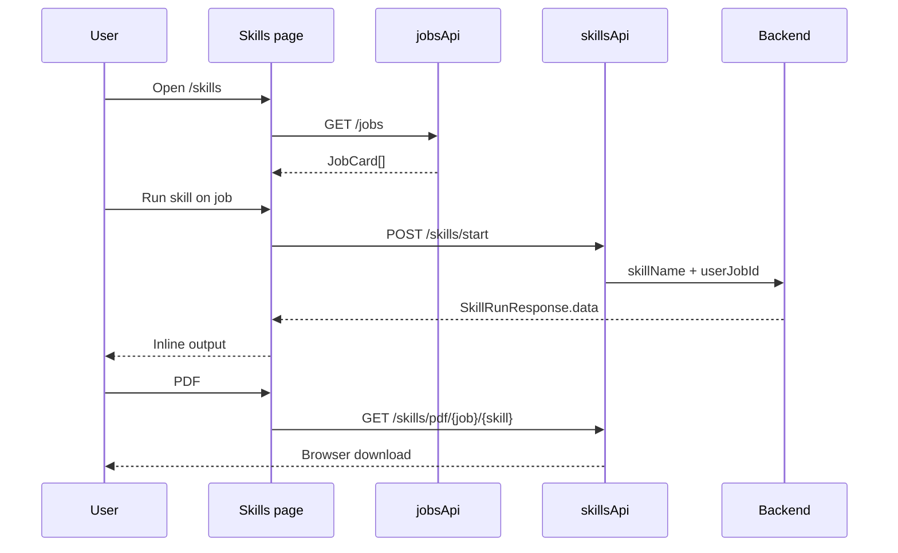

# AI Skills Coach

## Overview

Run nine AI skills per saved job role from an accordion list. Each skill: **Run** (sync start) and **PDF** download. Inline output preview after successful run.

## Route

| Item | Value |
|------|-------|
| Path | `/skills` |
| Guard | `ProtectedRoute` |
| Layout | `AppShell` |
| Lazy import | `Skills` in `App.tsx` |

## Main UI fields / actions

- **Job accordion:** title, company, location; expand/collapse
- **Skills (per job):** evaluate, tailor-resume, cover-letter, prep-interview, culture-fit, salary-negotiation, linkedin-optimize, outreach, apply
- **Run:** Starts skill, shows formatted JSON/text output
- **PDF:** Downloads skill report blob
- **Close:** Clears inline output for that skill key

## API endpoints

| Method | Endpoint | Action |
|--------|----------|--------|
| GET | `/jobs?page=&size=` | Job list (`useJobsList` → `jobsApi.list`) |
| POST | `/skills/start` | Run skill (`skillsApi.start`, 180s–420s timeout) |
| GET | `/skills/pdf/{userJobId}/{skillName}` | PDF blob (`skillsApi.downloadSkillPdf`) |

## File map

| File | Role |
|------|------|
| `frontend/src/pages/Skills.tsx` | Page UI + SKILL_LIST |
| `frontend/src/services/skillsApi.ts` | Skill HTTP layer |
| `frontend/src/hooks/queries/useJobs.ts` | `useJobsList` |
| `frontend/src/services/api.ts` | `jobsApi` |

## Sequence diagram

## Edge cases

- **No jobs:** Empty dashed state; skills unusable.
- **First job auto-expanded:** On load when jobs exist.
- **Skill failure:** Toast; no output panel.
- **Long-running skills:** tailor-resume uses extended timeout server-side.
- **401/403 on PDF:** `withFreshSessionRetry` refreshes session once.
