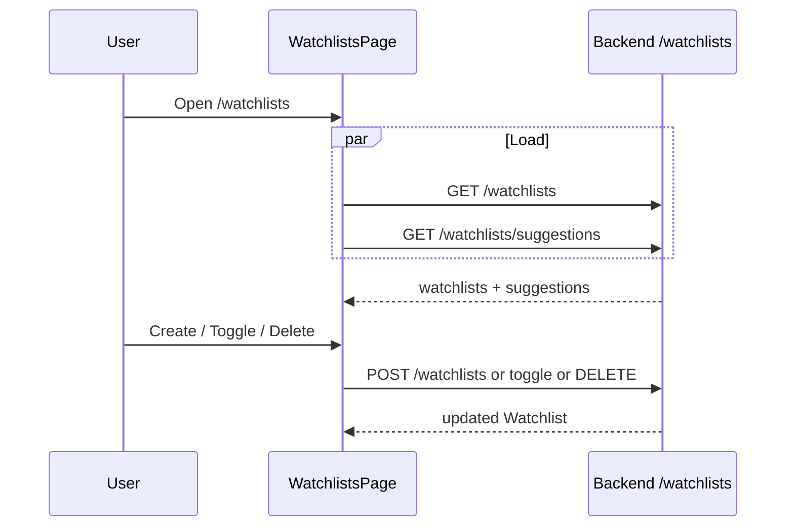

# Watchlists

## Overview

Saved job searches with alerts. Create watchlists (keywords, location, min salary), toggle active/paused, delete, and one-click add from AI **suggested** queries.

## Route

| Item | Value |
|------|-------|
| Path | `/watchlists` |
| Guard | `ProtectedRoute` |
| Layout | `AppShell` |
| Lazy import | `WatchlistsPage` in `App.tsx` |

## Main UI fields / actions

- **Header:** New Watchlist
- **Stats:** total, active count, total matches
- **Watchlist card:** name, query, location, salary range, last run, match count, toggle, delete
- **Create modal:** name*, search query*, location, min salary €
- **Suggested watchlists:** Add from suggestion list

## API endpoints

| Method | Endpoint | Action |
|--------|----------|--------|
| GET | `/watchlists` | List (`watchlistsApi.list`) |
| GET | `/watchlists/suggestions` | Suggested keyword strings |
| POST | `/watchlists` | Create |
| POST | `/watchlists/{id}/toggle` | Active ↔ paused |
| DELETE | `/watchlists/{id}` | Delete |

Not used on page: `GET /watchlists/{id}`, `PUT`, `GET .../runs`.

## File map

| File | Role |
|------|------|
| `frontend/src/pages/WatchlistsPage.tsx` | Page + CreateModal + WatchlistCard |
| `frontend/src/services/watchlistsApi.ts` | HTTP client |
| `frontend/src/components/ui/EmptyState.tsx` | Empty list |

## Sequence diagram

## Edge cases

- **Create validation:** Name and query required.
- **Delete:** Browser confirm dialog.
- **Toggle returns null:** No local update.
- **Suggestions:** Mapped to `{ query, location: null }`.
- **Salary display:** Uses min/max formatter; create only sends `minSalary`.
- **Never run:** Shows “Never run” for null `lastRunAt`.
