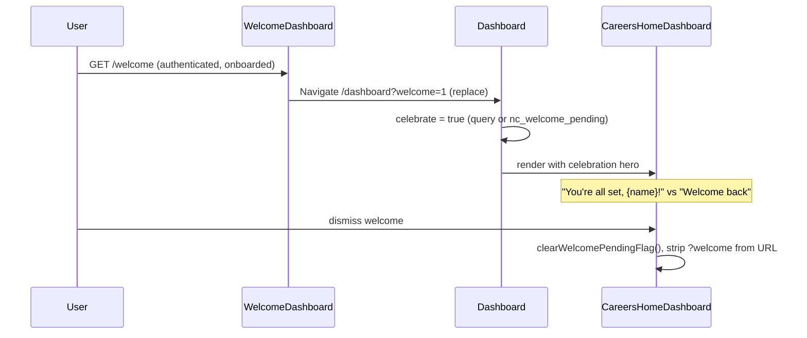

# Welcome (legacy redirect)

## Overview

Deprecated route preserved for bookmarks. Does not render content — immediately redirects to `/dashboard?welcome=1`, which triggers the post-onboarding celebration UI on the main dashboard. New users completing onboarding navigate directly to that URL; this route exists only for backward compatibility.

## Route

| Property | Value |
|----------|-------|
| URL | `/welcome` |
| Guard | `ProtectedRoute` (requires signed-in, onboarded user) |
| Layout | None (instant redirect) |
| Redirects | Always → `/dashboard?welcome=1` with `replace` |

## Fields and inputs

N/A — no UI on this route.

## Actions

| Action | Trigger | Result |
|--------|---------|--------|
| Redirect | Page mount | `<Navigate to="/dashboard?welcome=1" replace />` |

## Auth and session

Requires authenticated, onboarded user per `ProtectedRoute`. Unauthenticated users → `/login`. Non-onboarded users → `/onboarding`.

Welcome celebration on the dashboard is driven by:

| Signal | Mechanism |
|--------|-----------|
| `?welcome=1` query | `Dashboard.tsx` sets `celebrate = true` |
| `nc_welcome_pending` flag | `readWelcomePendingFlag()` in localStorage; set by onboarding `setWelcomePendingFlag()` |

The flag is cleared when the user dismisses the welcome experience on the dashboard (`clearWelcomePendingFlag`).

## API endpoints

None on this route. Dashboard loads profile and jobs via existing protected APIs after redirect.

## File map

### Frontend

| Role | Path |
|------|------|
| Redirect page | `frontend/src/pages/WelcomeDashboard.tsx` |
| Dashboard + celebration | `frontend/src/pages/Dashboard.tsx` |
| Welcome UI + flag helpers | `frontend/src/components/dashboard/CareersHomeDashboard.tsx` |
| Welcome styles | `frontend/src/styles/welcome-dashboard.css` |
| Onboarding sets flag | `frontend/src/pages/Onboarding.tsx` — `setWelcomePendingFlag`, `finishToDashboard` |
| Route registration | `frontend/src/App.tsx` |
| Route guard | `frontend/src/components/ProtectedRoute.tsx` |

### Middleware

No dedicated route.

### Backend

No dedicated endpoint.

## Sequence diagram

## Edge cases

- **Not logged in**: `ProtectedRoute` → `/login` before redirect runs.
- **Not onboarded**: `ProtectedRoute` → `/onboarding`.
- **Direct `/dashboard?welcome=1`**: Preferred canonical URL; same celebration without visiting `/welcome`.
- **Flag without query**: Onboarding may set `nc_welcome_pending` so dashboard celebrates even if query is omitted (e.g. onboarded user hitting `/onboarding` guard redirect).
- **OnboardingRoute for onboarded users**: Redirects to `/dashboard?welcome=1` when welcome flag is set, else plain `/dashboard`.
- **Full-width layout**: `/welcome` is listed in `useFullWidthLayout` paths but never renders long enough to matter.

## Related docs

- [onboarding/PAGE.md](../onboarding/PAGE.md)
- [shared/route-guards.md](../shared/route-guards.md)
