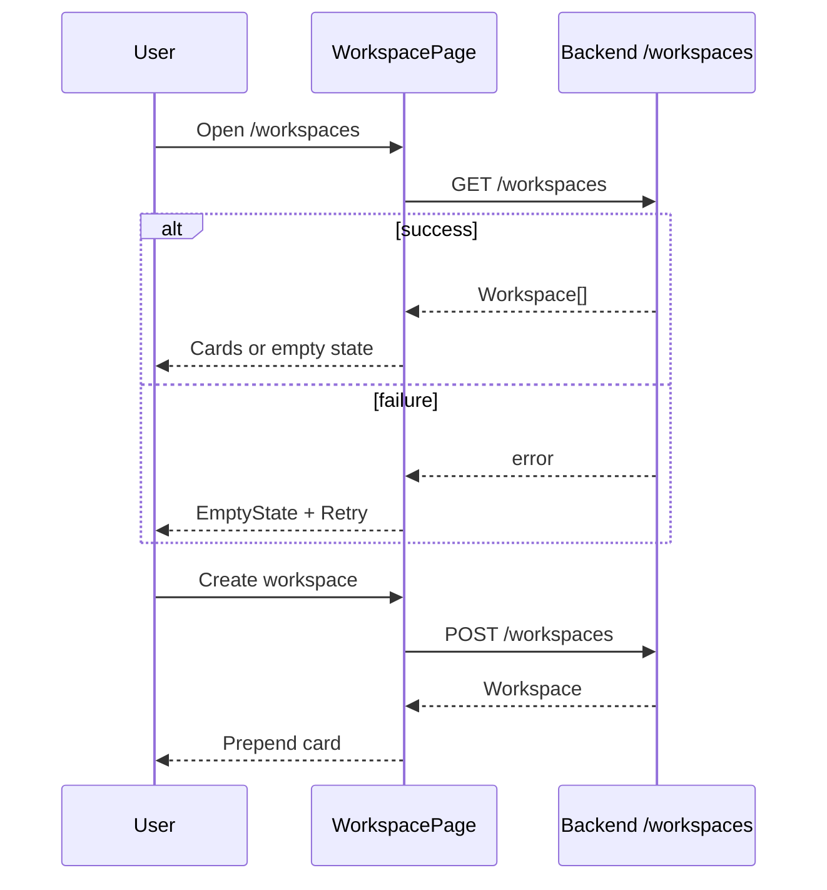

# Workspaces

## Overview

Lists shared workspaces for collaboration (coaches, interview buddies). Create workspace via modal; view members and roles. No invite UI on this page (API supports invite elsewhere).

## Route

| Item | Value |
|------|-------|
| Path | `/workspaces` |
| Guard | `ProtectedRoute` |
| Layout | `AppShell` |
| Lazy import | `WorkspacePage` in `App.tsx` |

## Main UI fields / actions

- **Header:** New Workspace
- **Create modal:** name*, description (optional)
- **Workspace card:** name, description, created date, member chips (owner crown + email/userId)
- **Empty / error:** `EmptyState` with retry on load failure

## API endpoints

| Method | Endpoint | Action |
|--------|----------|--------|
| GET | `/workspaces` | List workspaces (`workspaceApi.list`) |
| POST | `/workspaces` | Create (`workspaceApi.create`) |

Related (not used on page): `GET /workspaces/{id}`, `POST /workspaces/{id}/invite`, notes endpoints.

## File map

| File | Role |
|------|------|
| `frontend/src/pages/WorkspacePage.tsx` | Page + CreateModal |
| `frontend/src/services/workspaceApi.ts` | HTTP client |
| `frontend/src/components/ui/EmptyState.tsx` | Error/empty UI |

## Sequence diagram

## Edge cases

- **Load failure:** Dedicated retry screen (not toast-only).
- **Create without name:** Toast error.
- **Zero members:** “Invite collaborators” hint (no invite button here).
- **Member label:** `invitedEmail` → `userId` → “Pending member”.
